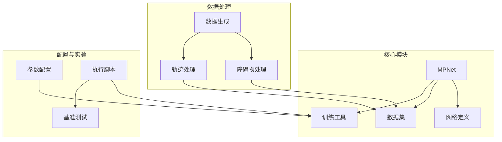
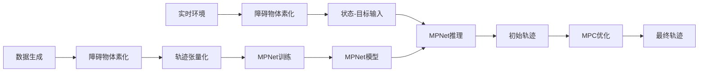
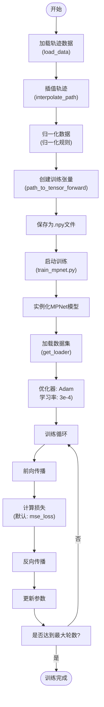
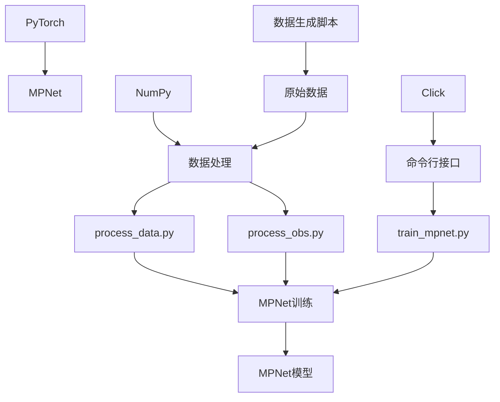

# MPC-MPNet集成规划器

<cite>
**本文档引用文件**  
- [mpnet.py](file://mpc-mpnet-py/mpnet/networks/mpnet.py)
- [voxel_encoder.py](file://mpc-mpnet-py/mpnet/networks/voxel_encoder.py)
- [pnet.py](file://mpc-mpnet-py/mpnet/networks/pnet.py)
- [train_mpnet.py](file://mpc-mpnet-py/mpnet/train_mpnet.py)
- [process_data.py](file://mpc-mpnet-py/mpnet/sst_envs/process_data.py)
- [process_obs.py](file://mpc-mpnet-py/mpnet/sst_envs/process_obs.py)
- [README.md](file://mpc-mpnet-py/README.md)
</cite>

## 目录
1. [简介](#简介)
2. [项目结构](#项目结构)
3. [核心组件](#核心组件)
4. [架构概述](#架构概述)
5. [详细组件分析](#详细组件分析)
6. [依赖分析](#依赖分析)
7. [性能考量](#性能考量)
8. [故障排除指南](#故障排除指南)
9. [结论](#结论)

## 简介
MPC-MPNet是一种结合模型预测控制（MPC）与神经网络规划器（MPNet）的混合运动规划框架，旨在实现快速、近最优且满足动力学约束的路径规划。该系统首先利用MPNet生成初始轨迹，随后通过MPC进行精细化优化，从而实现端到端的学习型规划。MPNet通过深度神经网络学习从环境障碍物和状态-目标对到可行轨迹的映射，显著提升了在复杂和未知环境中的泛化能力。本技术文档将深入解析其网络架构、训练流程、与MPC的集成机制，并展示其在quadrotor和car等机器人平台上的应用。

## 项目结构
mpc-mpnet-py模块采用模块化设计，主要包含数据生成、模型训练、基准测试和参数配置四大功能模块。系统支持多种机器人平台（如acrobot、quadrotor、car等），并通过独立的配置文件和训练脚本实现灵活的实验设置。



**图示来源**  
- [mpnet](file://mpc-mpnet-py/mpnet)
- [data_gen](file://mpc-mpnet-py/data_gen)
- [params](file://mpc-mpnet-py/params)
- [benchmarks](file://mpc-mpnet-py/benchmarks)

**本节来源**  
- [README.md](file://mpc-mpnet-py/README.md)

## 核心组件
mpc-mpnet-py的核心组件包括MPNet神经网络模型、体素编码器（Voxel Encoder）、前馈网络（PNet）、数据预处理模块（process_data.py, process_obs.py）以及训练入口（train_mpnet.py）。MPNet模型负责将环境障碍物和状态-目标信息融合，输出轨迹点预测；体素编码器将点云数据转换为低维潜在表示；PNet作为主干网络进行轨迹回归；数据预处理模块负责将原始轨迹和障碍物数据转换为可训练的张量格式。

**本节来源**  
- [mpnet.py](file://mpc-mpnet-py/mpnet/networks/mpnet.py)
- [process_data.py](file://mpc-mpnet-py/mpnet/sst_envs/process_data.py)
- [process_obs.py](file://mpc-mpnet-py/mpnet/sst_envs/process_obs.py)

## 架构概述
MPC-MPNet的架构分为两个主要阶段：学习阶段和规划阶段。在学习阶段，系统通过`data_gen`生成大量轨迹数据，利用`process_obs.py`和`process_data.py`将障碍物和轨迹转换为神经网络可处理的格式，最后通过`train_mpnet.py`训练MPNet模型。在规划阶段，MPNet接收当前环境的体素化障碍物表示和当前-目标状态，输出初始轨迹，该轨迹随后被送入MPC模块进行优化，以满足精确的动力学和避障要求。



**图示来源**  
- [data_generation.py](file://mpc-mpnet-py/data_gen/data_generation.py)
- [process_obs.py](file://mpc-mpnet-py/mpnet/sst_envs/process_obs.py)
- [process_data.py](file://mpc-mpnet-py/mpnet/sst_envs/process_data.py)
- [train_mpnet.py](file://mpc-mpnet-py/mpnet/train_mpnet.py)
- [mpnet.py](file://mpc-mpnet-py/mpnet/networks/mpnet.py)

## 详细组件分析

### MPNet网络架构分析
MPNet采用编码器-解码器风格的架构，但其“解码”部分由一个前馈网络（PNet）实现。该架构由两个核心子网络组成：体素编码器（VoxelEncoder）和轨迹预测网络（PNet）。

#### 网络结构图
```mermaid
classDiagram
class VoxelEncoder {
+encoder : Sequential
+head : Sequential
+forward(x) : Tensor
}
class PNet {
+fc : Sequential
+forward(x) : Tensor
}
class MPNet {
+encoder : VoxelEncoder
+pnet : PNet
+forward(x, obs) : Tensor
}
MPNet --> VoxelEncoder : "包含"
MPNet --> PNet : "包含"
VoxelEncoder --> "潜在表示 z" : "输出"
PNet <-- "拼接向量 z_x" : "输入"
```

**图示来源**  
- [voxel_encoder.py](file://mpc-mpnet-py/mpnet/networks/voxel_encoder.py)
- [pnet.py](file://mpc-mpnet-py/mpnet/networks/pnet.py)
- [mpnet.py](file://mpc-mpnet-py/mpnet/networks/mpnet.py)

#### 组件说明
- **VoxelEncoder**: 将输入的障碍物点云数据（如32x32的2D网格或32x32x32的3D体素）通过卷积层和池化层进行特征提取，最终通过全连接层压缩为一个固定长度的潜在向量（默认64维）。该过程实现了对高维环境信息的降维和抽象。
- **PNet**: 一个深度前馈神经网络，接收由潜在向量`z`和当前状态-目标状态拼接而成的向量`z_x`作为输入，输出下一个轨迹点的状态。其结构包含多个全连接层和PReLU激活函数，具有强大的非线性拟合能力。
- **MPNet**: 主类，负责将`VoxelEncoder`和`PNet`组合起来。其`forward`方法首先通过编码器处理障碍物`obs`得到`z`，然后将`z`与状态输入`x`拼接，最后将拼接结果送入`PNet`进行预测。

**本节来源**  
- [mpnet.py](file://mpc-mpnet-py/mpnet/networks/mpnet.py)
- [voxel_encoder.py](file://mpc-mpnet-py/mpnet/networks/voxel_encoder.py)
- [pnet.py](file://mpc-mpnet-py/mpnet/networks/pnet.py)

### 训练流程分析
MPNet的训练流程是一个监督学习过程，其目标是让网络学会从状态-目标对和环境障碍物预测出下一个轨迹点。

#### 训练流程图


**图示来源**  
- [process_data.py](file://mpc-mpnet-py/mpnet/sst_envs/process_data.py)
- [train_mpnet.py](file://mpc-mpnet-py/mpnet/train_mpnet.py)

#### 关键步骤
1.  **数据预处理 (`process_data.py`)**: `path_to_tensor_forward`函数是核心。它遍历每条轨迹，为路径上的每个点（除了最后一个）创建一个训练样本。每个样本的输入是`[env_id, current_state, goal_state]`，标签是路径上的下一个状态`next_state`。障碍物数据通过`process_obs.py`预先处理为体素网格。
2.  **模型训练 (`train_mpnet.py`)**: 使用`click`库提供命令行接口，允许用户灵活配置训练参数（如学习率、轮数、批量大小）。训练使用`training_utils.trainer`模块中的`train_network`函数，采用Adam优化器和均方误差（MSE）损失函数。

**本节来源**  
- [process_data.py](file://mpc-mpnet-py/mpnet/sst_envs/process_data.py)
- [train_mpnet.py](file://mpc-mpnet-py/mpnet/train_mpnet.py)

## 依赖分析
mpc-mpnet-py模块依赖于多个外部库和内部组件，形成了一个紧密耦合的系统。



**图示来源**  
- [train_mpnet.py](file://mpc-mpnet-py/mpnet/train_mpnet.py)
- [process_data.py](file://mpc-mpnet-py/mpnet/sst_envs/process_data.py)
- [process_obs.py](file://mpc-mpnet-py/mpnet/sst_envs/process_obs.py)

**本节来源**  
- [train_mpnet.py](file://mpc-mpnet-py/mpnet/train_mpnet.py)
- [process_data.py](file://mpc-mpnet-py/mpnet/sst_envs/process_data.py)
- [process_obs.py](file://mpc-mpnet-py/mpnet/sst_envs/process_obs.py)

## 性能考量
MPC-MPNet的设计在性能和精度之间取得了平衡。MPNet的前向推理速度非常快，能够实时生成初始轨迹，这是其相对于传统规划器的主要优势。然而，其性能受以下因素影响：
- **输入分辨率**: 体素编码器的输入大小（如32x32）直接影响计算量和环境细节的保留程度。
- **网络深度**: PNet的深度和宽度决定了其表达能力和计算开销。
- **数据质量**: 训练数据的多样性和覆盖范围直接决定了模型在未知环境中的泛化能力。
- **MPC后处理**: MPC优化的计算复杂度较高，是整个系统延迟的主要来源。

## 故障排除指南
在使用mpc-mpnet-py时，可能遇到以下常见问题：
- **训练不收敛**: 检查数据预处理是否正确，特别是状态和目标的归一化规则是否与`process_data.py`中的定义一致。尝试调整学习率或使用不同的损失函数。
- **路径规划失败**: 确保`sys.path`已正确设置，所有脚本都能找到依赖模块。检查障碍物体素化是否成功，输入到MPNet的`obs`张量维度是否正确。
- **环境不匹配**: 确保训练和推理时使用的机器人系统（system）和环境设置（setup）完全一致。

**本节来源**  
- [README.md](file://mpc-mpnet-py/README.md)
- [train_mpnet.py](file://mpc-mpnet-py/mpnet/train_mpnet.py)

## 结论
MPC-MPNet是一种创新的混合规划架构，它成功地将深度学习的快速推理能力与MPC的精确优化能力相结合。通过MPNet生成高质量的初始猜测，MPC的求解过程被极大地加速，从而实现了在复杂动态环境中的实时、近最优规划。该系统在quadrotor和car等多种平台上展现了强大的泛化能力，为机器人自主导航提供了一种高效且鲁棒的解决方案。其模块化的设计也便于扩展到其他机器人系统和应用场景。