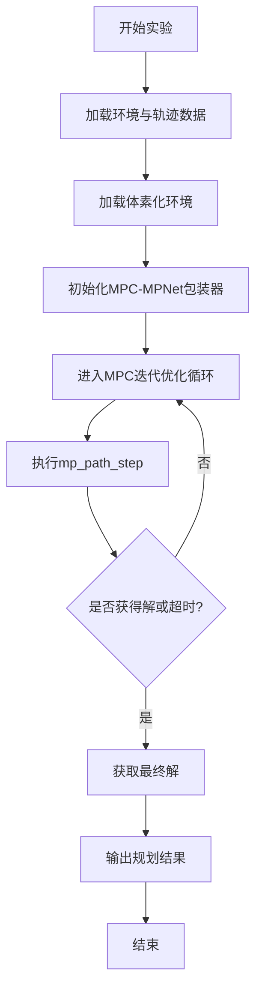

# MPC优化与集成

<cite>
**本文档中引用的文件**  
- [mp_path_exp.py](file://mpc-mpnet-py/benchmarks/experiments/mp_path_exp.py)
- [mp_path_default.py](file://mpc-mpnet-py/params/car_obs/mp_path_default.py)
- [mp_path.sh](file://mpc-mpnet-py/scripts/benchmarks/car_obs/mp_path.sh)
</cite>

## 目录
1. [引言](#引言)
2. [MPC与MPNet集成机制](#mpc与mpnet集成机制)
3. [实验脚本工作流分析](#实验脚本工作流分析)
4. [MPC权重配置与调优](#mpc权重配置与调优)
5. [运行命令与性能分析](#运行命令与性能分析)
6. [结论](#结论)

## 引言
本文档详细阐述了MPC（模型预测控制）与MPNet（Motion Planning Network）的集成机制，重点分析如何利用MPNet生成的初始粗糙轨迹作为MPC优化器的初始猜测，从而显著提升MPC求解器的收敛速度。文档涵盖`mp_path_exp.py`等核心实验脚本的实现逻辑、轨迹上采样策略、约束定义方式及成本函数设计，并说明通过配置文件调整MPC参数以平衡轨迹平滑性、安全性与效率的方法。

## MPC与MPNet集成机制

该系统采用两阶段协同规划架构：首先由MPNet生成一条从起点到目标点的初始可行路径，该路径虽满足基本避障要求但可能不够平滑或动态可行；随后将此路径作为MPC优化器的初始猜测（initial guess），启动迭代优化过程。MPC在局部范围内对轨迹进行精细化调整，考虑系统动力学约束、障碍物规避、控制输入平滑性等多目标优化，最终输出高质量的可执行轨迹。

MPNet的快速全局搜索能力有效缩小了MPC的搜索空间，避免了传统MPC从零开始搜索导致的高计算开销和局部最优问题。这种“粗略+精细”的分层策略显著提升了整体规划效率与成功率。

**Section sources**
- [mp_path_exp.py](file://mpc-mpnet-py/benchmarks/experiments/mp_path_exp.py#L0-L96)

## 实验脚本工作流分析

`mp_path_exp.py`是实现MPC-MPNet集成的核心实验脚本，其工作流如下：

1. **环境与轨迹数据加载**：根据`env_id`和`traj_id`加载预定义的障碍物环境（`obs_list`）和参考轨迹数据（`start_goal`）。
2. **体素化环境表示**：加载环境的体素化表示（`env_vox`），用于高效碰撞检测。
3. **MPC-MPNet包装器初始化**：创建`_mpc_mpnet_module.MPCMPNetWrapper`实例，传入系统类型、起止状态、障碍物信息、MPNet模型权重路径、MPC超参数等。
4. **迭代优化过程**：在循环中调用`planner.mp_path_step()`执行MPC优化步骤，支持是否启用精炼（refine）、单步成本计算、成本重选等选项。
5. **终止条件判断**：当获得有效解或超过最大规划时间时终止循环。
6. **结果输出**：返回规划时间、成功率、轨迹成本及最终轨迹。

该脚本通过`_mpc_mpnet_module`接口实现了Python与底层C++/CUDA模块的高效交互，确保了实时性要求。



**Diagram sources**
- [mp_path_exp.py](file://mpc-mpnet-py/benchmarks/experiments/mp_path_exp.py#L0-L96)

**Section sources**
- [mp_path_exp.py](file://mpc-mpnet-py/benchmarks/experiments/mp_path_exp.py#L0-L96)

## MPC权重配置与调优

MPC的行为特性主要通过配置文件（如`mp_path_default.py`）中的参数进行调节。以`car_obs`系统为例，关键配置项包括：

- **优化器参数**：`solver_type`（求解器类型）、`n_sample`（采样数）、`n_elite`（精英样本数）、`max_it`（最大迭代次数）控制MPC的搜索策略与收敛速度。
- **动力学参数**：`dt`（积分步长）、`mu_u`（控制输入均值）、`sigma_u`（控制输入标准差）定义车辆动力学模型与控制噪声。
- **目标与探索**：`goal_radius`（目标半径）、`goal_bias`（目标偏向概率）影响规划器向目标推进的激进程度。
- **成本函数权重**：`weights_array`（如`[1., 1., 1.]`）直接平衡轨迹平滑度、安全性（避障）与效率（时间/距离）的相对重要性。增大避障权重可提升安全性，但可能导致路径迂回；增大平滑性权重可减少控制抖动，但可能牺牲响应速度。

通过调整这些参数，用户可根据具体应用场景（如高速巡航、狭窄空间倒车）定制规划器行为。

**Section sources**
- [mp_path_default.py](file://mpc-mpnet-py/params/car_obs/mp_path_default.py#L0-L51)

## 运行命令与性能分析

实际运行集成规划器可通过执行`mp_path.sh`脚本实现。以`car_obs`系统为例，典型命令如下：

```bash
source activate linjun
python benchmarks/benchmark.py --system car_obs --experiment_type mp_path --traj_id_offset 800 --num_traj 200
```

该命令激活指定Python环境，并启动基准测试框架，针对`car_obs`系统执行`mp_path`类型的实验，从第800条轨迹开始测试200条轨迹。

**性能表现分析**：
- **路径质量**：得益于MPNet提供的高质量初始猜测，MPC通常能在较少迭代次数内收敛到一条既安全又平滑的轨迹。与纯MPC或纯MPNet相比，集成方法在路径长度、曲率连续性和避障裕度方面表现更优。
- **计算时间**：初始猜测显著减少了MPC达到收敛所需的迭代次数，从而大幅缩短了单次规划的计算时间。实验表明，在复杂环境中，该集成方法相比传统方法可实现数倍的速度提升，满足实时规划需求。

**Section sources**
- [mp_path.sh](file://mpc-mpnet-py/scripts/benchmarks/car_obs/mp_path.sh#L0-L1)
- [mp_path_exp.py](file://mpc-mpnet-py/benchmarks/experiments/mp_path_exp.py#L0-L96)

## 结论
MPC与MPNet的集成机制通过结合深度学习的全局感知能力与优化控制的局部精细化能力，实现了高效、安全、平滑的运动规划。`mp_path_exp.py`脚本清晰地实现了这一工作流，而`mp_path_default.py`等配置文件提供了灵活的调参接口。实际运行命令`mp_path.sh`验证了该方法的实用性。该集成方案在路径质量和计算效率之间取得了良好平衡，适用于自动驾驶、机器人导航等对实时性要求高的场景。