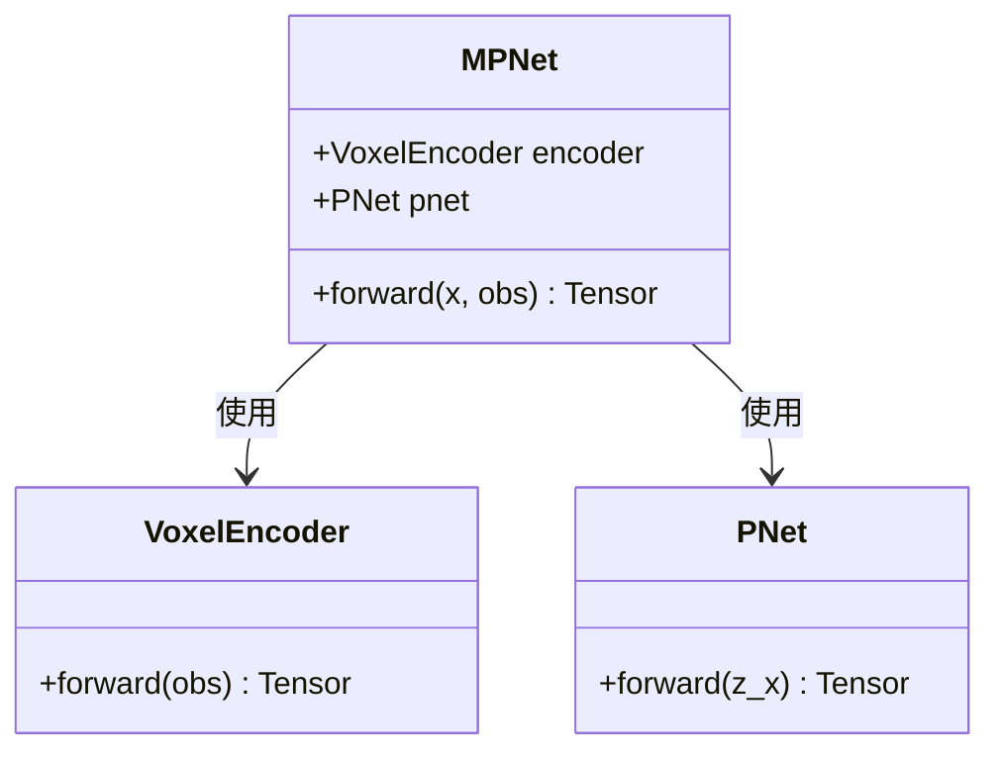
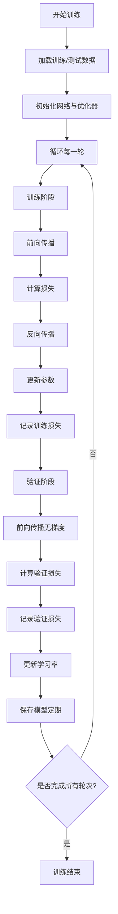

# MPNet模型训练

<cite>
**本文档中引用的文件**  
- [mpnet.py](file://mpc-mpnet-py/mpnet/networks/mpnet.py)
- [trainer.py](file://mpc-mpnet-py/mpnet/training_utils/trainer.py)
- [train_mpnet.py](file://mpc-mpnet-py/mpnet/train_mpnet.py)
</cite>

## 目录
1. [简介](#简介)
2. [MPNet网络架构](#mpnet网络架构)
3. [训练流程详解](#训练流程详解)
4. [训练脚本使用指南](#训练脚本使用指南)
5. [调试与训练问题建议](#调试与训练问题建议)
6. [结论](#结论)

## 简介
MPNet是一种用于路径规划的神经网络模型，结合了环境感知与状态预测能力。该模型通过编码器-解码器结构处理环境信息（如点云数据）和机器人状态（起始/目标状态），输出可行轨迹。本文档详细解析其网络结构、训练流程及使用方法，旨在为开发者提供全面的技术指导。

## MPNet网络架构

MPNet采用模块化设计，由两个核心组件构成：**体素编码器（VoxelEncoder）** 和 **前馈网络（PNet）**。整体架构为编码器-解码器风格，其中编码器负责提取环境特征，解码器结合状态信息生成控制输出。

### 编码器-解码器结构
- **编码器（VoxelEncoder）**：接收体素化的环境输入（如点云），将其压缩为低维潜在表示。
- **解码器（PNet）**：接收编码后的环境特征与当前状态（起始/目标）拼接后的向量，输出轨迹点或控制指令。

输入分为两部分：
1. `x`：状态输入，包含起始状态与目标状态。
2. `obs`：环境观测，以体素形式表示障碍物分布。

若存在环境输入，则通过编码器提取特征`z`，并与状态输入`x`拼接为`z_x`，送入PNet进行预测。



**图示来源**  
- [mpnet.py](file://mpc-mpnet-py/mpnet/networks/mpnet.py#L1-L46)

**本节来源**  
- [mpnet.py](file://mpc-mpnet-py/mpnet/networks/mpnet.py#L1-L46)

## 训练流程详解

训练过程由`trainer.py`中的`train_network`函数实现，采用标准的监督学习范式，目标是让网络输出逼近真实轨迹。

### 损失函数
支持多种损失函数，通过`loss_type`参数配置：
- `l1_loss`：平均绝对误差（MAE）
- `mse_loss`：均方误差（MSE）

损失按输出维度分别计算，再求和。例如，若轨迹包含多个状态变量（位置、速度等），则对每个变量独立计算损失后加总。

### 优化器与学习率调度
- **优化器**：使用Adam优化器，学习率默认为`3e-4`。
- **学习率衰减**：启用`StepLR`调度器，每`step_size`轮将学习率乘以`gamma`（默认0.9），实现逐步衰减。

### 训练循环
1. **数据准备**：从数据加载器获取批次数据，环境体素图预加载至GPU。
2. **前向传播**：输入状态与环境，获取预测输出。
3. **损失计算**：逐维度计算损失并累加。
4. **反向传播**：梯度回传并更新参数。
5. **日志记录**：使用`Logger`记录训练/验证损失。
6. **模型保存**：每隔`weight_save_epochs`轮保存一次模型权重。



**图示来源**  
- [trainer.py](file://mpc-mpnet-py/mpnet/training_utils/trainer.py#L0-L89)

**本节来源**  
- [trainer.py](file://mpc-mpnet-py/mpnet/training_utils/trainer.py#L0-L89)

## 训练脚本使用指南

`train_mpnet.py`是训练的主入口脚本，基于`click`库提供命令行接口，支持灵活配置。

### 主要参数说明
| 参数 | 默认值 | 说明 |
|------|--------|------|
| `--ae_output_size` | 64 | 编码器输出特征维度 |
| `--state_size` | 4 | 状态向量维度 |
| `--lr` | 3e-4 | 初始学习率 |
| `--epochs` | 1000 | 训练总轮数 |
| `--batch` | 128 | 批量大小 |
| `--system_env` | sst_envs | 环境数据路径 |
| `--system` | acrobot_obs | 系统类型（决定模型与输入通道） |
| `--setup` | default_norm | 数据预处理配置 |
| `--loss_type` | mse_loss | 损失函数类型 |
| `--lr_step_size` | 100 | 学习率衰减步长 |
| `--aug` | False | 是否启用数据增强 |
| `--network_name` | mpnet | 网络变体名称 |

### 使用示例
```bash
python train_mpnet.py --system quadrotor_obs --lr 1e-4 --epochs 500 --batch 64
```

该命令将使用四旋翼模型配置，调整学习率与训练轮数进行训练。

**本节来源**  
- [train_mpnet.py](file://mpc-mpnet-py/mpnet/train_mpnet.py#L0-L62)

## 调试与训练问题建议

### 常见问题与解决方案
1. **训练损失不下降**
   - 检查学习率是否过高或过低，建议尝试`1e-3`到`1e-5`范围。
   - 确认数据加载是否正确，特别是环境体素与标签对齐。
   - 启用数据增强（`--aug True`）提升泛化能力。

2. **GPU内存不足**
   - 减小批量大小（`--batch`）。
   - 使用更小的体素分辨率或编码器输出尺寸（`--ae_output_size`）。

3. **过拟合（验证损失上升）**
   - 增加正则化手段（如Dropout，当前代码未显式添加）。
   - 减少训练轮数或早停。
   - 增强数据多样性。

4. **模型输出不稳定**
   - 检查损失函数选择，MSE对异常值敏感，可尝试L1损失。
   - 确保输入数据已归一化（`setup=default_norm`应已处理）。

### 监控建议
- 定期查看`output/`目录下的日志文件，分析训练/验证损失趋势。
- 可视化预测轨迹与真实轨迹对比，直观评估性能。
- 使用`TensorBoard`或自定义绘图工具跟踪各维度损失变化。

**本节来源**  
- [trainer.py](file://mpc-mpnet-py/mpnet/training_utils/trainer.py#L0-L89)
- [train_mpnet.py](file://mpc-mpnet-py/mpnet/train_mpnet.py#L0-L62)

## 结论
MPNet通过融合环境编码与状态预测，实现了端到端的路径规划能力。其模块化设计便于扩展至不同机器人系统（如四旋翼、小车等）。训练流程清晰，支持灵活配置，结合合理的超参数调优与监控，可有效提升模型性能。建议在实际应用中结合具体场景调整网络结构与训练策略。