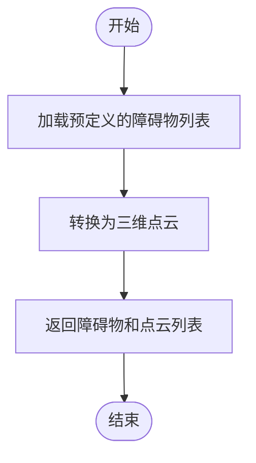
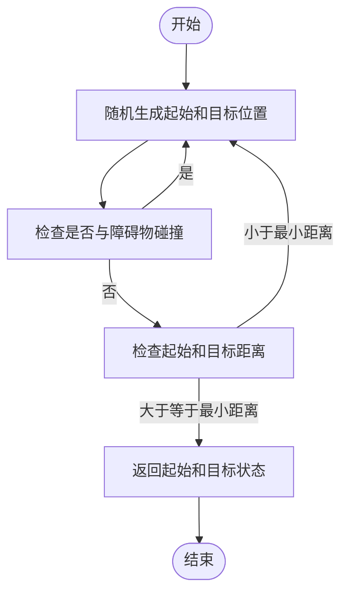
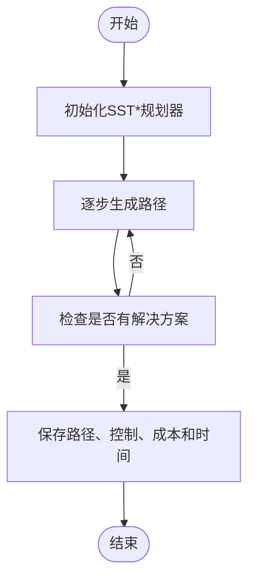
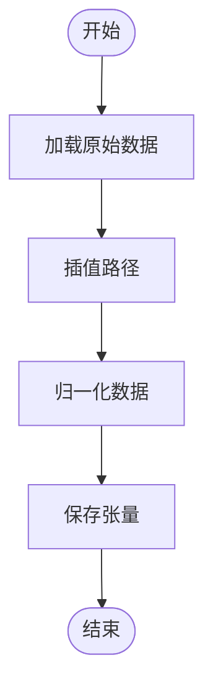
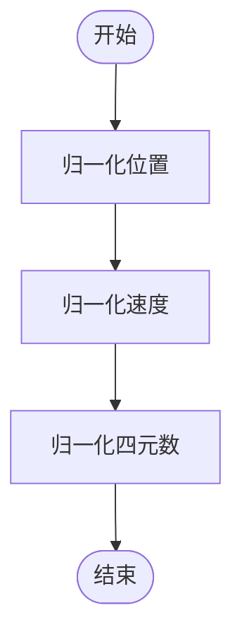

# 数据生成与处理

<cite>
**本文档中引用的文件**  
- [data_generation.py](file://mpc-mpnet-py/data_gen/data_generation.py)
- [quadrotor_obs_gen.py](file://mpc-mpnet-py/data_gen/quadrotor_obs_gen.py)
- [quadrotor_sg_gen.py](file://mpc-mpnet-py/data_gen/quadrotor_sg_gen.py)
- [process_data.py](file://mpc-mpnet-py/mpnet/sst_envs/process_data.py)
- [obs_3d.py](file://mpc-mpnet-py/mpnet/sst_envs/obs_3d.py)
- [utils.py](file://mpc-mpnet-py/mpnet/sst_envs/utils.py)
- [quadrotor.py](file://mpc-mpnet-py/mpnet/sst_envs/systems/quadrotor.py)
</cite>

## 目录
1. [简介](#简介)
2. [数据生成流程](#数据生成流程)
3. [核心组件分析](#核心组件分析)
4. [数据预处理与格式化](#数据预处理与格式化)
5. [数据质量与模型性能](#数据质量与模型性能)
6. [配置与运行脚本](#配置与运行脚本)
7. [结论](#结论)

## 简介
本文档详细阐述了mpc-mpnet-py数据生成系统的工作机制，重点介绍`data_generation.py`和`quadrotor_obs_gen.py`如何协同工作，为训练MPNet模型生成大规模的轨迹-环境配对数据集。文档将深入解析数据生成的各个阶段，包括障碍物环境的随机化、起始和目标状态的采样、以及使用SST*等采样算法生成最优轨迹。此外，还将详细说明数据预处理和格式化过程，特别是`process_data.py`如何将原始数据转换为适合神经网络训练的张量。

## 数据生成流程

### 障碍物环境随机化
在`quadrotor_obs_gen.py`中，`obs_gen`函数负责生成障碍物环境。该函数使用预定义的`obs_list`，其中包含多个障碍物的位置信息。通过调用`rectangle_pcd_3d`函数，将这些位置信息转换为三维点云，从而构建出复杂的障碍物环境。



**Diagram sources**
- [quadrotor_obs_gen.py](file://mpc-mpnet-py/data_gen/quadrotor_obs_gen.py#L10-L30)

**Section sources**
- [quadrotor_obs_gen.py](file://mpc-mpnet-py/data_gen/quadrotor_obs_gen.py#L10-L30)

### 起始和目标状态采样
`quadrotor_sg_gen.py`中的`start_goal_gen`函数负责生成起始和目标状态。该函数首先随机生成起始和目标位置，然后检查这些位置是否在障碍物之外，并确保起始和目标之间的距离大于最小距离。如果满足条件，则返回起始和目标状态。



**Diagram sources**
- [quadrotor_sg_gen.py](file://mpc-mpnet-py/data_gen/quadrotor_sg_gen.py#L30-L65)

**Section sources**
- [quadrotor_sg_gen.py](file://mpc-mpnet-py/data_gen/quadrotor_sg_gen.py#L30-L65)

### 使用SST*生成最优轨迹
`data_generation.py`中的`plan_one_path_sst`函数使用SST*算法生成最优轨迹。该函数首先初始化SST*规划器，然后在指定的最大迭代次数内逐步生成路径。如果在规定时间内找到解决方案，则保存路径、控制、成本和时间信息。



**Diagram sources**
- [data_generation.py](file://mpc-mpnet-py/data_gen/data_generation.py#L50-L100)

**Section sources**
- [data_generation.py](file://mpc-mpnet-py/data_gen/data_generation.py#L50-L100)

## 核心组件分析

### `data_generation.py`
`data_generation.py`是数据生成的核心脚本，负责协调整个数据生成过程。它通过调用`quadrotor_obs_gen.py`和`quadrotor_sg_gen.py`来生成障碍物环境和起始目标状态，并使用SST*算法生成最优轨迹。

**Section sources**
- [data_generation.py](file://mpc-mpnet-py/data_gen/data_generation.py#L1-L213)

### `quadrotor_obs_gen.py`
`quadrotor_obs_gen.py`负责生成障碍物环境。它通过预定义的`obs_list`和`rectangle_pcd_3d`函数生成三维点云，为后续的路径规划提供环境信息。

**Section sources**
- [quadrotor_obs_gen.py](file://mpc-mpnet-py/data_gen/quadrotor_obs_gen.py#L1-L161)

### `quadrotor_sg_gen.py`
`quadrotor_sg_gen.py`负责生成起始和目标状态。它通过随机采样和碰撞检测确保生成的状态是有效的，并且满足距离要求。

**Section sources**
- [quadrotor_sg_gen.py](file://mpc-mpnet-py/data_gen/quadrotor_sg_gen.py#L1-L65)

## 数据预处理与格式化

### `process_data.py`
`process_data.py`负责将原始数据转换为适合神经网络训练的张量。该脚本通过`path_to_tensor_forward`函数将路径、控制、成本等信息转换为张量，并进行归一化处理。



**Diagram sources**
- [process_data.py](file://mpc-mpnet-py/mpnet/sst_envs/process_data.py#L100-L255)

**Section sources**
- [process_data.py](file://mpc-mpnet-py/mpnet/sst_envs/process_data.py#L100-L255)

### 数据归一化
`process_data.py`中的`path_to_tensor_forward`函数对数据进行归一化处理，确保不同维度的数据具有相同的尺度。对于`quadrotor_obs`系统，数据被归一化到特定的范围内。



**Diagram sources**
- [process_data.py](file://mpc-mpnet-py/mpnet/sst_envs/process_data.py#L150-L200)

**Section sources**
- [process_data.py](file://mpc-mpnet-py/mpnet/sst_envs/process_data.py#L150-L200)

## 数据质量与模型性能
高质量的数据对模型性能至关重要。通过确保障碍物环境的多样性和起始目标状态的有效性，可以提高模型的泛化能力。此外，使用SST*算法生成的最优轨迹能够提供高质量的训练样本，从而提升模型的性能。

## 配置与运行脚本
### 配置参数
`data_generation.py`中的`params`字典定义了SST*算法的参数，包括积分步长、随机种子、目标半径等。这些参数可以根据具体需求进行调整。

```python
params = {
    "integration_step": 2e-3,
    "random_seed": 0,
    "goal_radius": 2,
    "sst_delta_near": 0.5,
    "sst_delta_drain": 0.1,
    "width": 1,        
    "min_time_steps": 50,
    "max_time_steps": 500,
    "number_of_iterations": 600000}
```

### 运行脚本
可以通过命令行参数运行`data_generation.py`脚本，例如：

```bash
python data_generation.py --env_name quadrotor_obs --N 1 --NP 2 --max_iter 2000000 --path_folder ./trajectories/quadrotor_obs/
```

**Section sources**
- [data_generation.py](file://mpc-mpnet-py/data_gen/data_generation.py#L1-L213)

## 结论
本文档详细介绍了mpc-mpnet-py数据生成系统的各个组件和流程。通过`data_generation.py`、`quadrotor_obs_gen.py`和`quadrotor_sg_gen.py`的协同工作，系统能够生成高质量的轨迹-环境配对数据集。`process_data.py`则负责将这些原始数据转换为适合神经网络训练的张量。高质量的数据生成和预处理是确保模型性能的关键。