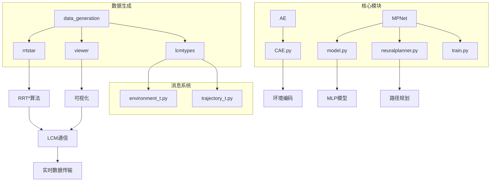
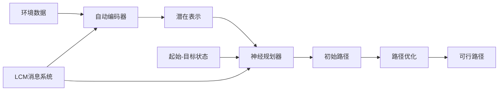
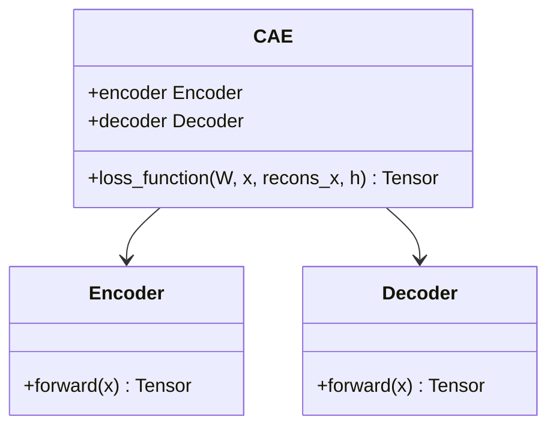
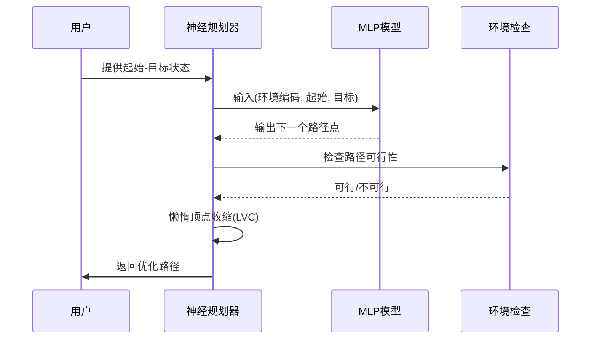
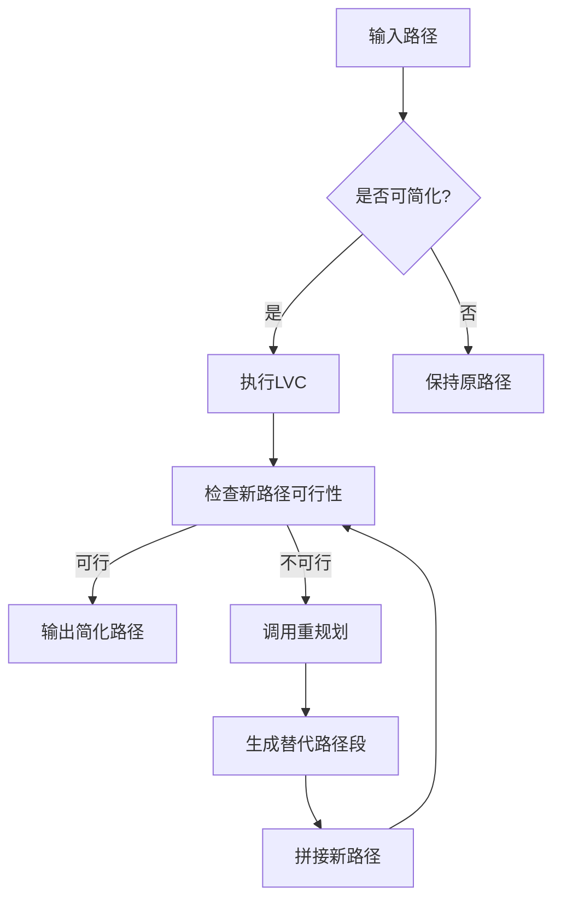
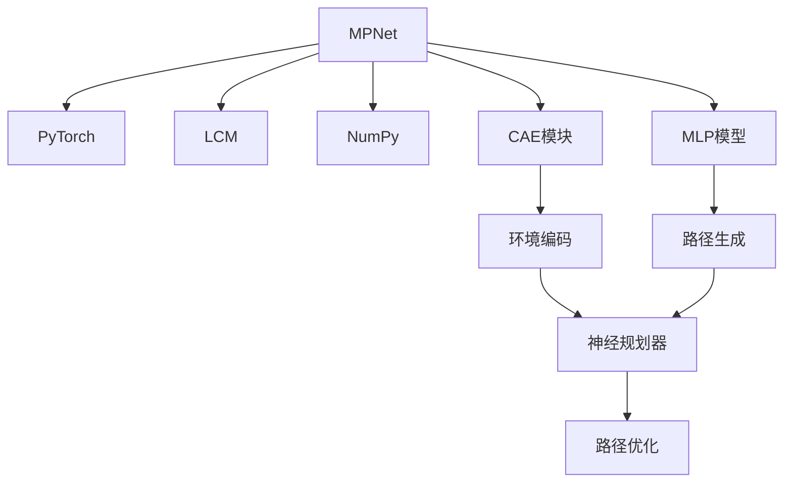

# MPNet运动规划器

<cite>
**本文档中引用的文件**  
- [model.py](file://MPNet/MPNet/model.py)
- [neuralplanner.py](file://MPNet/MPNet/neuralplanner.py)
- [CAE.py](file://MPNet/MPNet/AE/CAE.py)
- [environment_t.py](file://MPNet/data_generation/lcmtypes/lcmtypes/python/lcmtypes/environment_t.py)
- [trajectory_t.py](file://MPNet/data_generation/lcmtypes/lcmtypes/python/lcmtypes/trajectory_t.py)
</cite>

## 目录
1. [简介](#简介)
2. [项目结构](#项目结构)
3. [核心组件](#核心组件)
4. [架构概述](#架构概述)
5. [详细组件分析](#详细组件分析)
6. [依赖分析](#依赖分析)
7. [性能考量](#性能考量)
8. [故障排除指南](#故障排除指南)
9. [结论](#结论)

## 简介
MPNet（Motion Planning Networks）是一种基于深度学习的运动规划器，结合了自动编码器（Autoencoder）和神经网络规划器（Neural Planner）的优势，用于在复杂环境中高效生成可行路径。该系统通过学习环境和轨迹的潜在表示，实现对高维状态空间和复杂约束的有效处理。MPNet利用LCM（Lightweight Communications and Marshalling）消息系统支持实时通信，适用于静态和动态障碍物场景。本文档深入探讨其架构设计、神经规划原理、代码实现及性能表现，并与传统基于采样的规划器进行对比。

## 项目结构
MPNet项目包含多个关键模块，主要分为数据生成、自动编码器训练、神经规划器实现和可视化工具。核心代码位于`MPNet/MPNet`目录下，包括模型定义、规划算法和训练脚本。数据生成部分使用C++实现经典规划算法（如RRT*），并通过LCM协议传输路径和环境信息。Python部分负责模型训练和路径规划任务。

**图示来源**  
- [CAE.py](file://MPNet/MPNet/AE/CAE.py#L1-L125)
- [model.py](file://MPNet/MPNet/model.py#L1-L31)
- [neuralplanner.py](file://MPNet/MPNet/neuralplanner.py#L1-L392)
- [environment_t.py](file://MPNet/data_generation/lcmtypes/lcmtypes/python/lcmtypes/environment_t.py#L1-L75)
- [trajectory_t.py](file://MPNet/data_generation/lcmtypes/lcmtypes/python/lcmtypes/trajectory_t.py#L1-L67)

## 核心组件
MPNet的核心组件包括自动编码器（AE）、多层感知机（MLP）模型和神经规划器（Neural Planner）。AE模块用于学习环境的潜在表示，MLP模型作为路径生成器，神经规划器则整合环境信息和目标状态，生成可行路径。这些组件协同工作，实现了高效、鲁棒的运动规划。

**节来源**  
- [model.py](file://MPNet/MPNet/model.py#L1-L31)
- [neuralplanner.py](file://MPNet/MPNet/neuralplanner.py#L1-L392)
- [CAE.py](file://MPNet/MPNet/AE/CAE.py#L1-L125)

## 架构概述
MPNet的架构分为三个主要阶段：环境编码、路径生成和路径优化。首先，自动编码器将高维环境信息压缩为低维潜在表示；其次，神经规划器利用该表示和起始-目标状态生成初始路径；最后，通过懒惰顶点收缩（LVC）等技术优化路径，确保其可行性。

**图示来源**  
- [CAE.py](file://MPNet/MPNet/AE/CAE.py#L1-L125)
- [neuralplanner.py](file://MPNet/MPNet/neuralplanner.py#L1-L392)

## 详细组件分析

### 自动编码器（AE）分析
自动编码器模块负责将复杂的环境信息（如障碍物位置）编码为低维潜在空间表示。该模块由编码器和解码器组成，通过无监督学习训练，最小化重构误差和收缩损失，确保潜在表示的鲁棒性和泛化能力。

**图示来源**  
- [CAE.py](file://MPNet/MPNet/AE/CAE.py#L1-L125)

### 神经规划器分析
神经规划器是MPNet的核心，利用训练好的MLP模型生成路径。它接收环境的潜在表示、起始状态和目标状态作为输入，输出路径点序列。规划过程采用双向生成策略，逐步逼近目标，并通过可行性检查和重规划机制确保路径质量。

**图示来源**  
- [neuralplanner.py](file://MPNet/MPNet/neuralplanner.py#L1-L392)
- [model.py](file://MPNet/MPNet/model.py#L1-L31)

### 路径优化分析
路径优化模块通过懒惰顶点收缩（LVC）和重规划策略提高路径质量。LVC通过尝试直接连接非相邻路径点来简化路径，而重规划则在路径不可行时调用MLP模型生成替代路径段。

**图示来源**  
- [neuralplanner.py](file://MPNet/MPNet/neuralplanner.py#L1-L392)

**节来源**  
- [neuralplanner.py](file://MPNet/MPNet/neuralplanner.py#L1-L392)

## 依赖分析
MPNet依赖于多个外部库和内部模块。主要依赖包括PyTorch用于深度学习模型训练，LCM用于进程间通信，以及NumPy用于数值计算。内部模块间通过明确定义的接口进行交互，确保系统的模块化和可维护性。

**图示来源**  
- [neuralplanner.py](file://MPNet/MPNet/neuralplanner.py#L1-L392)
- [CAE.py](file://MPNet/MPNet/AE/CAE.py#L1-L125)

**节来源**  
- [neuralplanner.py](file://MPNet/MPNet/neuralplanner.py#L1-L392)
- [CAE.py](file://MPNet/MPNet/AE/CAE.py#L1-L125)

## 性能考量
MPNet在处理高维状态空间和复杂约束方面表现出色，尤其在静态和动态障碍物场景中。与传统基于采样的规划器相比，MPNet能够更快地生成高质量路径，且在未见环境中具有良好的泛化能力。然而，其性能依赖于训练数据的质量和数量，且在极端复杂环境中可能需要额外的优化策略。

## 故障排除指南
常见问题包括模型加载失败、路径不可行和通信中断。解决方案包括检查模型文件路径、验证环境数据格式和确保LCM网络正常运行。调试时可启用详细日志记录，逐步验证各模块的输出。

**节来源**  
- [neuralplanner.py](file://MPNet/MPNet/neuralplanner.py#L1-L392)
- [CAE.py](file://MPNet/MPNet/AE/CAE.py#L1-L125)

## 结论
MPNet通过结合深度学习和经典规划算法，实现了高效、鲁棒的运动规划。其基于自动编码器的架构设计有效处理了高维状态空间和复杂约束，而神经规划器则利用潜在表示快速生成可行路径。系统在lcmtypes消息系统支持下具备实时通信能力，适用于多种应用场景。未来工作可进一步优化模型结构，提高在极端复杂环境中的性能。