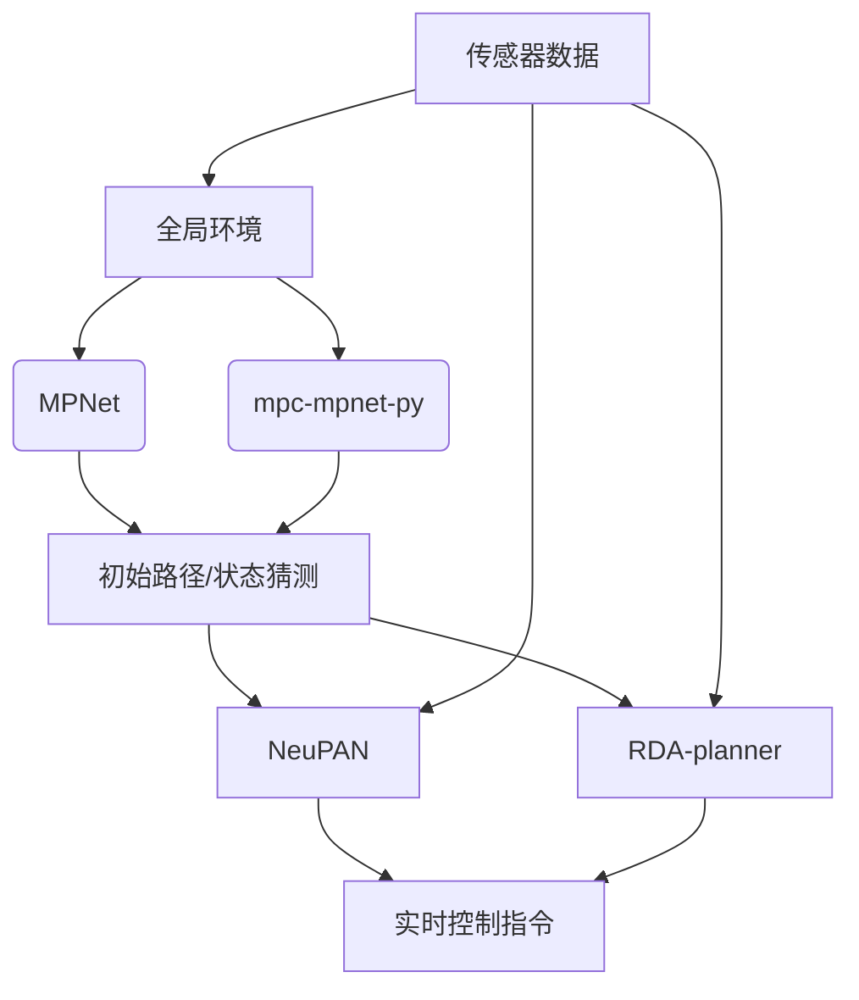

# 学习型规划方法

<cite>
**本文档中引用的文件**  
- [mpnet.py](file://mpc-mpnet-py/mpnet/networks/mpnet.py)
- [voxel_encoder.py](file://mpc-mpnet-py/mpnet/networks/voxel_encoder.py)
- [CAE.py](file://MPNet/MPNet/AE/CAE.py)
- [neuralplanner.py](file://MPNet/MPNet/neuralplanner.py)
- [mpc.py](file://RDA-planner/RDA_planner/mpc.py)
- [rda_solver.py](file://RDA-planner/RDA_planner/rda_solver.py)
- [neupan.py](file://NeuPAN/neupan/neupan.py)
- [nrmp.py](file://NeuPAN/neupan/blocks/nrmp.py)
- [obs_point_net.py](file://NeuPAN/neupan/blocks/obs_point_net.py)
- [dune.py](file://NeuPAN/neupan/blocks/dune.py)
- [initial_path.py](file://NeuPAN/neupan/blocks/initial_path.py)
- [README.md](file://mpc-mpnet-py/README.md)
- [README.md](file://MPNet/README.md)
- [README.md](file://NeuPAN/README.md)
- [README.md](file://RDA-planner/README.md)
</cite>

## 目录
1. [引言](#引言)
2. [mpc-mpnet-py 模块技术解析](#mpc-mpnet-py-模块技术解析)
3. [MPNet 模块技术解析](#mpnet-模块技术解析)
4. [适应性与泛化能力分析](#适应性与泛化能力分析)
5. [与NeuPAN和RDA-planner的集成关系](#与neupan和rda-planner的集成关系)
6. [网络架构与训练流程](#网络架构与训练流程)
7. [性能评估指标](#性能评估指标)
8. [结论](#结论)

## 引言
学习型规划方法通过结合深度学习与传统运动规划算法，实现了在复杂、动态和未知环境中的高效路径生成。本文重点介绍两个核心子模块：**mpc-mpnet-py** 和 **MPNet**，它们分别代表了模型预测控制（MPC）与神经网络融合的端到端学习范式，以及基于自动编码器的运动规划框架。这些方法不仅提升了规划速度和路径质量，还增强了对不同机器人平台的适应性和对未知环境的探索能力。此外，本文还将阐述它们如何与 **NeuPAN** 和 **RDA-planner** 等先进优化框架互补集成，构建更强大的自主导航系统。

## mpc-mpnet-py 模块技术解析
mpc-mpnet-py 是一种将模型预测控制（MPC）与深度神经网络相结合的端到端学习型运动规划方法。该方法的核心思想是利用神经网络学习从环境状态到最优控制动作的映射，同时嵌入MPC框架以确保满足动力学约束和实时优化。

该模块包含两种主要变体：**MPC-MPNet-Path** 和 **MPC-MPNet-Tree**。前者通过学习从当前状态和目标状态到路径的映射，实现快速路径生成；后者则学习整个搜索树的结构，以支持更复杂的规划场景。其工作流程通常包括：首先使用经典规划器（如RRT*）生成大量状态-目标对及其对应的可行路径作为训练数据；然后训练一个神经网络模型，该模型能够以当前状态、目标状态和环境障碍物信息为输入，直接输出未来一段时间内的控制序列或状态轨迹。

在实现上，mpc-mpnet-py 采用了一个双分支网络架构：一个分支处理由体素网格表示的障碍物环境，另一个分支处理状态-目标对。障碍物分支通常由卷积神经网络（CNN）构成，用于提取环境的高层次特征；状态-目标分支则与编码后的环境特征拼接，共同输入到一个多层感知机（MLP）中，最终输出规划结果。

**模块特点**：
- 实现了端到端的学习，减少了传统规划中多个模块串联带来的误差累积。
- 结合了MPC的实时优化能力和神经网络的快速推理能力。
- 支持多种机器人系统，如Acrobot、Cart-pole、Car和Quadrotor。

**Section sources**
- [mpnet.py](file://mpc-mpnet-py/mpnet/networks/mpnet.py#L1-L47)
- [voxel_encoder.py](file://mpc-mpnet-py/mpnet/networks/voxel_encoder.py#L1-L31)
- [README.md](file://mpc-mpnet-py/README.md#L0-L46)

## MPNet 模块技术解析
MPNet（Motion Planning Networks）是一种利用自动编码器进行运动规划的深度学习方法。其核心是通过一个编码器-解码器结构，将高维的障碍物点云数据压缩到一个低维的潜在空间，并在该空间中学习从起始状态到目标状态的路径生成。

MPNet 的架构主要包括三个部分：**障碍物编码器（Obstacle Encoder）**、**路径规划网络（Path Planning Network）** 和 **解码器（Decoder）**。障碍物编码器通常是一个卷积自编码器（CAE），它将原始的障碍物点云或体素网格编码为一个固定长度的特征向量。路径规划网络则接收起始状态、目标状态和编码后的环境特征作为输入，输出一条从起始点到目标点的初始路径。最后，解码器或后续的优化模块会对这条初始路径进行精细化调整，确保其满足机器人的动力学约束并完全避开障碍物。

MPNet 的训练过程分为两个阶段：首先，使用无监督学习在大量随机生成的环境中训练障碍物编码器，使其能够学习到环境的通用特征表示；然后，使用监督学习，基于由经典规划器生成的“专家路径”数据集，训练整个路径规划网络，使其能够生成高质量的初始路径。

**模块特点**：
- 利用自动编码器实现了对复杂环境的有效特征提取和降维。
- 生成的初始路径可以作为下游优化器（如MPC）的良好起点，显著加速收敛过程。
- 具备良好的泛化能力，能够处理训练集中未见过的环境布局。

**Section sources**
- [CAE.py](file://MPNet/MPNet/AE/CAE.py)
- [neuralplanner.py](file://MPNet/MPNet/neuralplanner.py)
- [README.md](file://MPNet/README.md#L0-L105)

## 适应性与泛化能力分析
mpc-mpnet-py 和 MPNet 两个模块均展现出卓越的适应性和泛化能力，能够有效应对不同机器人平台和未知环境的挑战。

**对不同机器人平台的适应性**：这两个模块的设计具有高度的通用性。mpc-mpnet-py 通过在训练数据中包含多种机器人系统（如car、quadrotor等）的动力学模型，使得其神经网络能够学习到特定于平台的运动模式。MPNet 同样可以通过调整其路径规划网络的输出维度和损失函数，来适应差速驱动、阿克曼转向或全向移动等多种机器人类型。这种灵活性使得开发者可以相对容易地将这些方法迁移到新的机器人硬件上。

**对未知环境的探索能力**：泛化能力是这两个模块的核心优势。mpc-mpnet-py 的障碍物编码器经过在大量随机环境中训练，能够识别和理解各种障碍物配置的模式，从而在面对全新的、未见过的环境时，依然能够做出合理的规划决策。MPNet 的自动编码器同样具备强大的特征提取能力，能够将新环境映射到已学习的潜在空间中，并基于此生成可行的路径。项目文档中明确提到了“seen test dataset”和“unseen test dataset”的划分，这表明其评估流程专门设计来验证模型在未知环境中的表现。

**路径生成能力**：两者都能生成平滑、安全且接近最优的路径。mpc-mpnet-py 由于集成了MPC，其生成的路径天然满足动力学约束，更适合实时控制。MPNet 生成的初始路径虽然可能需要后处理，但其作为“智能猜测”极大地减少了传统规划器的搜索空间，从而实现了快速路径生成。

**Section sources**
- [README.md](file://mpc-mpnet-py/README.md#L0-L46)
- [README.md](file://MPNet/README.md#L0-L105)

## 与NeuPAN和RDA-planner的集成关系
mpc-mpnet-py 和 MPNet 与 **NeuPAN** 和 **RDA-planner** 构成了一个互补的、分层的运动规划生态系统。

**与NeuPAN的互补关系**：NeuPAN 是一个端到端的、基于模型的优化规划器，它直接将障碍物点映射到控制动作，强调实时性和高精度。而 mpc-mpnet-py 和 MPNet 可以为 NeuPAN 提供强大的“先验知识”或“初始猜测”。例如，MPNet 可以生成一个全局的初始路径，这个路径可以作为 NeuPAN 中 `initial_path` 模块的输入。NeuPAN 的文档中提到了 `set_initial_path` 函数，这为集成学习生成的路径提供了明确的接口。通过这种方式，学习模块负责快速生成宏观策略，而优化模块负责精细的、安全的局部执行，实现了“规划”与“控制”的高效协同。

**与RDA-planner的集成方式**：RDA-planner 是一个基于ADMM（交替方向乘子法）的高性能MPC规划器，擅长处理包含任意凸形状的复杂碰撞规避问题。mpc-mpnet-py 的核心思想与 RDA-planner 高度一致，都是基于MPC框架。它们的集成可以是“热启动”（hot-starting）的方式：mpc-mpnet-py 的神经网络可以作为 RDA-planner 的 warm-start 初始化器，为其提供一个非常接近最优解的初始轨迹，从而极大地加速 RDA-planner 内部优化求解器的收敛速度，满足更高频率的实时控制需求。

**Diagram sources**
- [neupan.py](file://NeuPAN/neupan/neupan.py)
- [rda_solver.py](file://RDA-planner/RDA_planner/rda_solver.py)
- [neuralplanner.py](file://MPNet/MPNet/neuralplanner.py)
- [mpnet.py](file://mpc-mpnet-py/mpnet/networks/mpnet.py)

**Section sources**
- [neupan.py](file://NeuPAN/neupan/neupan.py)
- [nrmp.py](file://NeuPAN/neupan/blocks/nrmp.py)
- [obs_point_net.py](file://NeuPAN/neupan/blocks/obs_point_net.py)
- [dune.py](file://NeuPAN/neupan/blocks/dune.py)
- [initial_path.py](file://NeuPAN/neupan/blocks/initial_path.py)
- [mpc.py](file://RDA-planner/RDA_planner/mpc.py)
- [rda_solver.py](file://RDA-planner/RDA_planner/rda_solver.py)

## 网络架构与训练流程
本节详细说明 mpc-mpnet-py 和 MPNet 的网络架构设计及训练数据生成流程。

**mpc-mpnet-py 网络架构**：
- **障碍物编码器 (VoxelEncoder)**：采用卷积神经网络处理2D体素网格。包含两个卷积层（Conv2D）和最大池化层（MaxPool2D），用于提取空间特征，最后通过全连接层（Linear）将特征展平并映射到固定维度的潜在向量。
- **主规划网络 (PNet)**：一个多层感知机（MLP），接收拼接后的潜在向量和状态-目标对作为输入，输出预测的控制序列或状态轨迹。
- **整体模型 (MPNet)**：将编码器和PNet串联，形成一个完整的端到端模型。

**MPNet 网络架构**：
- **障碍物编码器 (CAE)**：一个卷积自编码器，由编码器和解码器组成，用于学习障碍物点云的低维表示。
- **路径规划网络**：一个深度神经网络，输入为编码后的环境特征、起始状态和目标状态，输出为一条从起始点到目标点的路径点序列。

**训练数据生成**：
- **mpc-mpnet-py**：使用 `data_gen` 目录下的脚本（如 `quadrotor_obs_gen.py`）生成包含障碍物配置和状态-目标对的数据集。经典规划器（如RRT*）用于生成“专家路径”作为监督信号。
- **MPNet**：在 `data_generation` 目录中，通过组合预定义的障碍物位置和尺寸，生成大量不同的环境。然后使用RRT*等算法在这些环境中生成路径数据，构成训练集。

**Section sources**
- [mpnet.py](file://mpc-mpnet-py/mpnet/networks/mpnet.py#L1-L47)
- [voxel_encoder.py](file://mpc-mpnet-py/mpnet/networks/voxel_encoder.py#L1-L31)
- [CAE.py](file://MPNet/MPNet/AE/CAE.py)

## 性能评估指标
对学习型规划方法的性能评估通常采用以下指标：
- **规划成功率 (Success Rate)**：在规定时间内成功到达目标的次数占总尝试次数的比例。
- **路径长度 (Path Length)**：生成路径的总长度，越短越好。
- **规划时间 (Planning Time)**：从接收规划请求到输出路径所需的时间，反映算法的实时性。
- **平滑度 (Smoothness)**：通过计算路径曲率或加速度的积分来衡量，值越小表示路径越平滑。
- **与最优路径的偏差 (Suboptimality)**：生成路径长度与已知最优路径长度的比值。
- **碰撞次数 (Collision Count)**：在执行过程中与障碍物发生碰撞的次数。

这些指标在 `mpc-mpnet-py` 的 `benchmark.py` 和各类 `exp.py` 脚本中被用于量化比较 MPC-MPNet 与其他基线方法（如SST）的性能。

**Section sources**
- [benchmark.py](file://mpc-mpnet-py/benchmarks/benchmark.py)
- [mp_path_exp.py](file://mpc-mpnet-py/benchmarks/experiments/mp_path_exp.py)

## 结论
mpc-mpnet-py 和 MPNet 代表了学习型运动规划的前沿方向。mpc-mpnet-py 通过将MPC与神经网络深度融合，实现了满足动力学约束的端到端快速规划。MPNet 则利用自动编码器的强大表征能力，为复杂环境下的路径生成提供了高效的初始解。两者都具备出色的适应性和泛化能力，能够服务于多种机器人平台并处理未知环境。更重要的是，它们并非孤立的解决方案，而是可以与 NeuPAN 和 RDA-planner 等先进的优化规划器紧密集成，形成“学习提供先验，优化保证安全”的协同架构，为构建高效、鲁棒的自主机器人系统提供了坚实的技术基础。