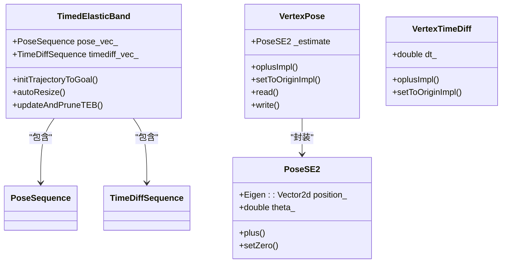
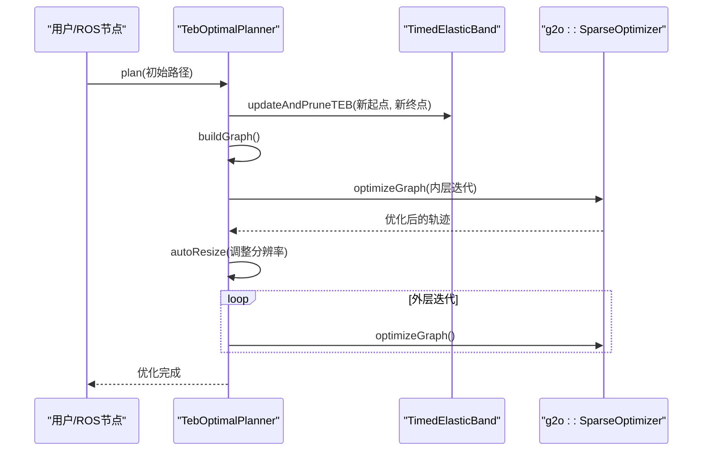

# 时序弹性带局部规划器

<cite>
**本文档引用的文件**   
- [timed_elastic_band.h](file://teb_local_planner/include/teb_local_planner/timed_elastic_band.h)
- [optimal_planner.h](file://teb_local_planner/include/teb_local_planner/optimal_planner.h)
- [TebLocalPlannerReconfigure.cfg](file://teb_local_planner/cfg/TebLocalPlannerReconfigure.cfg)
- [teb_config.h](file://teb_local_planner/include/teb_local_planner/teb_config.h)
- [vertex_pose.h](file://teb_local_planner/include/teb_local_planner/g2o_types/vertex_pose.h)
</cite>

## 目录
1. [简介](#简介)
2. [核心组件](#核心组件)
3. [轨迹建模与优化](#轨迹建模与优化)
4. [动态障碍物处理](#动态障碍物处理)
5. [参数调优策略](#参数调优策略)
6. [与全局规划器的协同](#与全局规划器的协同)
7. [结论](#结论)

## 简介
时序弹性带（Timed Elastic Band, TEB）局部规划器是一种基于优化的实时路径规划方法，广泛应用于机器人导航系统中。该规划器将机器人的运动轨迹建模为一条具有时间弹性的“带子”，通过在非线性优化框架下最小化包含障碍物避让、动力学约束和路径跟随等目标的代价函数，生成平滑且可行的轨迹。TEB规划器的核心思想是将轨迹离散化为一系列空间位姿点和时间间隔，并利用图优化技术（如G2O）对这些变量进行联合优化。其优势在于能够同时处理几何路径、速度规划和动力学约束，适用于差速驱动、阿克曼转向等多种机器人类型。此外，TEB还支持动态障碍物预测、旋转方向偏好以及多同伦类路径探索，使其在复杂动态环境中表现出色。

## 核心组件

时序弹性带局部规划器由多个核心组件构成，主要包括轨迹表示、优化求解器、障碍物处理、速度规划和参数配置等模块。其中，`TimedElasticBand`类负责轨迹的初始化、更新和管理，`TebOptimalPlanner`类实现基于G2O的非线性优化过程，`TebConfig`类管理所有可调参数，而`TebLocalPlannerReconfigure.cfg`文件则定义了可通过动态重配置接口调整的参数集合。这些组件协同工作，确保规划器能够在满足机器人动力学约束的前提下，实时生成安全、高效的局部轨迹。

**本文档引用的文件**   
- [timed_elastic_band.h](file://teb_local_planner/include/teb_local_planner/timed_elastic_band.h)
- [optimal_planner.h](file://teb_local_planner/include/teb_local_planner/optimal_planner.h)
- [TebLocalPlannerReconfigure.cfg](file://teb_local_planner/cfg/TebLocalPlannerReconfigure.cfg)
- [teb_config.h](file://teb_local_planner/include/teb_local_planner/teb_config.h)

## 轨迹建模与优化

### 数学模型与优化变量

时序弹性带规划器将轨迹建模为一个由位姿点和时间间隔组成的序列。具体而言，轨迹的空间部分由一系列位姿点 $ Q = \{ \mathbf{s}_i \}_{i=0...n} $ 表示，其中每个位姿 $ \mathbf{s}_i = [x_i, y_i, \beta_i]^T \in \mathbb{R}^2 \times S^1 $ 描述了机器人在二维平面上的位置和朝向。时间部分则由 $ n-1 $ 个时间差 $ \tau = \{ \Delta T_i \}_{i=0...n-1} $ 构成，表示机器人从一个位姿移动到下一个位姿所需的时间。

在实现上，`TimedElasticBand` 类通过两个容器 `PoseSequence` 和 `TimeDiffSequence` 分别存储这些位姿和时间差。每个位姿和时间差都被封装为G2O框架中的优化顶点（`VertexPose` 和 `VertexTimeDiff`），从而可以作为优化变量参与非线性优化过程。`VertexPose` 类继承自 `g2o::BaseVertex<3, PoseSE2>`，其估计值 `_estimate` 是一个 `PoseSE2` 类型的对象，包含位置向量和航向角。该类重写了 `oplusImpl` 方法，确保航向角在更新后能被正确归一化到 $[- \pi, \pi]$ 区间内。

**图源**
- [timed_elastic_band.h](file://teb_local_planner/include/teb_local_planner/timed_elastic_band.h)
- [vertex_pose.h](file://teb_local_planner/include/teb_local_planner/g2o_types/vertex_pose.h)

### 非线性优化实现

`TebOptimalPlanner` 类是TEB规划器的核心，负责构建和求解优化问题。它使用G2O（General Graph Optimization）框架来实现非线性优化。优化问题被建模为一个超图，其中顶点是轨迹的位姿和时间差，边则代表各种约束和代价函数。

优化过程主要由 `optimizeTEB` 方法驱动，该方法包含内外两层循环：
- **外层循环**：调用 `autoResize` 方法根据参考时间分辨率自动调整轨迹的采样密度。如果时间差过大，则插入新的位姿-时间对；如果时间差过小，则删除冗余的点。这有助于保持轨迹的时空分辨率合理，避免数值不稳定。
- **内层循环**：调用 `optimizeGraph` 方法，使用稀疏Levenberg-Marquardt算法对图进行优化。每次内层循环执行指定次数的迭代（由 `no_inner_iterations` 参数控制）。

优化图的构建由 `buildGraph` 方法完成，该方法依次添加各种类型的边（即代价函数）：
- **速度约束**：`AddEdgesVelocity` 添加速度限制边，确保轨迹速度不超过 `max_vel_x` 和 `max_vel_theta`。
- **加速度约束**：`AddEdgesAcceleration` 添加加速度限制边，防止机器人加速度超过 `acc_lim_x` 和 `acc_lim_theta`。
- **时间最优**：`AddEdgesTimeOptimal` 添加时间最优边，通过最小化时间差的平方和来缩短总运动时间。
- **障碍物避让**：`AddEdgesObstacles` 添加障碍物边，对靠近障碍物的位姿施加惩罚，其强度由 `weight_obstacle` 控制。
- **路径跟随**：`AddEdgesShortestPath` 添加最短路径边，鼓励轨迹尽可能接近全局路径。
- **运动学约束**：`AddEdgesKinematicsDiffDrive` 或 `AddEdgesKinematicsCarlike` 添加非完整约束边，确保轨迹符合差速驱动或阿克曼转向机器人的运动学模型。

**图源**
- [optimal_planner.h](file://teb_local_planner/include/teb_local_planner/optimal_planner.h)
- [timed_elastic_band.h](file://teb_local_planner/include/teb_local_planner/timed_elastic_band.h)

## 动态障碍物处理

TEB规划器能够有效处理动态障碍物，其核心在于对动态障碍物的运动进行预测，并在优化过程中考虑其未来位置。当 `include_dynamic_obstacles` 参数被启用时，规划器会假设动态障碍物以恒定速度运动，并基于其当前状态预测其在未来时间点的位置。

在优化图中，`AddEdgesDynamicObstacles` 方法会为每个轨迹点添加与预测的动态障碍物位置相关的边（`EdgeDynamicObstacle`）。这些边的代价函数会随着轨迹点与预测障碍物位置的距离减小而急剧增加，从而迫使优化器生成一条能够避开未来障碍物路径的轨迹。动态障碍物的缓冲区由 `dynamic_obstacle_inflation_dist` 参数定义，其优化权重由 `weight_dynamic_obstacle` 控制。

此外，为了减少计算量，规划器采用了一种高效的障碍物关联策略。对于每个轨迹点，只考虑其周围一定范围内的“相关”障碍物，该范围由 `obstacle_association_force_inclusion_factor` 和 `obstacle_association_cutoff_factor` 共同决定。这种策略避免了为每个轨迹点检查所有障碍物，显著提升了计算效率。

## 参数调优策略

TEB规划器的性能高度依赖于其参数配置。以下是一些关键参数的调优策略：

### 速度与加速度参数
- **`max_vel_x` / `max_vel_theta`**：这些参数应根据机器人的物理能力设置。过高的值可能导致轨迹不可行，过低的值则会限制机器人的运动效率。建议从机器人规格书中获取最大速度和角速度，并在此基础上留有一定余量。
- **`acc_lim_x` / `acc_lim_theta`**：这些参数决定了轨迹的平滑度。较高的加速度限制允许更急的加速和转弯，但可能导致机器人打滑或不稳定。通常，这些值应略低于机器人实际能达到的最大加速度。

### 障碍物相关参数
- **`min_obstacle_dist`**：这是机器人与障碍物之间的最小安全距离。该值应大于机器人的物理半径，并考虑传感器噪声和定位误差。一般设置为机器人半径的1.2-1.5倍。
- **`weight_obstacle`**：这是避障代价的权重。增加此权重会使轨迹更远离障碍物，但可能导致路径过长或陷入局部最优。建议从默认值50开始，根据避障效果进行微调。
- **`obstacle_cost_exponent`**：当此值大于1时，避障代价变为非线性（如平方），使得轨迹在接近障碍物时受到更强的惩罚，从而产生更安全的轨迹。

### 优化参数
- **`no_inner_iterations` / `no_outer_iterations`**：这两个参数控制优化的迭代次数。增加迭代次数可以提高轨迹质量，但会增加计算时间。通常，4-6次外层迭代和5次内层迭代是一个良好的平衡点。
- **`weight_adapt_factor`**：这是一个重要的自适应策略。在每次外层迭代中，避障权重会乘以该因子（默认为2.0），从而在优化后期逐步增加避障的重要性。这有助于避免早期陷入局部最优，同时在后期确保轨迹安全。

## 与全局规划器的协同

TEB局部规划器作为导航栈的局部规划器，与全局规划器（如`hybrid_astar_planner`）紧密协作。全局规划器负责生成从起点到目标点的全局路径，而TEB局部规划器则负责在当前局部窗口内，基于全局路径生成一条实时、平滑且安全的可执行轨迹。

这种协同工作模式通常如下：
1.  **路径获取**：TEB规划器从全局规划器获取一段局部路径（通常是机器人当前位置前方一定距离内的路径点）。
2.  **轨迹初始化**：`TebOptimalPlanner::plan` 方法使用这段局部路径来初始化 `TimedElasticBand`。如果存在之前的优化结果，规划器会尝试进行“热启动”（hot-starting），即在旧轨迹的基础上进行更新和剪枝，而不是完全重新初始化，这大大提高了计算效率。
3.  **轨迹优化**：规划器结合当前的障碍物信息、机器人状态和全局路径，运行优化循环，生成一条新的局部轨迹。
4.  **速度命令生成**：优化完成后，`getVelocityCommand` 方法会从优化后的轨迹中提取出下一个控制周期的速度命令（线速度和角速度），并发送给底层控制器。

通过这种方式，TEB规划器能够紧密跟踪全局路径，同时灵活地避开局部障碍物和处理动态环境变化，实现了全局最优性与局部实时性的完美结合。

## 结论
时序弹性带局部规划器是一种功能强大且高度可配置的基于优化的路径规划方法。它通过将轨迹建模为时空弹性带，并利用G2O框架进行非线性优化，能够生成满足动力学约束、有效避障且时间最优的平滑轨迹。其对动态障碍物的预测能力、灵活的参数调优机制以及与全局规划器的高效协同，使其成为复杂动态环境中机器人导航的理想选择。深入理解其数学模型、优化实现和参数意义，对于成功部署和调优该规划器至关重要。