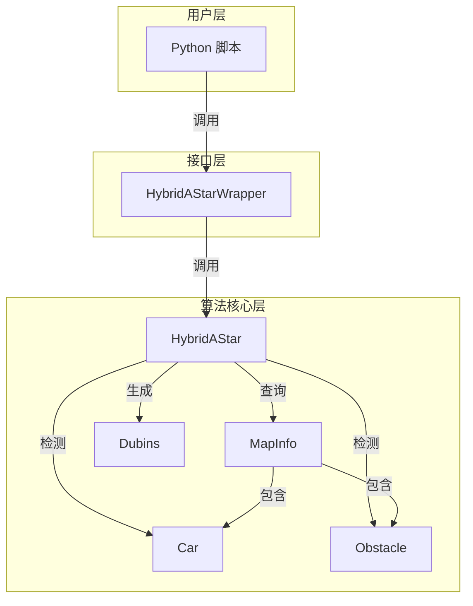
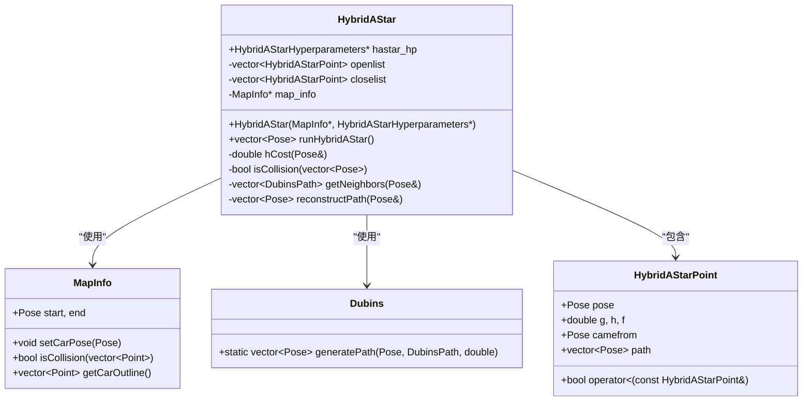
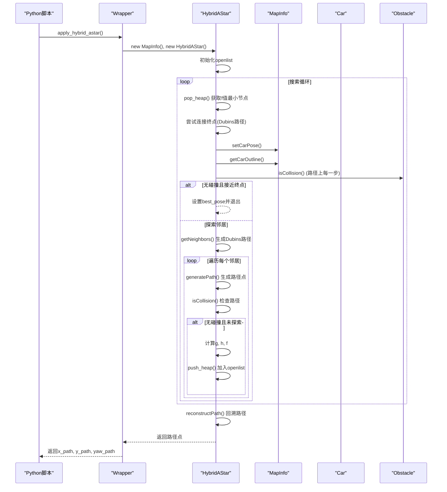
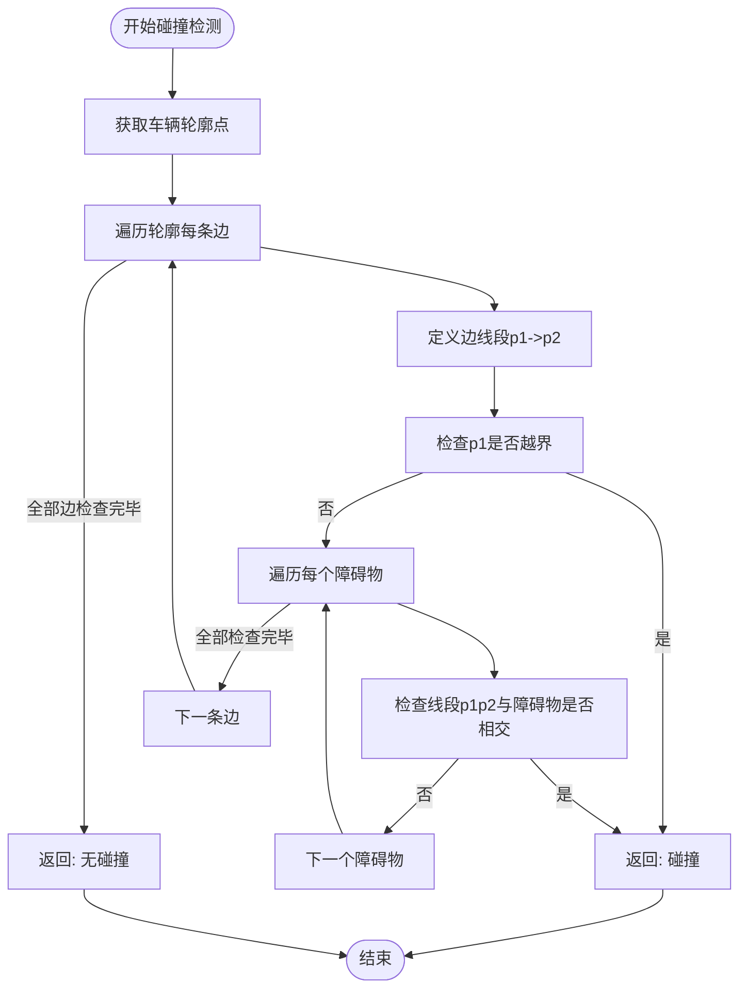
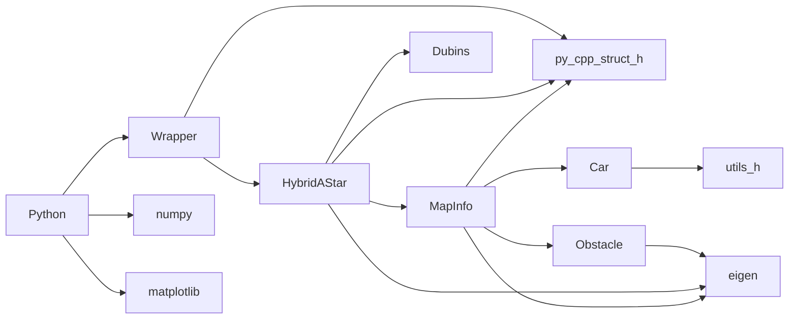

# 混合A*规划器

<cite>
**本文档中引用的文件**  
- [hybrid_astar.py](file://hybrid_astar_planner/HybridAStar/hybrid_astar.py)
- [hybrid_astar_wrapper.py](file://hybrid_astar_planner/HybridAStar/hybrid_astar_wrapper.py)
- [py_cpp_struct.py](file://hybrid_astar_planner/HybridAStar/py_cpp_struct.py)
- [HybridAStarWrapper.cpp](file://hybrid_astar_planner/src/HybridAStarWrapper.cpp)
- [HybridAStar.cpp](file://hybrid_astar_planner/src/HybridAStar.cpp)
- [HybridAStar.h](file://hybrid_astar_planner/include/HybridAStar.h)
- [MapInfo.cpp](file://hybrid_astar_planner/src/MapInfo.cpp)
- [MapInfo.h](file://hybrid_astar_planner/include/MapInfo.h)
- [Car.cpp](file://hybrid_astar_planner/src/Car.cpp)
- [Car.h](file://hybrid_astar_planner/include/Car.h)
- [Obstacle.cpp](file://hybrid_astar_planner/src/Obstacle.cpp)
- [Obstacle.h](file://hybrid_astar_planner/include/Obstacle.h)
- [Dubins.cpp](file://hybrid_astar_planner/src/Dubins.cpp)
- [Dubins.h](file://hybrid_astar_planner/include/Dubins.h)
- [constants.h](file://hybrid_astar_planner/include/constants.h)
- [utils.h](file://hybrid_astar_planner/include/utils.h)
</cite>

## 目录
1. [简介](#简介)
2. [项目结构](#项目结构)
3. [核心组件](#核心组件)
4. [架构概述](#架构概述)
5. [详细组件分析](#详细组件分析)
6. [依赖分析](#依赖分析)
7. [性能考量](#性能考量)
8. [故障排除指南](#故障排除指南)
9. [结论](#结论)

## 简介
混合A*（Hybrid A*）规划器是一种专为非完整约束车辆（如汽车）设计的全局路径规划算法。它结合了传统A*搜索的高效性与Reeds-Shepp或Dubins曲线对车辆运动学的精确建模，能够在考虑车辆转向半径和最小转弯能力的前提下，搜索出一条从起点到终点的可行、平滑且安全的路径。本技术文档深入剖析了该规划器的Python与C++混合实现，详细解释了其核心算法逻辑、关键数据结构、状态离散化策略、启发式函数设计、碰撞检测机制以及混合架构的性能优势。文档还提供了参数调优指南和在复杂场景下的应用实例，旨在为开发者和研究人员提供一份全面、深入的参考。

## 项目结构
混合A*规划器的项目结构清晰地分为Python接口层、C++核心算法层和共享数据结构层。Python部分主要负责提供用户友好的调试脚本和与外部系统的接口，而计算密集型的核心搜索算法则由C++实现以保证性能。`HybridAStar`目录包含Python脚本，`include`和`src`目录分别存放C++头文件和源文件，`py_cpp_struct.py`和`py_cpp_struct.h`则定义了Python与C++之间共享的数据结构，通过Cython或类似技术实现高效的数据交换。

```mermaid
graph TD
subgraph "Python 接口层"
A[hybrid_astar.py] --> B[hybrid_astar_wrapper.py]
B --> C[py_cpp_struct.py]
end
subgraph "C++ 核心层"
D[HybridAStarWrapper.cpp] --> E[HybridAStar.cpp]
E --> F[MapInfo.cpp]
E --> G[Dubins.cpp]
E --> H[Car.cpp]
E --> I[Obstacle.cpp]
D --> J[py_cpp_struct.h]
E --> K[HybridAStar.h]
F --> L[MapInfo.h]
G --> M[Dubins.h]
H --> N[Car.h]
I --> O[Obstacle.h]
end
C < --> J
B --> D
```

**图示来源**
- [hybrid_astar.py](file://hybrid_astar_planner/HybridAStar/hybrid_astar.py)
- [hybrid_astar_wrapper.py](file://hybrid_astar_planner/HybridAStar/hybrid_astar_wrapper.py)
- [py_cpp_struct.py](file://hybrid_astar_planner/HybridAStar/py_cpp_struct.py)
- [HybridAStarWrapper.cpp](file://hybrid_astar_planner/src/HybridAStarWrapper.cpp)
- [HybridAStar.cpp](file://hybrid_astar_planner/src/HybridAStar.cpp)
- [MapInfo.cpp](file://hybrid_astar_planner/src/MapInfo.cpp)
- [Dubins.cpp](file://hybrid_astar_planner/src/Dubins.cpp)
- [Car.cpp](file://hybrid_astar_planner/src/Car.cpp)
- [Obstacle.cpp](file://hybrid_astar_planner/src/Obstacle.cpp)

**节来源**
- [hybrid_astar.py](file://hybrid_astar_planner/HybridAStar/hybrid_astar.py)
- [HybridAStarWrapper.cpp](file://hybrid_astar_planner/src/HybridAStarWrapper.cpp)

## 核心组件
本规划器的核心组件包括：`HybridAStar`类，负责执行混合A*搜索算法；`MapInfo`类，管理地图信息、障碍物和车辆模型；`Car`类，定义车辆的几何尺寸和姿态；`Obstacle`类，表示矩形障碍物并提供碰撞检测；`Dubins`类，生成满足车辆运动学约束的路径段。这些组件协同工作，`HybridAStar`利用`MapInfo`提供的环境信息，通过`Dubins`生成邻居节点，并使用`Car`和`Obstacle`进行碰撞检测，最终构建出一条安全的路径。

**节来源**
- [HybridAStar.h](file://hybrid_astar_planner/include/HybridAStar.h#L1-L38)
- [MapInfo.h](file://hybrid_astar_planner/include/MapInfo.h#L1-L39)
- [Car.h](file://hybrid_astar_planner/include/Car.h#L1-L25)
- [Obstacle.h](file://hybrid_astar_planner/include/Obstacle.h#L1-L19)
- [Dubins.h](file://hybrid_astar_planner/include/Dubins.h)

## 架构概述
该混合A*规划器采用分层架构。顶层是Python脚本，用于配置初始条件和超参数，并调用底层C++函数。中间层是C++的`HybridAStarWrapper`，它作为Python和C++核心算法之间的桥梁，负责解析来自Python的数据结构，并调用`HybridAStar`的主函数。底层是`HybridAStar`及其依赖的`MapInfo`、`Car`、`Obstacle`和`Dubins`等类，它们共同实现了完整的路径搜索逻辑。这种架构充分利用了Python的开发便捷性和C++的运行效率。



**图示来源**
- [hybrid_astar.py](file://hybrid_astar_planner/HybridAStar/hybrid_astar.py)
- [HybridAStarWrapper.cpp](file://hybrid_astar_planner/src/HybridAStarWrapper.cpp)
- [HybridAStar.h](file://hybrid_astar_planner/include/HybridAStar.h)
- [MapInfo.h](file://hybrid_astar_planner/include/MapInfo.h)

## 详细组件分析

### HybridAStar 类分析
`HybridAStar`类是整个算法的核心，它继承了A*算法的框架，但将状态空间扩展为包含位置(x, y)和航向角(yaw)的三维空间，并使用Dubins路径作为状态转移。

#### 类图


**图示来源**
- [HybridAStar.h](file://hybrid_astar_planner/include/HybridAStar.h#L1-L38)
- [HybridAStar.cpp](file://hybrid_astar_planner/src/HybridAStar.cpp#L1-L171)
- [MapInfo.h](file://hybrid_astar_planner/include/MapInfo.h#L1-L39)

#### 搜索流程序列图


**图示来源**
- [HybridAStarWrapper.cpp](file://hybrid_astar_planner/src/HybridAStarWrapper.cpp#L1-L33)
- [HybridAStar.cpp](file://hybrid_astar_planner/src/HybridAStar.cpp#L1-L171)
- [MapInfo.cpp](file://hybrid_astar_planner/src/MapInfo.cpp#L1-L110)

**节来源**
- [HybridAStar.cpp](file://hybrid_astar_planner/src/HybridAStar.cpp#L1-L171)
- [HybridAStar.h](file://hybrid_astar_planner/include/HybridAStar.h#L1-L38)

### MapInfo 与碰撞检测分析
`MapInfo`类负责管理地图的全局信息，包括起点、终点、障碍物列表和车辆模型。它通过`isCollision`方法进行碰撞检测，该方法将车辆的轮廓（由`Car`类的`getOutline`方法提供）与所有障碍物进行线段相交检测。

#### 碰撞检测流程图


**图示来源**
- [MapInfo.cpp](file://hybrid_astar_planner/src/MapInfo.cpp#L1-L110)
- [Car.cpp](file://hybrid_astar_planner/src/Car.cpp#L1-L54)
- [Obstacle.cpp](file://hybrid_astar_planner/src/Obstacle.cpp)

**节来源**
- [MapInfo.cpp](file://hybrid_astar_planner/src/MapInfo.cpp#L1-L110)
- [Car.cpp](file://hybrid_astar_planner/src/Car.cpp#L1-L54)

## 依赖分析
该项目的依赖关系清晰。C++核心算法层（`HybridAStar`, `MapInfo`等）依赖于Eigen库进行线性代数运算，并通过`py_cpp_struct.h`与Python层交换数据。Python层依赖于NumPy进行数组操作和Matplotlib进行可视化。`HybridAStar`类直接依赖`MapInfo`来获取环境信息，依赖`Dubins`来生成路径段。`MapInfo`类依赖`Car`和`Obstacle`类来完成碰撞检测。没有发现循环依赖，模块化程度高。



**图示来源**
- [CMakeLists.txt](file://hybrid_astar_planner/CMakeLists.txt)
- [HybridAStarWrapper.cpp](file://hybrid_astar_planner/src/HybridAStarWrapper.cpp#L1-L33)
- [HybridAStar.h](file://hybrid_astar_planner/include/HybridAStar.h#L1-L38)
- [MapInfo.h](file://hybrid_astar_planner/include/MapInfo.h#L1-L39)

**节来源**
- [CMakeLists.txt](file://hybrid_astar_planner/CMakeLists.txt)

## 性能考量
混合A*规划器的计算复杂度主要取决于搜索空间的大小和障碍物的密度。其时间复杂度近似于O(n log n)，其中n是探索的状态节点数，主要由优先队列（堆）操作决定。空间复杂度为O(n)，用于存储openlist和closelist。性能瓶颈通常在于碰撞检测，因为`isCollision`方法需要对路径上的每一个离散点都进行车辆轮廓与所有障碍物的相交检测。通过调整`step_size`和`rad_step`等超参数，可以在路径质量和计算时间之间进行权衡。C++的实现显著提升了计算速度，使其能够满足实时规划的需求。

## 故障排除指南
当规划器失败时，应首先检查初始条件和超参数配置。常见问题包括：
- **路径未找到**：检查起点和终点是否被障碍物包围，或`max_iterations`设置过小。尝试增大`lane_width`或减小`obstacle_clearance`。
- **路径不平滑或不符合运动学**：检查`radius`（最小转弯半径）是否设置正确，`step_size`是否过大。过大的`step_size`会导致路径离散化严重。
- **计算时间过长**：检查`rad_step`是否过小，这会生成过多的邻居节点。尝试增大`rad_step`或减小`max_iterations`。同时检查障碍物数量，过多的障碍物会显著增加碰撞检测开销。
- **C++编译错误**：确保已正确安装Eigen库，并在`CMakeLists.txt`中正确配置了包含路径。

**节来源**
- [hybrid_astar.py](file://hybrid_astar_planner/HybridAStar/hybrid_astar.py#L1-L101)
- [HybridAStar.cpp](file://hybrid_astar_planner/src/HybridAStar.cpp#L1-L171)
- [MapInfo.cpp](file://hybrid_astar_planner/src/MapInfo.cpp#L1-L110)

## 结论
混合A*规划器通过巧妙地结合A*搜索框架与Dubins曲线（或Reeds-Shepp曲线）的运动学模型，为非完整约束车辆提供了一种高效的全局路径规划解决方案。其Python与C++的混合架构既保证了开发的灵活性，又确保了运行时的高性能。通过对状态空间的合理离散化、高效的启发式函数设计以及精确的碰撞检测，该规划器能够在复杂环境中生成安全、可行的路径。通过合理调优超参数，可以适应从停车场泊车到狭窄通道通行等多种应用场景，为`teb_local_planner`等局部规划器提供高质量的初始路径。未来的工作可以集中在优化启发式函数、引入更复杂的车辆模型以及处理动态障碍物等方面。