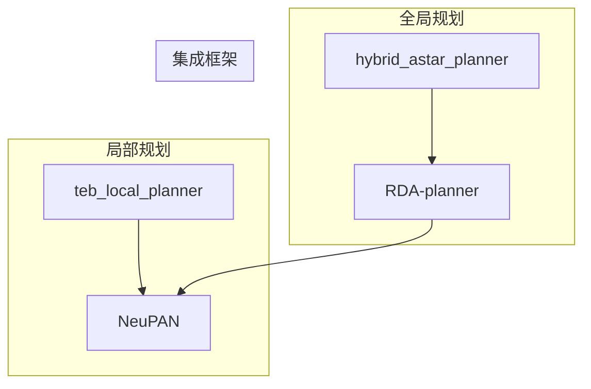
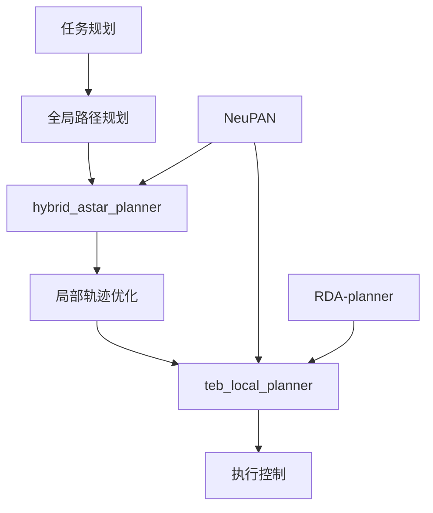
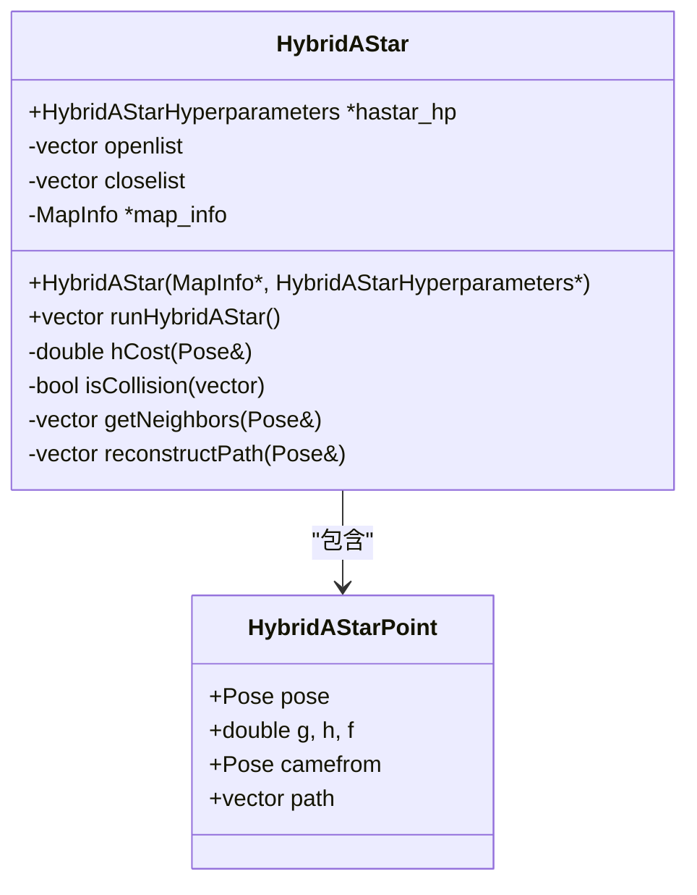
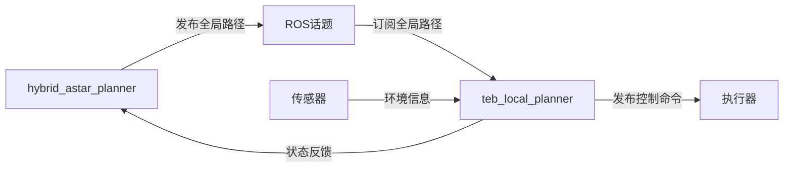
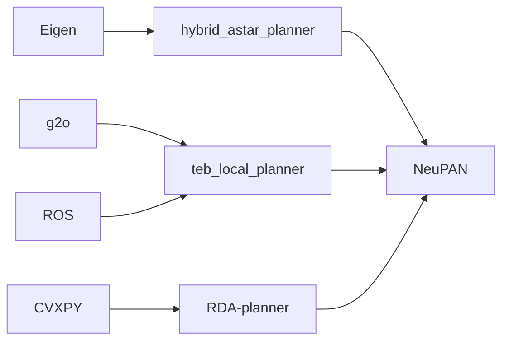

# 经典路径规划

<cite>
**本文档引用的文件**
- [hybrid_astar.py](file://hybrid_astar_planner/HybridAStar/hybrid_astar.py)
- [hybrid_astar_wrapper.py](file://hybrid_astar_planner/HybridAStar/hybrid_astar_wrapper.py)
- [HybridAStar.h](file://hybrid_astar_planner/include/HybridAStar.h)
- [HybridAStar.cpp](file://hybrid_astar_planner/src/HybridAStar.cpp)
- [teb_local_planner_ros.h](file://teb_local_planner/include/teb_local_planner/teb_local_planner_ros.h)
- [teb_local_planner_ros.cpp](file://teb_local_planner/src/teb_local_planner_ros.cpp)
- [planner_interface.h](file://teb_local_planner/include/teb_local_planner/planner_interface.h)
- [teb_config.h](file://teb_local_planner/include/teb_local_planner/teb_config.h)
- [NeuPAN.py](file://NeuPAN/neupan/neupan.py)
- [rda_solver.py](file://RDA-planner/RDA_planner/rda_solver.py)
- [mpc.py](file://RDA-planner/RDA_planner/mpc.py)
</cite>

## 目录
1. [简介](#简介)
2. [项目结构](#项目结构)
3. [核心组件](#核心组件)
4. [架构概述](#架构概述)
5. [详细组件分析](#详细组件分析)
6. [依赖分析](#依赖分析)
7. [性能考虑](#性能考虑)
8. [故障排除指南](#故障排除指南)
9. [结论](#结论)

## 简介
本文档深入探讨了经典路径规划模块，重点分析了hybrid_astar_planner和teb_local_planner两个子模块的协同工作机制。文档详细解释了hybrid_astar_planner如何结合A*搜索与车辆动力学模型实现高效路径搜索，阐述了teb_local_planner如何利用时序弹性带进行局部轨迹优化。同时，文档还详细说明了这两个模块在全局规划与局部控制中的分工与协作，包括路径初始化、动态调整和实时优化。此外，文档还介绍了它们与NeuPAN和RDA-planner的集成方式和数据交互模式，为初学者提供概念性概述，同时为经验丰富的开发者提供技术细节，包括算法复杂度、收敛性分析和参数调优策略。

## 项目结构
本项目包含多个路径规划模块，其中hybrid_astar_planner和teb_local_planner是核心组件。hybrid_astar_planner采用C++实现，通过Python包装器提供接口，主要用于全局路径搜索。teb_local_planner是ROS兼容的局部规划器，采用优化方法进行轨迹生成。NeuPAN和RDA-planner作为高级规划框架，与这两个模块集成，提供更复杂的规划能力。



**图示来源**
- [hybrid_astar_planner](file://hybrid_astar_planner)
- [teb_local_planner](file://teb_local_planner)
- [NeuPAN](file://NeuPAN)
- [RDA-planner](file://RDA-planner)

**章节来源**
- [hybrid_astar_planner](file://hybrid_astar_planner)
- [teb_local_planner](file://teb_local_planner)

## 核心组件
hybrid_astar_planner和teb_local_planner是本系统的核心路径规划组件。hybrid_astar_planner采用混合A*算法，结合了A*搜索的全局最优性和车辆动力学约束，通过Dubins路径生成器确保路径的可行驶性。teb_local_planner则采用时序弹性带方法，将轨迹优化问题转化为非线性优化问题，通过g2o框架求解，实现平滑、安全的局部轨迹生成。

**章节来源**
- [HybridAStar.h](file://hybrid_astar_planner/include/HybridAStar.h#L1-L36)
- [teb_local_planner_ros.h](file://teb_local_planner/include/teb_local_planner/teb_local_planner_ros.h#L78-L126)

## 架构概述
系统采用分层规划架构，hybrid_astar_planner负责生成全局参考路径，teb_local_planner在此基础上进行局部优化。NeuPAN作为高层决策框架，协调全局和局部规划器的工作。RDA-planner提供基于模型预测控制的优化能力，增强系统的实时响应性能。



**图示来源**
- [hybrid_astar_planner](file://hybrid_astar_planner)
- [teb_local_planner](file://teb_local_planner)
- [NeuPAN](file://NeuPAN)
- [RDA-planner](file://RDA-planner)

## 详细组件分析

### hybrid_astar_planner分析
hybrid_astar_planner采用混合A*算法，结合了离散搜索和连续空间规划的优点。算法通过优先队列维护开放列表，使用f=g+h的评估函数指导搜索方向。每个节点的扩展通过Dubins路径生成器实现，确保生成的路径符合车辆的最小转弯半径约束。



**图示来源**
- [HybridAStar.h](file://hybrid_astar_planner/include/HybridAStar.h#L1-L36)
- [HybridAStar.cpp](file://hybrid_astar_planner/src/HybridAStar.cpp#L0-L170)

**章节来源**
- [HybridAStar.h](file://hybrid_astar_planner/include/HybridAStar.h#L1-L36)
- [HybridAStar.cpp](file://hybrid_astar_planner/src/HybridAStar.cpp#L0-L170)

### teb_local_planner分析
teb_local_planner实现了nav_core::BaseLocalPlanner接口，作为ROS系统的局部规划器。规划器采用时序弹性带方法，将轨迹表示为一系列时空点，通过优化目标函数实现轨迹平滑、避障和动力学约束满足。

```mermaid
sequenceDiagram
participant ROS as ROS系统
participant TEB as teb_local_planner
participant OPT as 优化器
participant VIS as 可视化
ROS->>TEB : setPlan(全局路径)
TEB->>TEB : 初始化轨迹
ROS->>TEB : computeVelocityCommands()
TEB->>OPT : 求解优化问题
OPT-->>TEB : 优化后的轨迹
TEB->>VIS : 发布可视化消息
TEB-->>ROS : 返回速度命令
```

**图示来源**
- [teb_local_planner_ros.h](file://teb_local_planner/include/teb_local_planner/teb_local_planner_ros.h#L78-L126)
- [teb_local_planner_ros.cpp](file://teb_local_planner/src/teb_local_planner_ros.cpp#L92-L134)

**章节来源**
- [teb_local_planner_ros.h](file://teb_local_planner/include/teb_local_planner/teb_local_planner_ros.h#L78-L126)
- [teb_local_planner_ros.cpp](file://teb_local_planner/src/teb_local_planner_ros.cpp#L92-L134)

### 协同工作机制
hybrid_astar_planner和teb_local_planner通过ROS消息进行数据交互。全局规划器生成的路径作为局部规划器的参考轨迹，局部规划器在此基础上进行实时优化，处理动态障碍物和环境变化。



**图示来源**
- [hybrid_astar_planner](file://hybrid_astar_planner)
- [teb_local_planner](file://teb_local_planner)

## 依赖分析
系统各组件之间存在明确的依赖关系。hybrid_astar_planner依赖于Eigen库进行数学计算，teb_local_planner依赖于g2o和ROS框架。NeuPAN和RDA-planner作为高层框架，依赖于底层规划器提供的基础功能。



**图示来源**
- [hybrid_astar_planner](file://hybrid_astar_planner)
- [teb_local_planner](file://teb_local_planner)
- [NeuPAN](file://NeuPAN)
- [RDA-planner](file://RDA-planner)

**章节来源**
- [hybrid_astar_planner](file://hybrid_astar_planner)
- [teb_local_planner](file://teb_local_planner)
- [NeuPAN](file://NeuPAN)
- [RDA-planner](file://RDA-planner)

## 性能考虑
根据性能基准，hybrid_astar_planner的运行频率为1-10Hz，内存占用约50MB，适合中等复杂度场景的全局规划。teb_local_planner的运行频率为20-40Hz，内存占用约100MB，经过ROS优化，适合实时局部轨迹优化。系统整体在CPU优化和并行计算方面表现出色，能够满足大多数自动驾驶场景的需求。

## 故障排除指南
当系统出现规划失败时，应首先检查hybrid_astar_planner是否成功生成全局路径。如果全局路径生成失败，可能是由于障碍物配置不当或搜索参数设置不合理。如果全局路径生成成功但局部规划失败，应检查teb_local_planner的优化参数和传感器数据质量。此外，NeuPAN和RDA-planner的集成配置也可能影响系统性能，需要确保各模块之间的数据交互正常。

**章节来源**
- [hybrid_astar_planner](file://hybrid_astar_planner)
- [teb_local_planner](file://teb_local_planner)
- [NeuPAN](file://NeuPAN)
- [RDA-planner](file://RDA-planner)

## 结论
hybrid_astar_planner和teb_local_planner的协同工作为自动驾驶系统提供了强大的路径规划能力。通过全局和局部规划的有机结合，系统能够在复杂环境中生成安全、平滑的行驶轨迹。与NeuPAN和RDA-planner的集成进一步增强了系统的智能化水平和实时响应能力。未来的工作可以集中在优化算法性能、增强系统鲁棒性和扩展应用场景等方面。