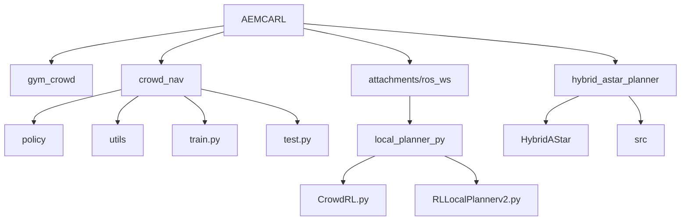
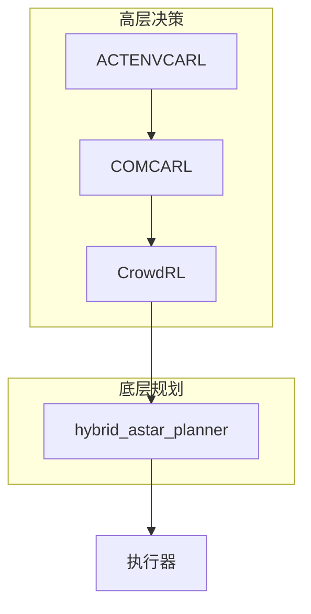
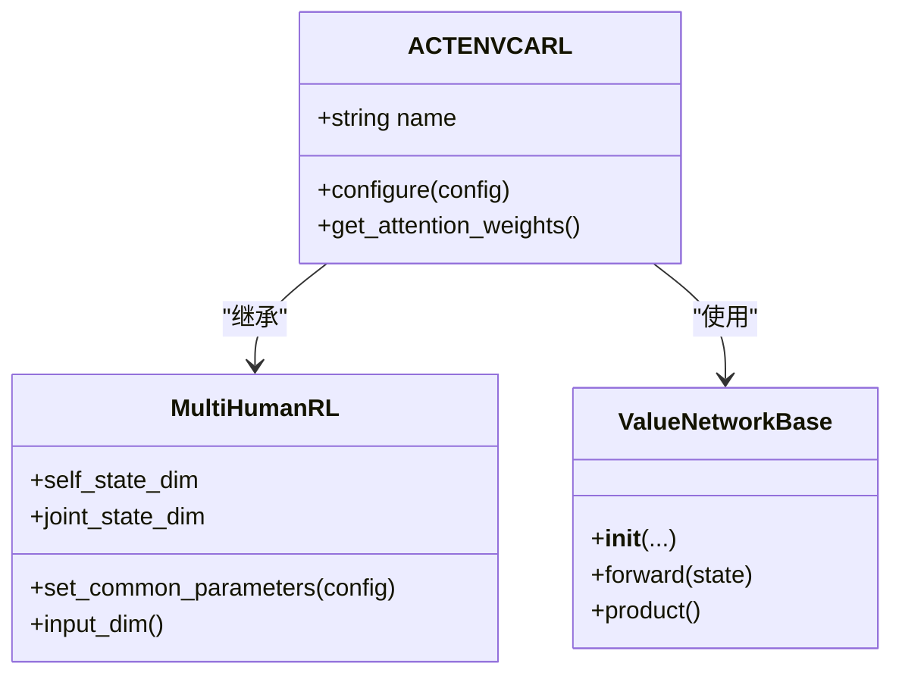
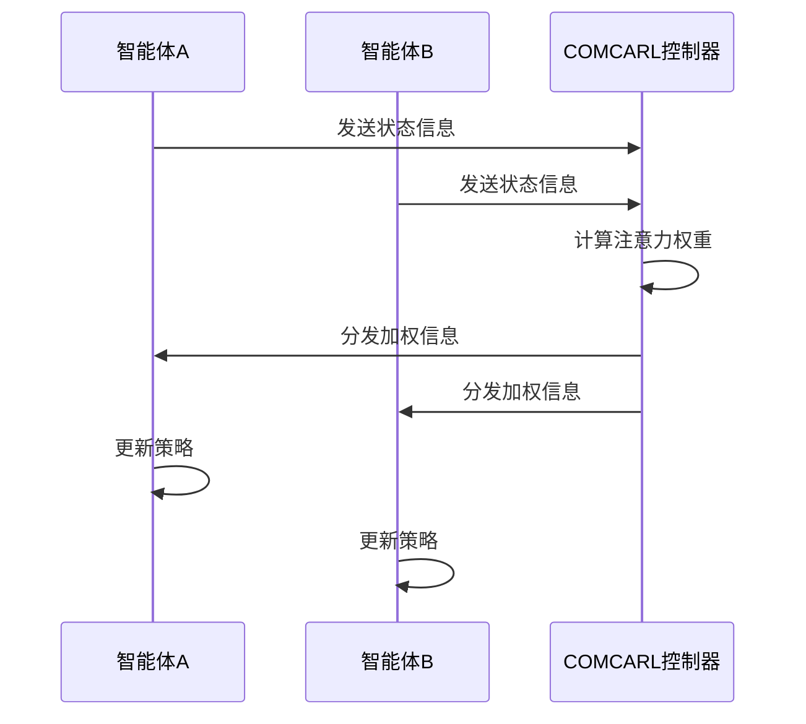
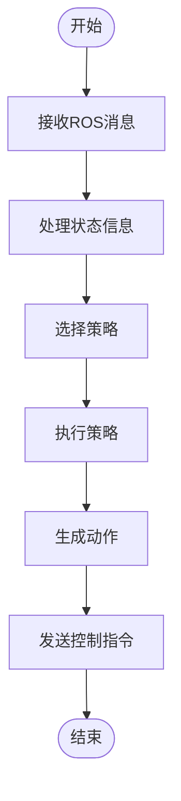
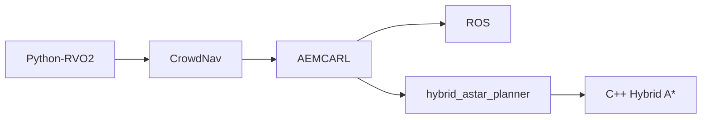

# AEMCARL 扩展

<cite>
**本文档引用的文件**  
- [actenvcarl.py](file://AEMCARL/crowd_nav/policy/actenvcarl.py)
- [comcarl.py](file://AEMCARL/crowd_nav/policy/comcarl.py)
- [CrowdRL.py](file://AEMCARL/attachments/ros_ws/local_planner_py/scripts/CrowdRL.py)
- [hybrid_astar.py](file://hybrid_astar_planner/HybridAStar/hybrid_astar.py)
- [hybrid_astar_wrapper.py](file://hybrid_astar_planner/HybridAStar/hybrid_astar_wrapper.py)
- [hybrid_astar_planner.cpp](file://hybrid_astar_planner/src/HybridAStar.cpp)
</cite>

## 目录
1. [引言](#引言)
2. [项目结构](#项目结构)
3. [核心组件](#核心组件)
4. [架构概述](#架构概述)
5. [详细组件分析](#详细组件分析)
6. [依赖分析](#依赖分析)
7. [性能考虑](#性能考虑)
8. [故障排除指南](#故障排除指南)
9. [结论](#结论)

## 引言
AEMCARL（Adaptive Environment Modeling Based Collision Avoidance Reinforcement Learning）是一个基于强化学习的机器人避障框架，旨在复杂拥挤环境中实现安全高效的导航。该系统在CrowdNav基础上进行了多项扩展，增强了多智能体交互能力，通过对抗性环境学习和通信增强机制提升策略鲁棒性。本项目结合高层社交决策与底层轨迹规划，在城市交通等复杂场景中展现出巨大应用潜力。

## 项目结构
AEMCARL项目采用模块化设计，主要分为仿真环境和策略训练两大部分。`gym_crowd/`目录包含仿真环境，而`crowd_nav/`则负责策略的训练与测试。此外，系统集成了ROS消息处理模块和混合A*轨迹规划器，形成完整的导航解决方案。

**图示来源**  
- [README.md](file://AEMCARL/README.md#L0-L11)
- [project_structure](file://#L0-L1000)

**章节来源**  
- [README.md](file://AEMCARL/README.md#L0-L70)

## 核心组件
AEMCARL的核心组件包括对抗性环境学习（ACTENVCARL）、通信增强型强化学习（COMCARL）以及CrowdRL控制器。这些组件共同构成了系统的智能决策层，实现了从环境感知到动作执行的完整闭环。

**章节来源**  
- [actenvcarl.py](file://AEMCARL/crowd_nav/policy/actenvcarl.py#L0-L69)
- [comcarl.py](file://AEMCARL/crowd_nav/policy/comcarl.py#L0-L132)
- [CrowdRL.py](file://AEMCARL/attachments/ros_ws/local_planner_py/scripts/CrowdRL.py#L0-L265)

## 架构概述
AEMCARL系统采用分层架构，上层为基于强化学习的社会力决策模型，下层为基于几何搜索的轨迹规划器。这种架构使得系统既能处理复杂的社交交互，又能生成平滑可行的运动轨迹。

**图示来源**  
- [actenvcarl.py](file://AEMCARL/crowd_nav/policy/actenvcarl.py#L0-L69)
- [comcarl.py](file://AEMCARL/crowd_nav/policy/comcarl.py#L0-L132)
- [hybrid_astar.py](file://hybrid_astar_planner/HybridAStar/hybrid_astar.py#L0-L100)

## 详细组件分析

### 对抗性环境学习机制分析
ACTENVCARL通过自适应计算时间模型生成更具挑战性的训练场景，从而提升策略的鲁棒性。该机制允许网络根据输入复杂度动态调整计算深度。

#### 类图

**图示来源**  
- [actenvcarl.py](file://AEMCARL/crowd_nav/policy/actenvcarl.py#L0-L69)

### 通信增强型强化学习框架分析
COMCARL框架通过显式通信机制协调多智能体行动，利用注意力机制实现信息的有效交换。

#### 序列图

**图示来源**  
- [comcarl.py](file://AEMCARL/crowd_nav/policy/comcarl.py#L0-L132)

### 核心控制器分析
CrowdRL作为核心控制器，负责整合高级策略并处理ROS消息，协调整个系统的运行。

#### 流程图

**图示来源**  
- [CrowdRL.py](file://AEMCARL/attachments/ros_ws/local_planner_py/scripts/CrowdRL.py#L0-L265)

**章节来源**  
- [CrowdRL.py](file://AEMCARL/attachments/ros_ws/local_planner_py/scripts/CrowdRL.py#L0-L265)

## 依赖分析
AEMCARL系统依赖于多个外部库和内部模块，形成了复杂的依赖网络。

**图示来源**  
- [README.md](file://AEMCARL/README.md#L12-L41)
- [hybrid_astar_wrapper.py](file://hybrid_astar_planner/HybridAStar/hybrid_astar_wrapper.py#L0-L38)

## 性能考虑
AEMCARL在设计时充分考虑了实时性要求，通过优化神经网络结构和算法复杂度来保证系统的响应速度。然而，在高密度人群场景中仍可能面临计算瓶颈，需要进一步优化。

## 故障排除指南
当系统出现异常时，可按照以下步骤进行排查：
1. 检查ROS节点通信是否正常
2. 验证强化学习模型参数配置
3. 确认混合A*规划器的输入输出格式
4. 检查传感器数据质量

**章节来源**  
- [CrowdRL.py](file://AEMCARL/attachments/ros_ws/local_planner_py/scripts/CrowdRL.py#L0-L265)
- [hybrid_astar.py](file://hybrid_astar_planner/HybridAStar/hybrid_astar.py#L0-L100)

## 结论
AEMCARL通过引入对抗性环境学习和通信增强机制，显著提升了多智能体交互能力。其分层架构设计实现了高层社交决策与底层轨迹规划的有效协同，在复杂城市交通场景中展现出良好的应用前景。未来工作可进一步优化计算效率，拓展到更多样化的应用场景。