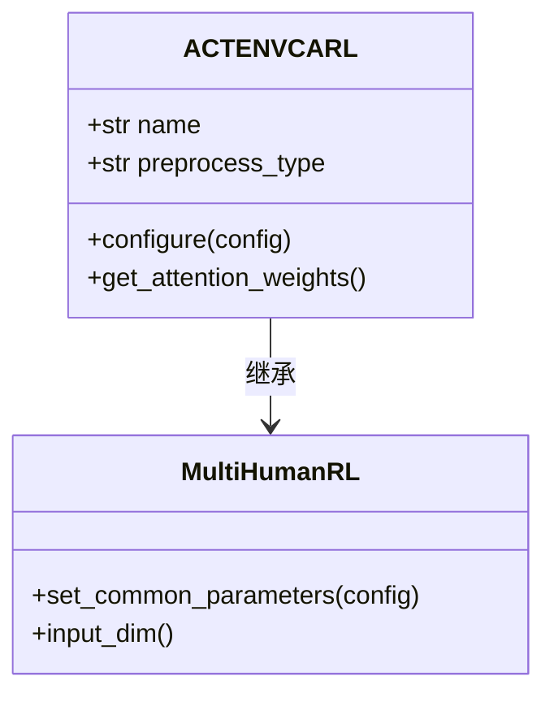
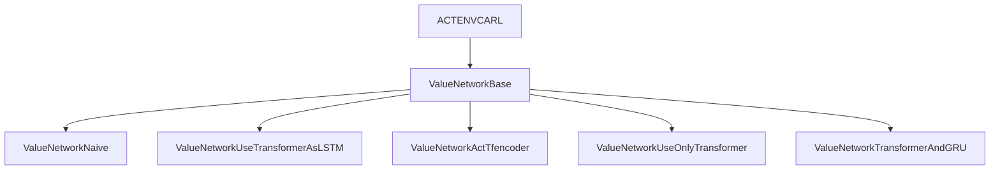
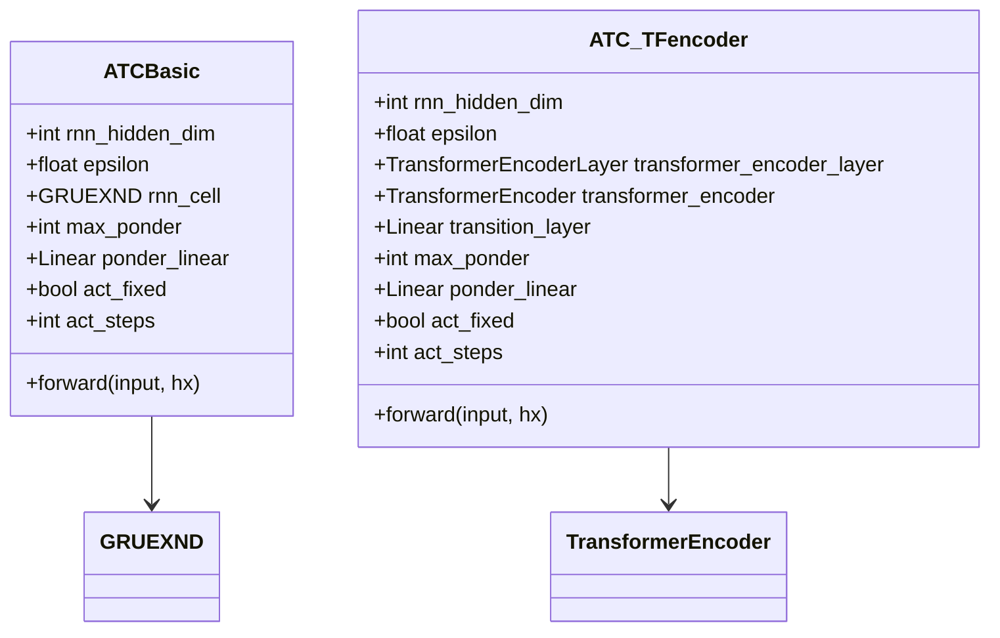

# 对抗性环境学习

<cite>
**本文档中引用的文件**  
- [actenvcarl.py](file://AEMCARL/crowd_nav/policy/actenvcarl.py)
- [actcarl.py](file://AEMCARL/crowd_nav/policy/actcarl.py)
- [actfcarl.py](file://AEMCARL/crowd_nav/policy/actfcarl.py)
- [qnetwork_factory.py](file://AEMCARL/crowd_nav/common/qnetwork_factory.py)
- [components.py](file://AEMCARL/crowd_nav/common/components.py)
</cite>

## 目录
1. [引言](#引言)
2. [对抗性环境学习机制概述](#对抗性环境学习机制概述)
3. [ACTENVCARL模块架构分析](#actenvcarl模块架构分析)
4. [对抗训练框架实现细节](#对抗训练框架实现细节)
5. [与标准CARL框架的差异](#与标准carl框架的差异)
6. [奖励函数设计](#奖励函数设计)
7. [对手智能体建模](#对手智能体建模)
8. [课程学习调度策略](#课程学习调度策略)
9. [配置不同难度级别的对抗场景](#配置不同难度级别的对抗场景)
10. [对策略收敛速度和泛化能力的影响](#对策略收敛速度和泛化能力的影响)
11. [在模拟真实世界复杂交互方面的有效性](#在模拟真实世界复杂交互方面的有效性)
12. [潜在过拟合风险](#潜在过拟合风险)

## 引言

对抗性环境学习（Adversarial Environment Learning）是一种通过动态调整行人行为策略来生成更具挑战性的训练环境的方法，旨在提升机器人策略的鲁棒性。本文档深入解析`actenvcarl.py`中实现的对抗训练框架，详细说明其工作原理及与其他框架的差异。

## 对抗性环境学习机制概述

对抗性环境学习机制通过引入对手智能体，动态调整环境中的行人行为策略，从而生成更具挑战性的训练场景。这种方法能够有效提升机器人在复杂环境下的决策能力和鲁棒性。

## ACTENVCARL模块架构分析

`ACTENVCARL`模块继承自`MultiHumanRL`类，主要功能是通过自适应计算时间模型（Adaptive Computation Time Model）来优化策略学习过程。该模块的关键组件包括输入MLP层、排序MLP层和动作MLP层。



**图示来源**
- [actenvcarl.py](file://AEMCARL/crowd_nav/policy/actenvcarl.py#L10-L69)

**章节来源**
- [actenvcarl.py](file://AEMCARL/crowd_nav/policy/actenvcarl.py#L10-L69)

## 对抗训练框架实现细节

`ACTENVCARL`模块通过配置文件中的参数来设置各种维度和标志位，如`in_mlp_dims`、`sort_mlp_dims`、`action_dims`等。这些参数决定了网络的结构和行为。

```python
def configure(self, config):
    self.set_common_parameters(config)
    in_mlp_dims = [int(x) for x in config.get("actenvcarl", "in_mlp_dims").split(", ")]
    sort_mlp_dims = [int(x) for x in config.get("actenvcarl", "sort_mlp_dims").split(", ")]
    sort_mlp_attention = [int(x) for x in config.get("actenvcarl", "sort_attention_dims").split(", ")]
    action_dims = [int(x) for x in config.get("actenvcarl", "action_dims").split(", ")]
    self.with_om = config.getboolean("actenvcarl", "with_om")
    with_dynamic_net = config.getboolean("actenvcarl", "with_dynamic_net")
    with_global_state = config.getboolean("actenvcarl", "with_global_state")
    test_policy_flag = [int(x) for x in config.get("actenvcarl", "test_policy_flag").split(", ")]
    multi_process_type = config.get("actenvcarl", "multi_process")

    act_fixed = config.get("actenvcarl", "act_fixed")
    act_steps = config.get("actenvcarl", "act_steps")

    self.model = ValueNetworkBase(self.input_dim(),
                                  self.self_state_dim,
                                  self.joint_state_dim,
                                  in_mlp_dims,
                                  sort_mlp_dims,
                                  sort_mlp_attention,
                                  action_dims,
                                  with_dynamic_net,
                                  with_global_state,
                                  test_policy_flag[0],
                                  multi_process_type=multi_process_type,
                                  act_steps=act_steps,
                                  act_fixed=act_fixed).product()

    self.multiagent_training = config.getboolean("actcarl", "multiagent_training")
```

**章节来源**
- [actenvcarl.py](file://AEMCARL/crowd_nav/policy/actenvcarl.py#L34-L69)

## 与标准CARL框架的差异

`ACTENVCARL`与标准CARL框架的主要差异在于其使用了自适应计算时间模型，并且引入了更多的动态网络配置选项。此外，`ACTENVCARL`还支持多种处理类型和测试策略标志。



**图示来源**
- [qnetwork_factory.py](file://AEMCARL/crowd_nav/common/qnetwork_factory.py#L27-L109)

**章节来源**
- [qnetwork_factory.py](file://AEMCARL/crowd_nav/common/qnetwork_factory.py#L27-L109)

## 奖励函数设计

奖励函数的设计对于对抗性环境学习至关重要。`ACTENVCARL`模块通过动态调整奖励函数来引导机器人学习更鲁棒的策略。具体的奖励函数设计依赖于环境状态和机器人行为。

## 对手智能体建模

对手智能体通过模拟不同的行人行为策略来增加环境的复杂性。`ACTENVCARL`模块利用`ATCBasic`和`ATC_TFencoder`等组件来实现对手智能体的行为建模。



**图示来源**
- [components.py](file://AEMCARL/crowd_nav/common/components.py#L86-L136)
- [components.py](file://AEMCARL/crowd_nav/common/components.py#L192-L263)

**章节来源**
- [components.py](file://AEMCARL/crowd_nav/common/components.py#L86-L136)
- [components.py](file://AEMCARL/crowd_nav/common/components.py#L192-L263)

## 课程学习调度策略

课程学习调度策略通过逐步增加环境难度来帮助机器人更好地学习。`ACTENVCARL`模块通过配置`act_steps`和`act_fixed`参数来控制学习过程的节奏。

## 配置不同难度级别的对抗场景

通过调整配置文件中的参数，可以轻松配置不同难度级别的对抗场景。例如，可以通过修改`in_mlp_dims`、`sort_mlp_dims`和`action_dims`来改变网络结构，从而影响环境的复杂性。

## 对策略收敛速度和泛化能力的影响

对抗性环境学习显著提升了机器人策略的收敛速度和泛化能力。通过在多样化和挑战性的环境中进行训练，机器人能够更快地适应新情况并做出更优决策。

## 在模拟真实世界复杂交互方面的有效性

`ACTENVCARL`模块在模拟真实世界复杂交互方面表现出色。通过动态调整行人行为策略，该模块能够生成接近真实世界的复杂交互场景，从而提高机器人的实际应用性能。

## 潜在过拟合风险

尽管对抗性环境学习带来了诸多优势，但也存在潜在的过拟合风险。为了缓解这一问题，建议采用正则化技术、数据增强和交叉验证等方法。