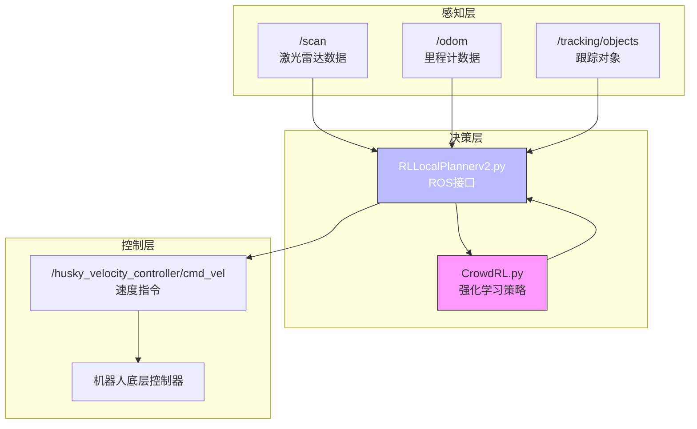
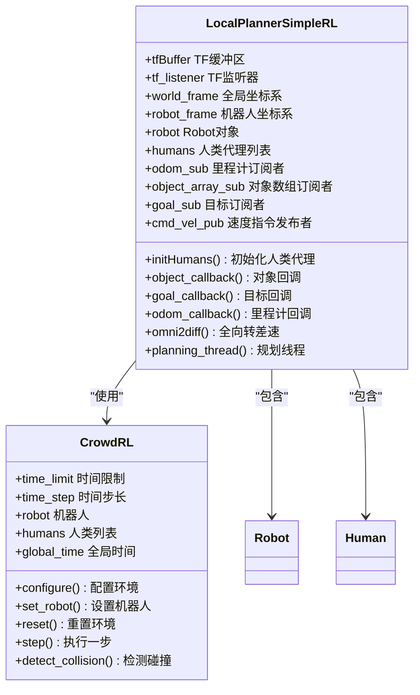
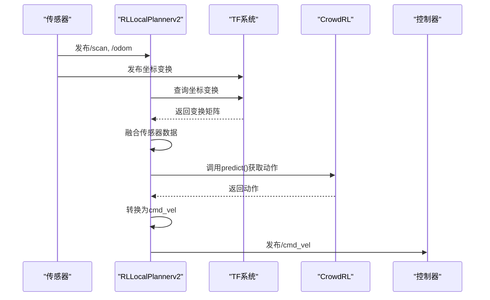
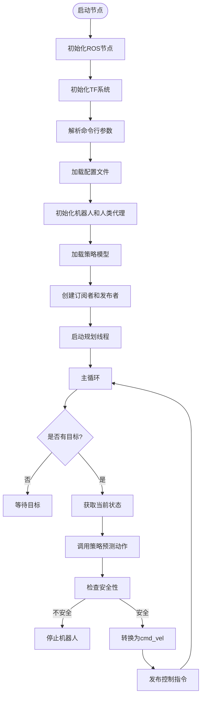
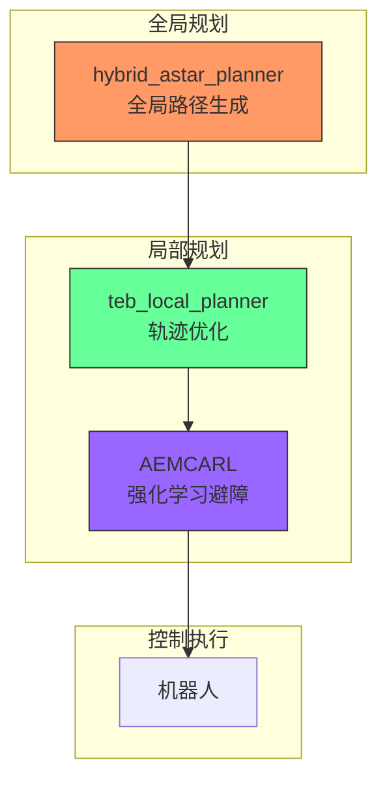

# 系统集成与ROS接口

<cite>
**本文档引用的文件**  
- [CrowdRL.py](file://AEMCARL/attachments/ros_ws/local_planner_py/scripts/CrowdRL.py)
- [RLLocalPlannerv2.py](file://AEMCARL/attachments/ros_ws/local_planner_py/scripts/RLLocalPlannerv2.py)
- [TebLocalPlannerReconfigure.cfg](file://teb_local_planner/cfg/TebLocalPlannerReconfigure.cfg)
- [teb_local_planner_ros.cpp](file://teb_local_planner/src/teb_local_planner_ros.cpp)
- [hybrid_astar.py](file://hybrid_astar_planner/HybridAStar/hybrid_astar.py)
- [hybrid_astar_wrapper.py](file://hybrid_astar_planner/HybridAStar/hybrid_astar_wrapper.py)
</cite>

## 目录
1. [AEMCARL与ROS集成架构](#aemcarl与ros集成架构)
2. [CrowdRL与RLLocalPlannerv2核心功能分析](#crowdrl与rlllocalplannerv2核心功能分析)
3. [ROS通信机制与TF坐标变换](#ros通信机制与tf坐标变换)
4. [节点启动流程与参数配置](#节点启动流程与参数配置)
5. [与teb_local_planner和hybrid_astar_planner的协同工作](#与teb_local_planner和hybrid_astar_planner的协同工作)
6. [常见通信故障诊断](#常见通信故障诊断)
7. [性能调优建议](#性能调优建议)

## AEMCARL与ROS集成架构

AEMCARL系统通过ROS框架实现高层决策与底层控制的桥梁连接。系统核心由`CrowdRL.py`和`RLLocalPlannerv2.py`两个Python脚本构成，它们作为ROS节点运行，负责接收传感器数据、执行强化学习策略并发布控制指令。

该架构采用分层规划设计，其中`CrowdRL.py`提供基于强化学习的局部规划策略，而`RLLocalPlannerv2.py`作为ROS接口层，处理ROS通信、TF坐标变换和传感器数据融合。这种设计实现了算法逻辑与机器人控制的解耦，提高了系统的可维护性和可扩展性。



**图示来源**  
- [CrowdRL.py](file://AEMCARL/attachments/ros_ws/local_planner_py/scripts/CrowdRL.py)
- [RLLocalPlannerv2.py](file://AEMCARL/attachments/ros_ws/local_planner_py/scripts/RLLocalPlannerv2.py)

**本节来源**  
- [CrowdRL.py](file://AEMCARL/attachments/ros_ws/local_planner_py/scripts/CrowdRL.py)
- [RLLocalPlannerv2.py](file://AEMCARL/attachments/ros_ws/local_planner_py/scripts/RLLocalPlannerv2.py)

## CrowdRL与RLLocalPlannerv2核心功能分析

### CrowdRL.py功能分析

`CrowdRL.py`文件实现了基于强化学习的局部规划环境，其主要功能包括：

1. **环境配置**：通过`configure`方法加载配置文件，设置时间步长、奖励函数参数和仿真配置
2. **状态重置**：`reset`方法初始化机器人和人类代理的状态
3. **动作执行**：`step`方法执行动作，检测碰撞，计算奖励并返回新的观察状态
4. **碰撞检测**：实现精确的碰撞检测算法，计算机器人与人类之间的最小距离

该模块通过`JointState`类将机器人状态和人类状态组合成强化学习算法的输入观察空间。

### RLLocalPlannerv2.py功能分析

`RLLocalPlannerv2.py`作为ROS节点，实现了以下关键功能：

1. **节点初始化**：在`__init__`方法中初始化ROS节点、TF监听器和订阅/发布主题
2. **传感器数据处理**：通过`odom_callback`和`object_callback`方法处理里程计和对象跟踪数据
3. **目标处理**：`goal_callback`方法处理目标点设置，触发规划过程
4. **规划线程**：`planning_thread`方法在独立线程中持续执行规划循环
5. **速度转换**：`omni2diff`方法将全向移动速度转换为差速驱动控制指令



**图示来源**  
- [RLLocalPlannerv2.py](file://AEMCARL/attachments/ros_ws/local_planner_py/scripts/RLLocalPlannerv2.py)
- [CrowdRL.py](file://AEMCARL/attachments/ros_ws/local_planner_py/scripts/CrowdRL.py)

**本节来源**  
- [CrowdRL.py](file://AEMCARL/attachments/ros_ws/local_planner_py/scripts/CrowdRL.py#L1-L265)
- [RLLocalPlannerv2.py](file://AEMCARL/attachments/ros_ws/local_planner_py/scripts/RLLocalPlannerv2.py#L1-L493)

## ROS通信机制与TF坐标变换

### 订阅的传感器话题

`RLLocalPlannerv2.py`节点订阅了以下ROS话题：

- `/current_pose`：接收机器人当前位姿（PoseStamped消息）
- `/tracking/objects`：接收跟踪对象信息（ObjectArray消息）
- `/move_base_simple/goal`：接收目标点设置（PoseStamped消息）

这些传感器数据通过回调函数处理，为局部规划提供必要的环境感知信息。

### 发布的控制指令

该模块发布以下控制指令：

- `/husky_velocity_controller/cmd_vel`：发布速度指令（Twist消息），控制机器人运动
- `/robot_marker_info`：发布机器人状态可视化标记
- `/goal_marker_info`：发布目标点可视化标记
- `/robot_path_info`：发布机器人路径信息

### TF坐标变换机制

系统使用TF（Transform）系统处理坐标变换：

1. **TF缓冲区**：`tfBuffer`存储所有坐标变换信息
2. **TF监听器**：`tf_listener`订阅TF广播并更新缓冲区
3. **坐标变换**：在`odom_callback`中，将里程计数据转换到指定坐标系
4. **姿态提取**：使用`tf.transformations.euler_from_quaternion`将四元数转换为欧拉角

TF系统确保了不同传感器数据在统一坐标系下的正确融合，为规划算法提供准确的环境表示。



**图示来源**  
- [RLLocalPlannerv2.py](file://AEMCARL/attachments/ros_ws/local_planner_py/scripts/RLLocalPlannerv2.py)
- [CrowdRL.py](file://AEMCARL/attachments/ros_ws/local_planner_py/scripts/CrowdRL.py)

**本节来源**  
- [RLLocalPlannerv2.py](file://AEMCARL/attachments/ros_ws/local_planner_py/scripts/RLLocalPlannerv2.py#L100-L493)

## 节点启动流程与参数配置

### 节点启动流程

1. **初始化ROS节点**：调用`rospy.init_node('local_planner_node')`
2. **创建TF监听器**：初始化`tfBuffer`和`tf_listener`
3. **解析命令行参数**：使用`argparse`解析模型路径、配置文件等参数
4. **加载配置文件**：读取环境配置和策略配置文件
5. **初始化机器人和人类代理**：创建Robot和Human对象并设置初始状态
6. **设置策略模型**：加载预训练的强化学习模型权重
7. **创建订阅者和发布者**：订阅传感器话题，发布控制指令
8. **启动规划线程**：在独立线程中运行规划循环

### 参数服务器配置

系统使用参数服务器进行配置管理：

- **环境配置**：通过`env_config`文件配置时间步长、奖励函数等参数
- **策略配置**：通过`policy_config`文件配置强化学习策略参数
- **命令行参数**：支持通过命令行覆盖默认配置

### 动态重配置接口

虽然当前实现未直接使用动态重配置，但系统设计支持通过参数服务器动态调整以下参数：

- `safe_dist`：安全距离阈值
- `use_safe_policy`：是否启用安全策略
- `use_hua`：是否使用HUA控制模式
- `diff_rad_threshold`：角度差阈值



**图示来源**  
- [RLLocalPlannerv2.py](file://AEMCARL/attachments/ros_ws/local_planner_py/scripts/RLLocalPlannerv2.py)

**本节来源**  
- [RLLocalPlannerv2.py](file://AEMCARL/attachments/ros_ws/local_planner_py/scripts/RLLocalPlannerv2.py#L1-L493)

## 与teb_local_planner和hybrid_astar_planner的协同工作

### 分层规划架构

AEMCARL系统与`teb_local_planner`和`hybrid_astar_planner`共同构成分层规划架构：

1. **高层规划**：`hybrid_astar_planner`生成全局路径
2. **中层规划**：`teb_local_planner`进行局部轨迹优化
3. **底层规划**：AEMCARL的强化学习策略处理动态障碍物避让

### 与teb_local_planner的集成

`teb_local_planner`通过以下方式与AEMCARL协同工作：

- **参数配置**：`TebLocalPlannerReconfigure.cfg`文件定义了轨迹优化参数
- **障碍物处理**：将AEMCARL检测到的动态障碍物作为TEB规划的输入
- **轨迹融合**：结合TEB生成的平滑轨迹和强化学习的避障决策

### 与hybrid_astar_planner的集成

`hybrid_astar_planner`为AEMCARL提供全局路径参考：

- **路径生成**：`hybrid_astar.py`实现混合A*算法生成全局路径
- **C++封装**：`hybrid_astar_wrapper.py`提供Python接口调用C++实现
- **参数传递**：通过字典传递初始条件和超参数



**图示来源**  
- [TebLocalPlannerReconfigure.cfg](file://teb_local_planner/cfg/TebLocalPlannerReconfigure.cfg)
- [teb_local_planner_ros.cpp](file://teb_local_planner/src/teb_local_planner_ros.cpp)
- [hybrid_astar.py](file://hybrid_astar_planner/HybridAStar/hybrid_astar.py)
- [hybrid_astar_wrapper.py](file://hybrid_astar_planner/HybridAStar/hybrid_astar_wrapper.py)

**本节来源**  
- [TebLocalPlannerReconfigure.cfg](file://teb_local_planner/cfg/TebLocalPlannerReconfigure.cfg#L1-L447)
- [teb_local_planner_ros.cpp](file://teb_local_planner/src/teb_local_planner_ros.cpp#L1-L799)
- [hybrid_astar.py](file://hybrid_astar_planner/HybridAStar/hybrid_astar.py#L1-L100)
- [hybrid_astar_wrapper.py](file://hybrid_astar_planner/HybridAStar/hybrid_astar_wrapper.py#L1-L123)

## 常见通信故障诊断

### 诊断步骤

1. **检查节点状态**：
   ```bash
   rosnode list
   rosnode info /local_planner_node
   ```

2. **验证话题连接**：
   ```bash
   rostopic list
   rostopic info /current_pose
   rostopic info /tracking/objects
   rostopic info /move_base_simple/goal
   ```

3. **检查TF树完整性**：
   ```bash
   rosrun tf view_frames
   rosrun tf tf_echo odom base_link
   ```

4. **监控消息流**：
   ```bash
   rostopic echo /current_pose
   rostopic echo /tracking/objects
   rostopic hz /current_pose
   ```

5. **检查参数服务器**：
   ```bash
   rosparam list
   rosparam get /local_planner_node/model_dir
   ```

### 常见问题及解决方案

| 问题现象 | 可能原因 | 解决方案 |
|---------|--------|--------|
| 无速度输出 | 目标未设置 | 发布目标点到`/move_base_simple/goal` |
| 机器人不移动 | 安全策略激活 | 检查`safe_dist`参数，确保周围无障碍物 |
| TF变换失败 | 坐标系不匹配 | 确认`world_frame`和`robot_frame`设置正确 |
| 模型加载失败 | 路径错误 | 检查`model_dir`参数，确认模型文件存在 |
| 人类代理未更新 | 对象话题无数据 | 检查感知系统是否正常发布`/tracking/objects` |

**本节来源**  
- [RLLocalPlannerv2.py](file://AEMCARL/attachments/ros_ws/local_planner_py/scripts/RLLocalPlannerv2.py)
- [teb_local_planner_ros.cpp](file://teb_local_planner/src/teb_local_planner_ros.cpp)

## 性能调优建议

### 算法参数调优

1. **时间步长**：调整`env_config`中的`time_step`参数，平衡计算精度和实时性
2. **安全距离**：根据机器人尺寸和速度调整`safe_dist`参数
3. **奖励函数**：优化`CrowdRL.py`中的奖励权重，改善避障行为
4. **控制频率**：调整`planning_thread`中的`rate`参数，匹配系统计算能力

### 系统性能优化

1. **线程优化**：确保规划线程不会阻塞ROS回调
2. **内存管理**：定期清理过期的人类代理数据
3. **计算负载**：在`step`方法中优化碰撞检测算法
4. **通信效率**：减少不必要的消息发布和TF查询

### 配置建议

```python
# 推荐配置参数
args = {
    'env_config': 'output_gscarl-unicycle-v6/env.config',
    'policy_config': 'output_gscarl-unicycle-v6/policy.config',
    'policy': 'comcarl',
    'model_dir': '/path/to/model/',
    'phase': 'test',
    'safe_dist': 0.8,
    'use_safe_policy': True,
    'use_hua': False
}
```

通过合理配置这些参数，可以显著提升系统的响应速度和避障性能。

**本节来源**  
- [CrowdRL.py](file://AEMCARL/attachments/ros_ws/local_planner_py/scripts/CrowdRL.py)
- [RLLocalPlannerv2.py](file://AEMCARL/attachments/ros_ws/local_planner_py/scripts/RLLocalPlannerv2.py)