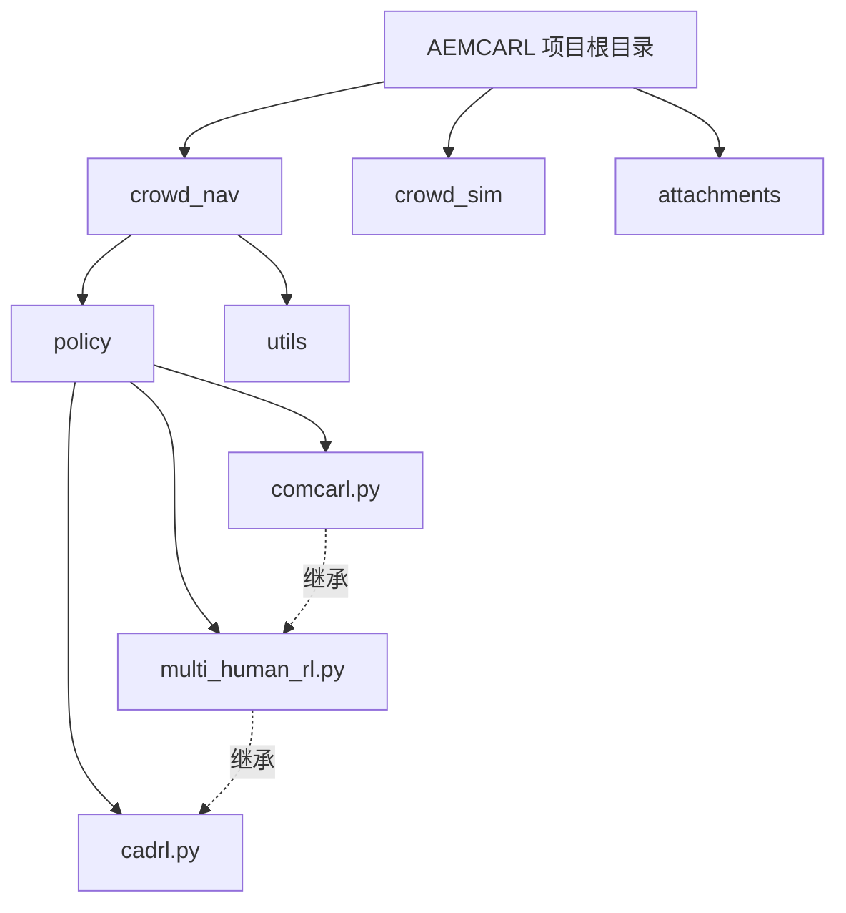
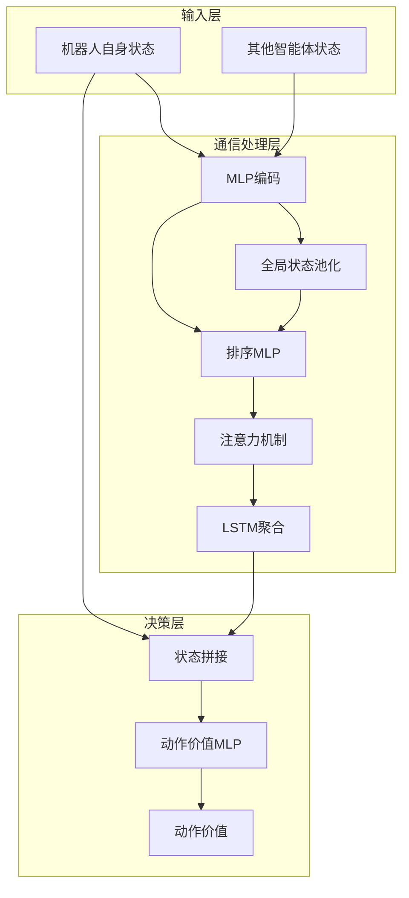
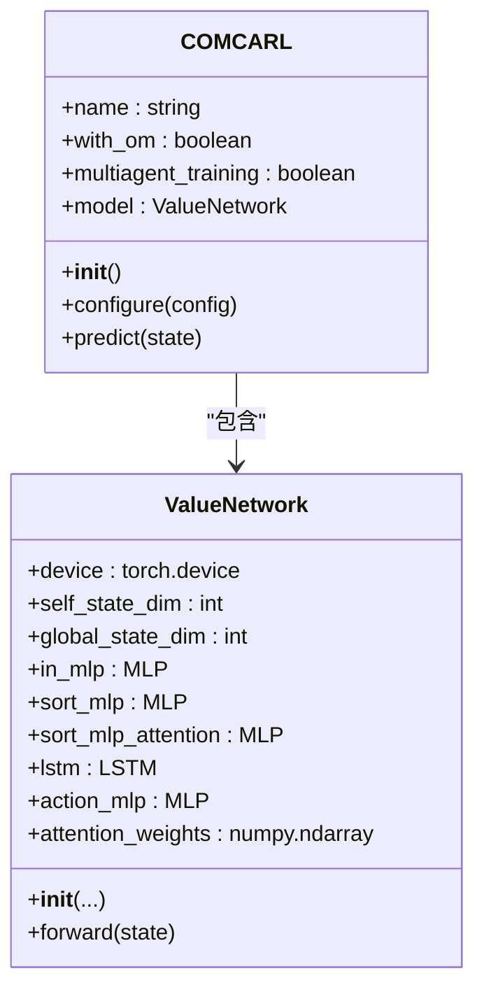
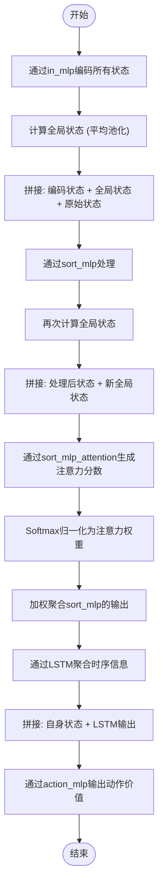
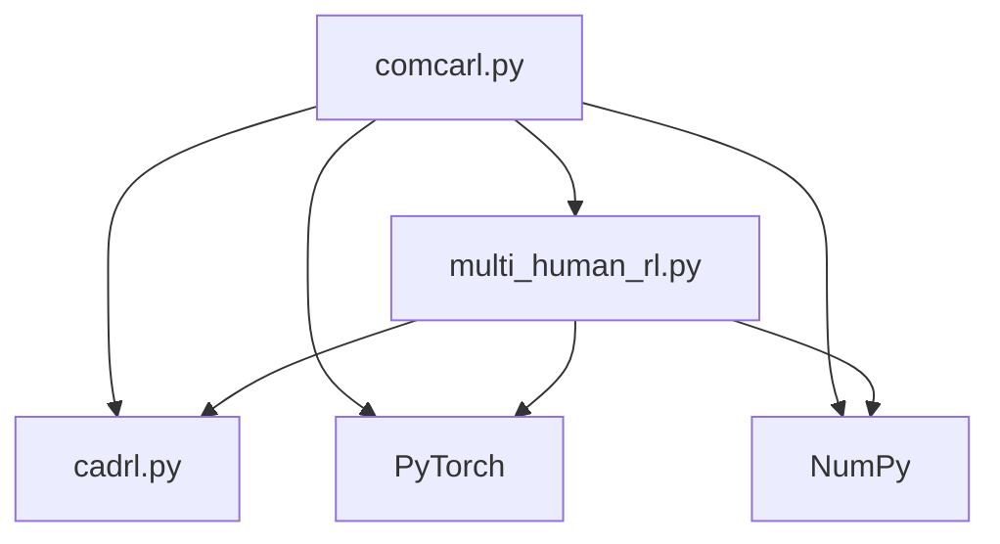

# 通信增强型学习

<cite>
**本文档中引用的文件**   
- [comcarl.py](file://AEMCARL/crowd_nav/policy/comcarl.py)
- [multi_human_rl.py](file://AEMCARL/crowd_nav/policy/multi_human_rl.py)
- [cadrl.py](file://AEMCARL/crowd_nav/policy/cadrl.py)
</cite>

## 目录
1. [引言](#引言)
2. [项目结构](#项目结构)
3. [核心组件](#核心组件)
4. [架构概述](#架构概述)
5. [详细组件分析](#详细组件分析)
6. [依赖分析](#依赖分析)
7. [性能考量](#性能考量)
8. [故障排除指南](#故障排除指南)
9. [结论](#结论)
10. [附录](#附录)（如有必要）

## 引言
本文档全面阐述了通信增强型强化学习（Communication-Enhanced CARL）框架的技术细节，重点分析`comcarl.py`中的实现。该框架旨在通过智能体间的协调机制解决多智能体路径规划中的冲突问题，特别适用于密集人群场景下的导航任务。文档将深入探讨其通信协议设计、信息编码方式以及对系统通信开销的影响，并评估其在提升导航效率和安全性方面的效果。

## 项目结构
项目`AEMCARL`是一个基于深度强化学习的多智能体导航框架，其核心位于`crowd_nav`模块。该模块遵循典型的机器学习项目结构，包含策略（policy）、工具（utils）和环境（envs）等子模块。`comcarl.py`文件位于`crowd_nav/policy/`目录下，是本研究的核心，它继承自`multi_human_rl.py`中的`MultiHumanRL`基类，并实现了基于注意力机制的通信模型。项目还包含`crowd_sim`模块用于环境模拟，以及ROS工作区（`ros_ws`）用于实际机器人部署。

**图源**
- [comcarl.py](file://AEMCARL/crowd_nav/policy/comcarl.py)
- [multi_human_rl.py](file://AEMCARL/crowd_nav/policy/multi_human_rl.py)

**节源**
- [comcarl.py](file://AEMCARL/crowd_nav/policy/comcarl.py)
- [multi_human_rl.py](file://AEMCARL/crowd_nav/policy/multi_human_rl.py)

## 核心组件
`comcarl.py`的核心是`COMCARL`类，它继承了`MultiHumanRL`类，从而获得了多智能体强化学习的基本框架，包括动作空间构建、状态转换和奖励计算等功能。其最核心的创新在于`ValueNetwork`类，该类实现了一个基于注意力机制的神经网络，用于模拟智能体间的隐式通信。该网络通过计算智能体之间的“注意力权重”来动态聚合其他智能体的状态信息，从而让每个智能体能够关注对其决策最重要的邻居。

**节源**
- [comcarl.py](file://AEMCARL/crowd_nav/policy/comcarl.py#L1-L132)
- [multi_human_rl.py](file://AEMCARL/crowd_nav/policy/multi_human_rl.py#L1-L500)

## 架构概述
通信增强型CARL框架的架构可以分为三层：输入层、通信处理层和决策层。输入层接收包含机器人自身状态和所有人类（或其他智能体）状态的联合状态。通信处理层是核心，由`ValueNetwork`实现，它通过多层感知机（MLP）和注意力机制处理输入，生成一个包含全局上下文信息的特征向量。决策层则将机器人自身状态与处理后的全局特征向量拼接，通过一个MLP输出动作的价值，指导机器人选择最优路径。

**图源**
- [comcarl.py](file://AEMCARL/crowd_nav/policy/comcarl.py#L1-L132)

## 详细组件分析
### COMCARL 类分析
`COMCARL`类是通信增强框架的入口。其`configure`方法从配置文件中读取关键参数，如MLP的维度、dropout率、是否使用全局状态等，并据此初始化`ValueNetwork`模型。`COMCARL`本身不直接处理通信逻辑，而是作为`ValueNetwork`的容器和接口，将多智能体环境的状态传递给网络进行处理。

#### 对象导向组件

**图源**
- [comcarl.py](file://AEMCARL/crowd_nav/policy/comcarl.py#L1-L132)

**节源**
- [comcarl.py](file://AEMCARL/crowd_nav/policy/comcarl.py#L1-L132)

### ValueNetwork 通信机制分析
`ValueNetwork`是实现隐式通信的核心。其`forward`方法详细描述了信息处理流程：
1.  **状态编码**：所有智能体的状态（包括自身）首先通过一个`in_mlp`进行编码。
2.  **全局状态生成**：通过对所有编码后的状态求平均，生成一个代表“群体”或“环境”的全局状态。
3.  **注意力计算**：将编码后的状态、全局状态和原始状态拼接，输入`sort_mlp`进行处理。处理后的结果再次与全局状态拼接，通过`sort_mlp_attention`生成注意力分数。
4.  **加权聚合**：使用softmax函数将注意力分数转换为权重，对`sort_mlp`的输出进行加权求和，得到一个聚焦于关键智能体的特征向量。
5.  **时序聚合**：加权后的特征向量序列输入LSTM，以捕捉智能体间交互的时序动态。
6.  **决策输出**：最后，将机器人自身的状态与LSTM的输出拼接，通过`action_mlp`得到最终的动作价值。

这个过程模拟了智能体通过观察环境和同伴，动态地“关注”最相关的个体，并基于这种关注做出决策，实现了无需显式消息传递的隐式通信。

**图源**
- [comcarl.py](file://AEMCARL/crowd_nav/policy/comcarl.py#L1-L132)

**节源**
- [comcarl.py](file://AEMCARL/crowd_nav/policy/comcarl.py#L1-L132)

## 依赖分析
`comcarl.py`的实现依赖于项目内的多个模块。它直接依赖`multi_human_rl.py`以获得多智能体RL的基类和环境交互逻辑，依赖`cadrl.py`中的`mlp`函数来构建其神经网络层。从外部依赖来看，它重度依赖`PyTorch`进行张量运算和神经网络构建，依赖`numpy`进行数值计算。这种依赖结构清晰地表明，`comcarl`是在一个成熟的多智能体RL框架之上，通过引入特定的神经网络架构来实现通信增强功能。

**图源**
- [comcarl.py](file://AEMCARL/crowd_nav/policy/comcarl.py)
- [multi_human_rl.py](file://AEMCARL/crowd_nav/policy/multi_human_rl.py)
- [cadrl.py](file://AEMCARL/crowd_nav/policy/cadrl.py)

**节源**
- [comcarl.py](file://AEMCARL/crowd_nav/policy/comcarl.py)
- [multi_human_rl.py](file://AEMCARL/crowd_nav/policy/multi_human_rl.py)
- [cadrl.py](file://AEMCARL/crowd_nav/policy/cadrl.py)

## 性能考量
`COMCARL`框架的通信开销主要体现在计算复杂度上，而非网络传输。其`O(n^2)`的注意力机制计算（n为智能体数量）在密集人群场景下会成为性能瓶颈。然而，由于所有计算都在单个智能体的决策模型内部完成，避免了分布式系统中显式通信带来的延迟和同步问题，这在去中心化系统中是一个显著优势。其可扩展性受限于LSTM和注意力机制的计算成本，当智能体数量极大时，训练和推理时间会显著增加。通过配置`with_global_state`和`dropout`等参数，可以在模型复杂度和性能之间进行权衡。

## 故障排除指南
若`COMCARL`模型表现不佳，可从以下几个方面排查：
1.  **注意力权重**：通过`get_attention_weights`方法（在部分版本中实现）检查注意力权重的分布。理想的权重应集中在少数几个关键智能体上，如果权重分布过于均匀，可能表明模型未能有效学习到通信模式。
2.  **配置参数**：检查`comcarl`配置文件中的`in_mlp_dims`、`sort_mlp_dims`等维度设置是否合理，过小的维度可能导致模型欠拟合。
3.  **训练数据**：确保训练环境中的场景足够多样化，包含各种密集和稀疏的行人配置，以使模型学习到鲁棒的通信策略。
4.  **奖励函数**：检查`compute_reward`函数（继承自`MultiHumanRL`）的奖励设置，确保对碰撞和到达目标的奖励/惩罚足够显著。

**节源**
- [comcarl.py](file://AEMCARL/crowd_nav/policy/comcarl.py)
- [multi_human_rl.py](file://AEMCARL/crowd_nav/policy/multi_human_rl.py#L1-L500)

## 结论
通信增强型CARL框架通过在价值网络中引入注意力机制，成功地在多智能体路径规划任务中实现了高效的隐式通信。该方法无需复杂的显式消息协议，通过学习动态的注意力权重来协调智能体行为，有效解决了密集人群中的导航冲突。尽管其计算复杂度限制了在超大规模系统中的应用，但在机器人导航等典型场景下，它提供了一种优雅且高效的去中心化协作解决方案。未来的工作可以探索更高效的注意力变体以进一步提升其可扩展性。

## 附录
### 配置参数表
下表列出了`comcarl.py`中关键的配置参数及其含义。

| 参数名 | 类型 | 描述 |
| :--- | :--- | :--- |
| `global_state_dim` | int | 全局状态的维度 |
| `dropout` | float | Dropout层的丢弃率 |
| `alpha` | float | （未在代码中直接使用，可能为遗留参数） |
| `nheads` | int | （未在代码中直接使用，可能为遗留参数） |
| `in_mlp_dims` | string | 输入MLP各层的维度，用逗号分隔 |
| `sort_mlp_dims` | string | 排序MLP各层的维度，用逗号分隔 |
| `sort_attention_dims` | string | 注意力MLP各层的维度，用逗号分隔 |
| `action_dims` | string | 动作价值MLP各层的维度，用逗号分隔 |
| `with_om` | boolean | 是否使用占据地图（Occupancy Map）作为输入 |
| `with_global_state` | boolean | 是否在注意力计算中使用全局状态 |
| `multiagent_training` | boolean | 是否启用多智能体训练模式 |

**节源**
- [comcarl.py](file://AEMCARL/crowd_nav/policy/comcarl.py#L107-L125)