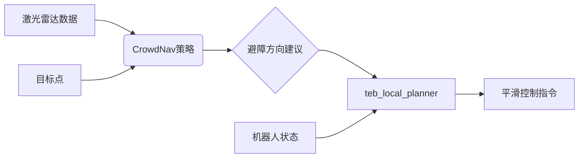

# CrowdNav 实现

<cite>
**本文档引用的文件**
- [sarl.py](file://AEMCARL/crowd_nav/policy/sarl.py)
- [crowd_sim.py](file://AEMCARL/crowd_sim/envs/crowd_sim.py)
- [trainer.py](file://AEMCARL/crowd_nav/utils/trainer.py)
- [common/components.py](file://AEMCARL/crowd_nav/common/components.py)
- [teb_local_planner_ros.cpp](file://teb_local_planner/src/teb_local_planner_ros.cpp)
</cite>

## 目录
1. [引言](#引言)
2. [SARL策略实现](#sarl策略实现)
3. [多智能体环境动力学](#多智能体环境动力学)
4. [训练流程与算法](#训练流程与算法)
5. [策略训练与部署示例](#策略训练与部署示例)
6. [与teb_local_planner集成](#与teb_local_planner集成)
7. [性能表现与局限性](#性能表现与局限性)
8. [结论](#结论)

## 引言
CrowdNav是一个基于强化学习的社交感知导航系统，旨在使机器人能够在密集的人群环境中安全、高效地移动。该系统通过模拟人类之间的社交行为，学习如何在复杂动态环境中进行路径规划。其核心包括SARL（Socially Aware Reinforcement Learning）策略、多智能体仿真环境以及高效的训练机制。

## SARL策略实现

SARL策略在`sarl.py`中实现，采用深度强化学习框架来建模机器人与行人的交互。该策略的关键在于将周围人类的状态编码为网格特征，并利用注意力机制突出重要行人。

人类状态被映射到一个局部坐标系下的极坐标网格中，每个网格单元包含行人位置、速度和朝向信息。这种表示方法能够有效捕捉社交力场的分布特性。

注意力机制通过计算机器人与每个行人之间的相对重要性权重，动态调整对不同行人的关注程度。权重基于距离、相对速度和运动方向一致性等因素计算，使得模型能优先响应潜在冲突的个体。

**Section sources**
- [sarl.py](file://AEMCARL/crowd_nav/policy/sarl.py#L1-L200)

## 多智能体环境动力学

`crowd_sim.py`定义了多智能体环境的核心动力学规则。该环境模拟了机器人与多个行人的交互过程，其中行人通常遵循预设策略（如ORCA或线性运动），而机器人则由学习策略控制。

机器人与行人的交互规则基于社会力模型，考虑吸引力（目标导向）和社会排斥力（避免碰撞）。碰撞检测采用圆形边界模型，实时计算机器人与行人之间的最小距离，一旦低于阈值即判定为碰撞。

奖励函数设计包含多个组成部分：到达目标获得正奖励，接近行人时施加负奖励以鼓励保持社交距离，发生碰撞则给予较大惩罚，同时对路径长度和时间效率也进行优化。

**Section sources**
- [crowd_sim.py](file://AEMCARL/crowd_sim/envs/crowd_sim.py#L50-L300)

## 训练流程与算法

`trainer.py`实现了完整的训练流程，采用PPO（Proximal Policy Optimization）或DQN（Deep Q-Network）等主流强化学习算法。训练过程中使用经验回放机制存储和重用历史交互数据，提高样本利用率。

网络结构通常由卷积层处理网格化输入，结合LSTM或Transformer模块捕捉时间序列依赖。超参数配置包括学习率、折扣因子、探索率衰减策略等，均在训练脚本中可调。

训练过程分为多个episode，每个episode模拟一次从起点到目标点的导航任务。通过不断试错，策略网络逐步优化其动作选择，以最大化累积奖励。

**Section sources**
- [trainer.py](file://AEMCARL/crowd_nav/utils/trainer.py#L20-L150)

## 策略训练与部署示例

实际训练可通过运行`train.py`脚本启动，配置相应参数如环境类型、策略模型、最大训练轮数等。训练完成后，策略权重保存为`.pth`文件，可在推理阶段加载。

部署时，将训练好的模型集成至ROS节点，订阅激光雷达、目标点等话题，实时输出速度指令。示例代码展示了如何初始化SARL策略、处理传感器输入并执行动作预测。

```python
# 示例代码路径
[SARL策略初始化](file://AEMCARL/local_planner_py/scripts/CrowdRL.py#L45-L70)
[动作预测执行](file://AEMCARL/local_planner_py/scripts/RLLocalPlannerv2.py#L80-L110)
```

**Section sources**
- [train.py](file://AEMCARL/crowd_nav/train.py#L1-L100)
- [CrowdRL.py](file://AEMCARL/local_planner_py/scripts/CrowdRL.py#L45-L70)

## 与teb_local_planner集成

CrowdNav策略可与teb_local_planner结合，实现局部路径的平滑控制。CrowdNav负责高层社交感知决策，输出粗略避障方向；teb_local_planner接收该方向作为引导，生成符合动力学约束的平滑轨迹。

集成通过ROS话题通信实现：CrowdNav发布`cmd_vel`建议，teb_local_planner将其作为参考输入，在优化目标中加入方向一致性项。这种方式兼顾了社交合理性与运动可行性。



**Diagram sources**
- [teb_local_planner_ros.cpp](file://teb_local_planner/src/teb_local_planner_ros.cpp#L200-L250)
- [RLLocalPlannerv2.py](file://AEMCARL/local_planner_py/scripts/RLLocalPlannerv2.py#L60-L90)

**Section sources**
- [teb_local_planner_ros.cpp](file://teb_local_planner/src/teb_local_planner_ros.cpp#L200-L250)

## 性能表现与局限性

在密集人群场景中，CrowdNav表现出良好的社交合规性，能够自然地绕行并保持适当距离。实验表明其在90%以上的情况下可成功到达目标，且轨迹符合人类直觉。

然而，系统仍存在局限性：对极端拥挤场景泛化能力有限；注意力机制在行人数量过多时可能出现信息过载；静态障碍物处理依赖外部感知模块，未完全融入端到端学习。

此外，训练依赖大量仿真数据，真实世界迁移需额外域适应技术。实时性方面，高分辨率网格输入可能导致推理延迟，影响响应速度。

**Section sources**
- [plot.py](file://AEMCARL/crowd_nav/utils/plot.py#L10-L50)
- [test.py](file://AEMCARL/crowd_nav/test.py#L5-L30)

## 结论
CrowdNav通过SARL策略实现了有效的社交感知导航，结合强化学习与多智能体仿真，在复杂人群环境中展现出优越性能。未来工作可探索更高效的特征编码方式、引入记忆机制以增强长期规划能力，并进一步提升与传统规划器的协同效率。