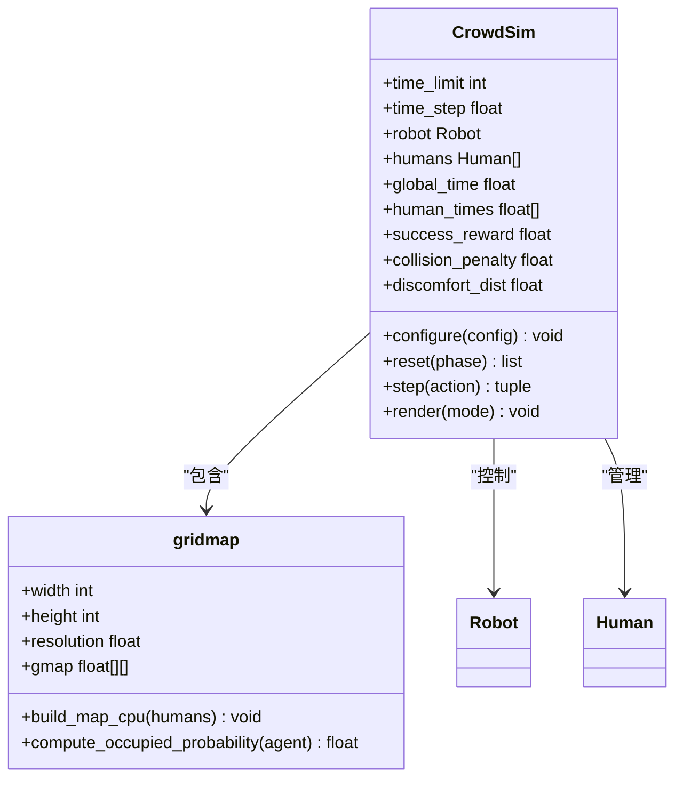
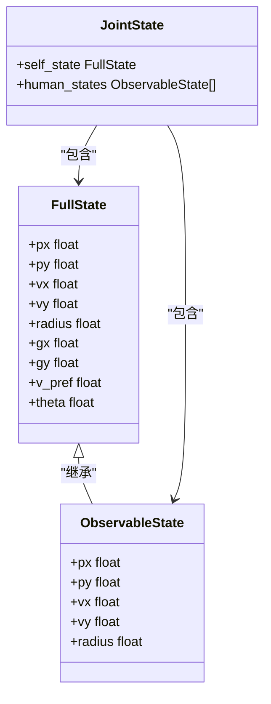
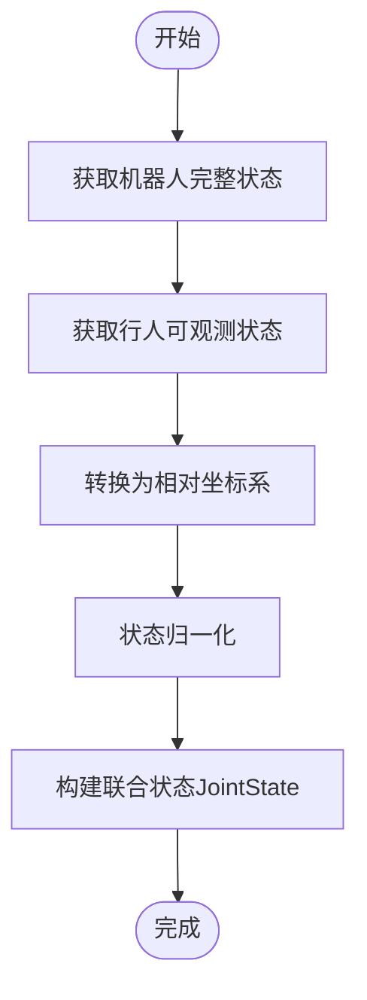
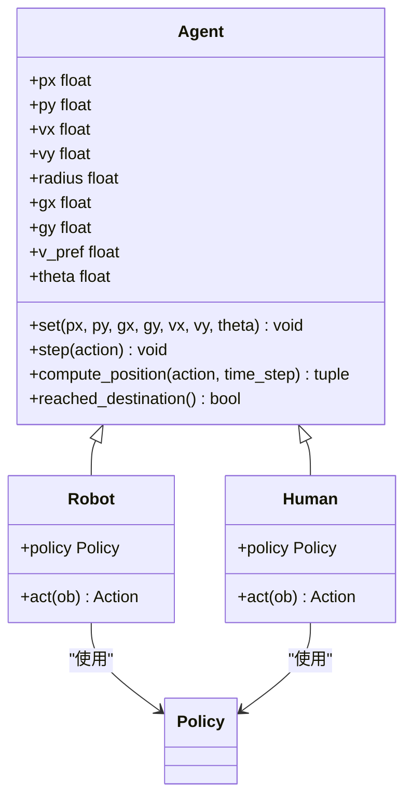
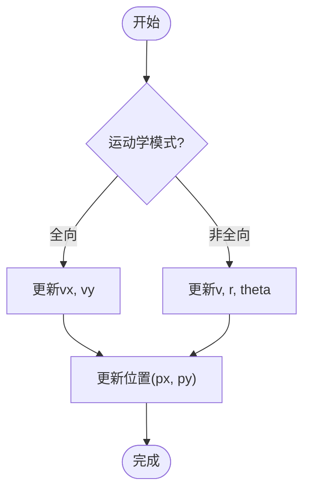
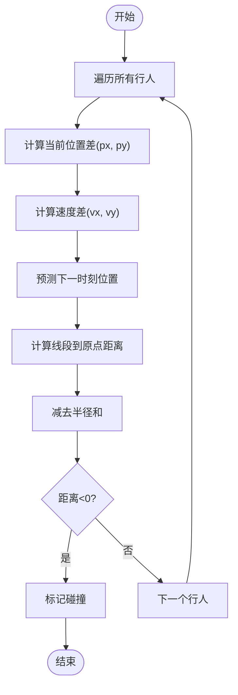
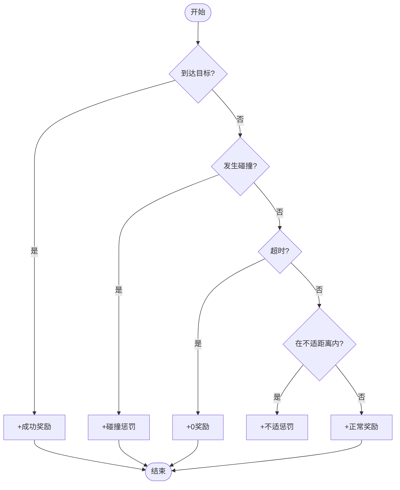
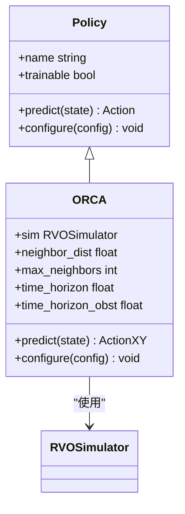
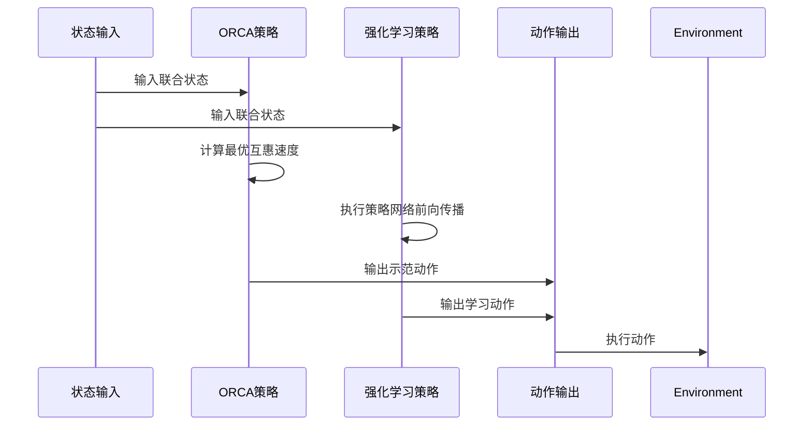
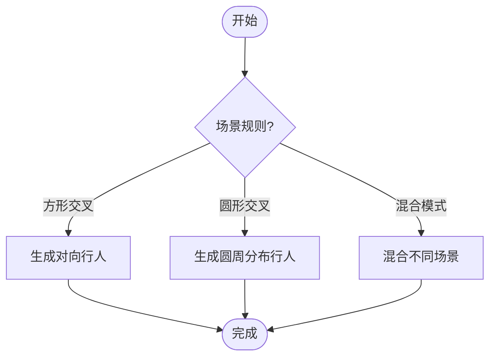

# 多智能体环境模拟

<cite>
**本文档中引用的文件**  
- [crowd_sim.py](file://AEMCARL/crowd_sim/envs/crowd_sim.py)
- [robot.py](file://AEMCARL/crowd_sim/envs/utils/robot.py)
- [human.py](file://AEMCARL/crowd_sim/envs/utils/human.py)
- [orca.py](file://AEMCARL/crowd_sim/envs/policy/orca.py)
- [state.py](file://AEMCARL/crowd_sim/envs/utils/state.py)
- [env.yaml](file://AEMCARL/env.yaml)
</cite>

## 目录
1. [引言](#引言)
2. [仿真环境架构](#仿真环境架构)
3. [环境状态空间构建](#环境状态空间构建)
4. [运动学模型实现](#运动学模型实现)
5. [碰撞检测与奖励函数](#碰撞检测与奖励函数)
6. [ORCA策略集成](#orca策略集成)
7. [人群场景配置](#人群场景配置)
8. [环境参数影响](#环境参数影响)

## 引言
本文档深入分析CrowdNav中多智能体环境模拟的核心实现，重点阐述`crowd_sim.py`中定义的仿真环境架构。详细解释环境状态空间的构建方式、机器人与行人的运动学模型、碰撞检测机制以及ORCA策略的集成方式。

## 仿真环境架构

CrowdNav的多智能体仿真环境基于`gym.Env`构建，实现了`CrowdSim`类作为核心环境容器。该环境支持n+1个智能体（1个机器人和n个行人）的协同运动模拟。



**图示来源**
- [crowd_sim.py](file://AEMCARL/crowd_sim/envs/crowd_sim.py#L221-L262)
- [crowd_sim.py](file://AEMCARL/crowd_sim/envs/crowd_sim.py#L264-L288)

**本节来源**
- [crowd_sim.py](file://AEMCARL/crowd_sim/envs/crowd_sim.py#L221-L289)

## 环境状态空间构建

环境状态空间由机器人和行人的状态表示、观测范围和相对坐标变换构成。系统采用分层的状态表示方法，区分完整状态和可观测状态。

### 状态表示结构



**图示来源**
- [state.py](file://AEMCARL/crowd_sim/envs/utils/state.py#L0-L50)

**本节来源**
- [state.py](file://AEMCARL/crowd_sim/envs/utils/state.py#L0-L50)

### 观测范围与坐标变换

环境采用相对坐标系进行状态观测，机器人观测到的行人状态是相对于机器人自身的坐标变换结果。系统通过`JointState`类将机器人自身完整状态与周围行人的可观测状态进行整合。



**本节来源**
- [crowd_sim.py](file://AEMCARL/crowd_sim/envs/crowd_sim.py#L221-L262)
- [state.py](file://AEMCARL/crowd_sim/envs/utils/state.py#L0-L50)

## 运动学模型实现

机器人和行人的运动学模型在`robot.py`和`human.py`中实现，继承自共同的`Agent`基类。

### 机器人运动学模型



**图示来源**
- [robot.py](file://AEMCARL/crowd_sim/envs/utils/robot.py#L0-L15)
- [human.py](file://AEMCARL/crowd_sim/envs/utils/human.py#L0-L17)

**本节来源**
- [robot.py](file://AEMCARL/crowd_sim/envs/utils/robot.py#L0-L15)
- [human.py](file://AEMCARL/crowd_sim/envs/utils/human.py#L0-L17)

### 速度与加速度更新逻辑

运动学模型支持两种运动模式：全向（holonomic）和非全向（non-holonomic）。速度更新逻辑根据运动模式的不同而有所区别。



**本节来源**
- [crowd_sim.py](file://AEMCARL/crowd_sim/envs/crowd_sim.py#L221-L262)
- [robot.py](file://AEMCARL/crowd_sim/envs/utils/robot.py#L0-L15)

## 碰撞检测与奖励函数

碰撞检测机制是环境安全性的核心保障，与奖励函数紧密结合，引导智能体学习安全的导航策略。

### 碰撞检测实现原理

系统采用线段距离检测算法，计算机器人与行人之间在时间步内的最近距离。检测考虑了智能体的半径，确保物理碰撞的准确判断。



**本节来源**
- [crowd_sim.py](file://AEMCARL/crowd_sim/envs/crowd_sim.py#L221-L262)

### 奖励函数设计

奖励函数综合考虑了任务完成、碰撞惩罚和不适距离等因素，形成多目标优化问题。



**本节来源**
- [crowd_sim.py](file://AEMCARL/crowd_sim/envs/crowd_sim.py#L264-L288)

## ORCA策略集成

ORCA（最优互惠碰撞避免）策略作为基线方法在`orca.py`中实现，为训练过程提供专家示范。

### ORCA策略架构



**图示来源**
- [orca.py](file://AEMCARL/crowd_sim/envs/policy/orca.py#L0-L132)

**本节来源**
- [orca.py](file://AEMCARL/crowd_sim/envs/policy/orca.py#L0-L132)

### 专家示范作用

ORCA策略在训练过程中作为专家示范，通过以下方式发挥作用：
1. 为强化学习算法提供高质量的初始策略
2. 作为性能基准，评估学习算法的优劣
3. 在混合训练策略中，与学习策略进行对比和融合



**本节来源**
- [orca.py](file://AEMCARL/crowd_sim/envs/policy/orca.py#L0-L132)

## 人群场景配置

环境支持多种人群场景配置，可通过配置文件灵活调整场景参数。

### 场景生成规则

系统实现了多种场景生成规则，包括：
- 方形交叉（square_crossing）
- 圆形交叉（circle_crossing）
- 混合模式（mixed）



**本节来源**
- [crowd_sim.py](file://AEMCARL/crowd_sim/envs/crowd_sim.py#L221-L262)

### 配置示例

```yaml
env:
  time_limit: 50
  time_step: 0.3
  val_size: 500
  test_size: 500
  randomize_attributes: True
reward:
  success_reward: 1.0
  collision_penalty: -0.25
  discomfort_dist: 0.2
  discomfort_penalty_factor: 0.3
sim:
  train_val_sim: 'circle_crossing'
  test_sim: 'circle_crossing'
  square_width: 10
  circle_radius: 4
  human_num: 5
humans:
  policy: 'orca'
  radius: 0.3
  v_pref: 1.0
robot:
  radius: 0.3
  v_pref: 1.0
```

**本节来源**
- [env.yaml](file://AEMCARL/env.yaml#L0-L73)

## 环境参数影响

环境参数对训练稳定性有重要影响，需要仔细调优。

### 关键参数分析

| 参数名称 | 默认值 | 影响分析 |
|--------|-------|--------|
| time_step | 0.3 | 时间步长越小，模拟越精确，但计算开销越大 |
| human_num | 5 | 行人数量越多，环境复杂度越高，训练难度越大 |
| discomfort_dist | 0.2 | 不适距离越小，安全要求越高，策略越保守 |
| time_limit | 50 | 时间限制越长，任务完成难度越低 |

**本节来源**
- [crowd_sim.py](file://AEMCARL/crowd_sim/envs/crowd_sim.py#L264-L288)
- [env.yaml](file://AEMCARL/env.yaml#L0-L73)