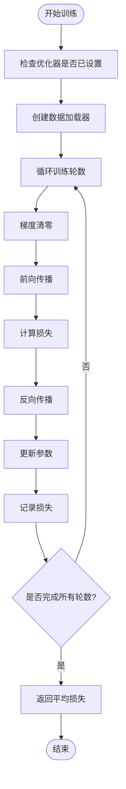
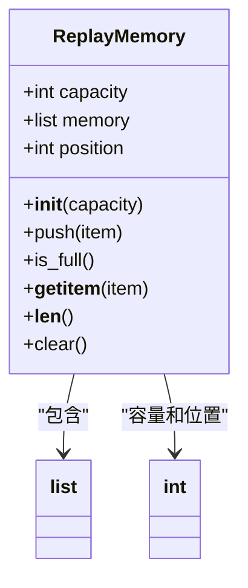
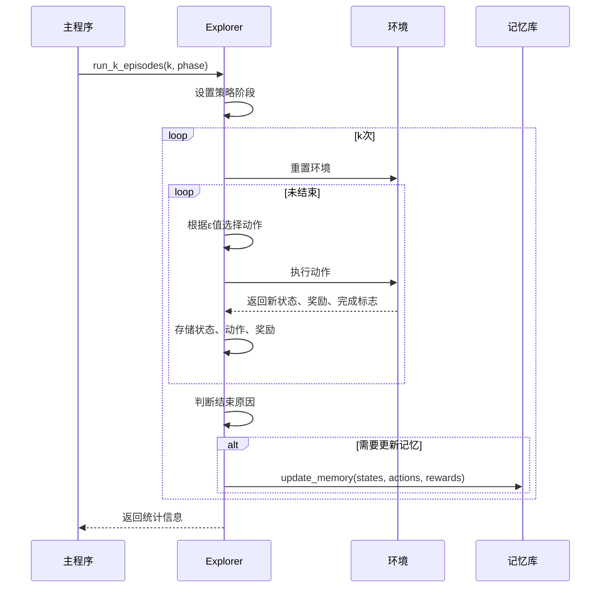
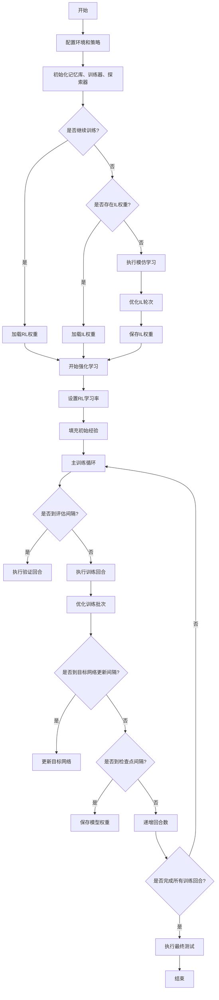

# 强化学习训练流程

<cite>
**本文档中引用的文件**  
- [trainer.py](file://CrowdNav/crowd_nav/utils/trainer.py)
- [memory.py](file://CrowdNav/crowd_nav/utils/memory.py)
- [explorer.py](file://CrowdNav/crowd_nav/utils/explorer.py)
- [train.py](file://CrowdNav/crowd_nav/train.py)
- [policy_factory.py](file://CrowdNav/crowd_nav/policy/policy_factory.py)
</cite>

## 目录
1. [简介](#简介)
2. [训练循环实现](#训练循环实现)
3. [经验回放缓冲区设计](#经验回放缓冲区设计)
4. [ε-greedy探索机制](#ε-greedy探索机制)
5. [DQN算法应用](#dqn算法应用)
6. [超参数配置与调优](#超参数配置与调优)
7. [训练日志分析](#训练日志分析)
8. [结论](#结论)

## 简介
本文档全面解析CrowdNav项目中的强化学习训练流程，重点分析`trainer.py`中的训练循环实现、`memory.py`中的经验回放缓冲区设计、`explorer.py`中的探索机制以及`train.py`中的超参数配置。文档旨在为用户提供完整的训练流程理解，帮助识别和解决训练过程中的常见问题。

## 训练循环实现

`trainer.py`文件中的`Trainer`类负责实现强化学习模型的训练循环。该类通过`optimize_epoch`和`optimize_batch`两个核心方法实现训练过程。

`optimize_epoch`方法按指定的训练轮数进行优化，每轮遍历整个经验回放缓冲区。该方法首先检查优化器是否已设置，然后创建数据加载器以实现数据的随机打乱。训练过程中，输入数据和目标值被转换为PyTorch变量，通过前向传播计算输出，计算均方误差损失，执行反向传播更新模型参数，并记录每轮的平均损失。

`optimize_batch`方法则按指定的批次数进行优化，每次从数据加载器中获取一个批次的数据进行训练。这种方法更适合在线学习场景，可以更频繁地更新模型参数。

**图示来源**
- [trainer.py](file://CrowdNav/crowd_nav/utils/trainer.py#L37-L71)

**本节来源**
- [trainer.py](file://CrowdNav/crowd_nav/utils/trainer.py#L0-L71)

## 经验回放缓冲区设计

`memory.py`文件中的`ReplayMemory`类实现了经验回放缓冲区，这是深度强化学习中的关键组件。该类继承自PyTorch的`Dataset`类，使其能够与`DataLoader`无缝集成。

缓冲区采用循环队列的设计，当缓冲区满时，新的经验会覆盖最旧的经验。`push`方法负责将新的经验项添加到缓冲区，通过`position`属性跟踪下一个插入位置，并使用模运算实现循环覆盖。`is_full`方法用于检查缓冲区是否已满，`__getitem__`和`__len__`方法使缓冲区支持索引访问和长度查询。

这种设计确保了训练数据的多样性，同时避免了缓冲区无限增长的内存问题。通过`DataLoader`的随机采样，模型能够在训练过程中从不同时间点的经验中学习，打破数据的时间相关性，提高训练稳定性。

**图示来源**
- [memory.py](file://CrowdNav/crowd_nav/utils/memory.py#L0-L28)

**本节来源**
- [memory.py](file://CrowdNav/crowd_nav/utils/memory.py#L0-L28)

## ε-greedy探索机制

`explorer.py`文件中的`Explorer`类实现了ε-greedy探索机制，这是平衡探索与利用的关键策略。在训练初期，算法以较高的概率进行随机探索（高ε值），随着训练的进行，ε值逐渐衰减，算法更多地依赖已学习的策略进行决策。

`run_k_episodes`方法执行指定数量的训练或评估回合，根据当前的ε值决定是采取策略建议的动作还是随机动作。`update_memory`方法负责将经验存储到回放缓冲区，对于模仿学习，状态价值被定义为累积折扣奖励；对于强化学习，在非终止状态，价值是即时奖励与下一状态价值的折扣和。

ε值的调度在`train.py`中实现，采用线性衰减策略：在前`epsilon_decay`个训练回合中，ε从`epsilon_start`线性衰减到`epsilon_end`，之后保持恒定。这种调度方式确保了算法在训练初期有足够的探索，而在后期能够稳定收敛。

**图示来源**
- [explorer.py](file://CrowdNav/crowd_nav/utils/explorer.py#L0-L132)
- [train.py](file://CrowdNav/crowd_nav/train.py#L130-L145)

**本节来源**
- [explorer.py](file://CrowdNav/crowd_nav/utils/explorer.py#L0-L132)

## DQN算法应用

虽然项目支持多种策略，但训练流程主要基于DQN（深度Q网络）算法的变体。在`train.py`的主函数中，首先配置环境、策略和训练参数，然后初始化经验回放缓冲区、训练器和探索器。

训练流程分为两个阶段：模仿学习和强化学习。在模仿学习阶段，使用专家策略收集经验并进行监督学习，优化目标是使网络输出接近专家策略的价值。在强化学习阶段，使用ε-greedy策略收集经验，通过最小化预测价值与目标价值之间的均方误差来更新网络。

目标网络的使用是DQN的关键特征，通过`explorer.update_target_model(model)`定期更新目标网络，提高了训练的稳定性。损失函数为均方误差（MSELoss），优化器为SGD，梯度更新通过标准的反向传播实现。

**图示来源**
- [train.py](file://CrowdNav/crowd_nav/train.py#L0-L177)
- [trainer.py](file://CrowdNav/crowd_nav/utils/trainer.py#L0-L71)

**本节来源**
- [train.py](file://CrowdNav/crowd_nav/train.py#L0-L177)

## 超参数配置与调优

`train.py`中的超参数配置对训练效果至关重要。配置文件分为环境配置、策略配置和训练配置三部分。关键的训练超参数包括：

- **学习率**：强化学习阶段的学习率（`rl_learning_rate`）需要仔细调优。过高的学习率可能导致训练不稳定，过低则收敛缓慢。建议从0.001开始尝试，根据损失曲线调整。
- **折扣因子**（gamma）：决定了未来奖励的重要性。较高的值（如0.9）鼓励长期规划，较低的值（如0.8）更关注即时奖励。应根据任务特性选择。
- **批大小**（batch_size）：影响训练稳定性和速度。较大的批大小提供更稳定的梯度估计，但需要更多内存。32-128是常见范围。
- **经验回放缓冲区容量**（capacity）：应足够大以包含多样化的经验，但不宜过大以免包含过时的经验。10000-50000是典型值。
- **ε-greedy参数**：`epsilon_start`通常设为1.0（完全探索），`epsilon_end`设为0.1或0.01（少量探索），`epsilon_decay`控制衰减速度，应与总训练回合数匹配。

调优建议：首先固定其他参数，调整学习率至损失平稳下降；然后调整折扣因子以平衡短期和长期奖励；最后微调探索参数以确保充分探索。

**本节来源**
- [train.py](file://CrowdNav/crowd_nav/train.py#L70-L120)

## 训练日志分析

训练日志提供了评估模型性能的关键信息。日志中记录的成功率、碰撞率、导航时间和平均奖励是主要的评估指标。

**过拟合识别**：如果验证集成功率远低于训练集成功率，或验证集损失开始上升而训练集损失继续下降，则可能发生过拟合。解决方案包括增加经验回放缓冲区的随机性、添加正则化或减少模型复杂度。

**训练停滞识别**：如果成功率和平均奖励长时间不提升，可能表明训练停滞。原因可能是学习率过低、探索不足或陷入局部最优。解决方案包括增加探索率（提高ε_end）、调整学习率或重新初始化部分网络权重。

日志中的"Frequency of being in danger"指标反映了机器人在危险区域的频率，应随训练进行而降低。如果该值不降反升，可能表明策略过于激进，需要调整奖励函数或增加安全空间。

**本节来源**
- [train.py](file://CrowdNav/crowd_nav/train.py#L150-L170)
- [explorer.py](file://CrowdNav/crowd_nav/utils/explorer.py#L100-L130)

## 结论
CrowdNav的强化学习训练流程设计完整，涵盖了从经验收集、模型训练到策略评估的各个环节。通过理解`trainer.py`的训练循环、`memory.py`的缓冲区设计、`explorer.py`的探索机制和`train.py`的超参数配置，用户能够有效训练和调优导航策略。建议在实际应用中密切监控训练日志，及时识别和解决过拟合、训练停滞等问题，以获得最佳的导航性能。