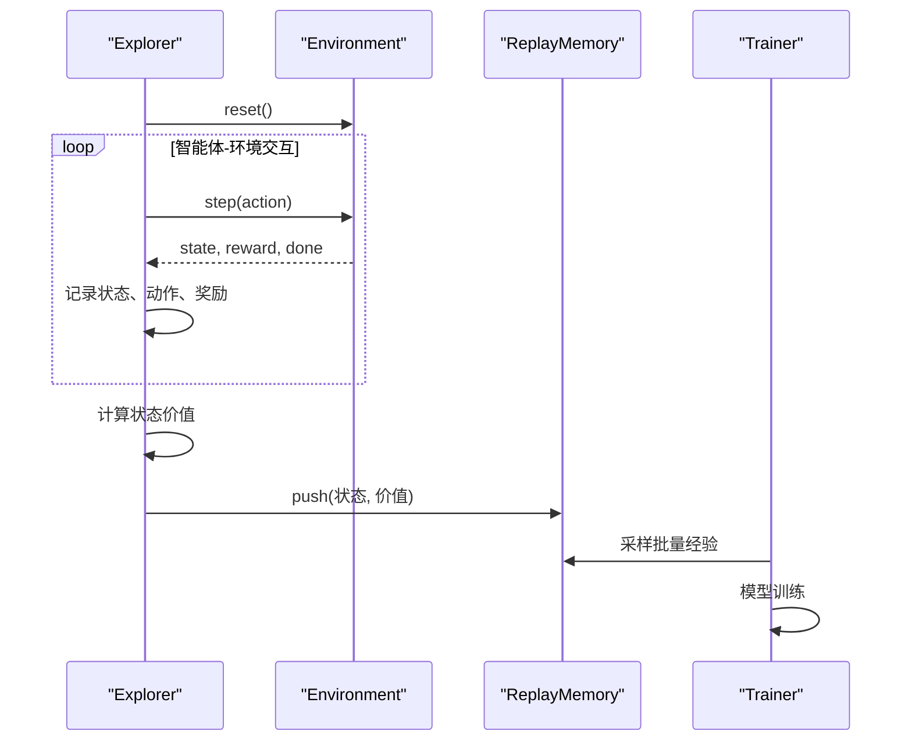
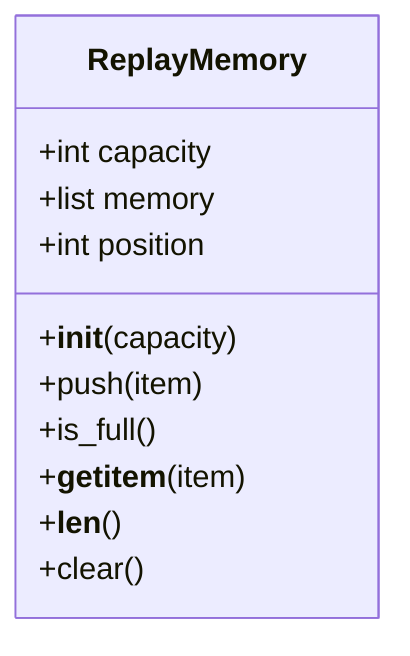
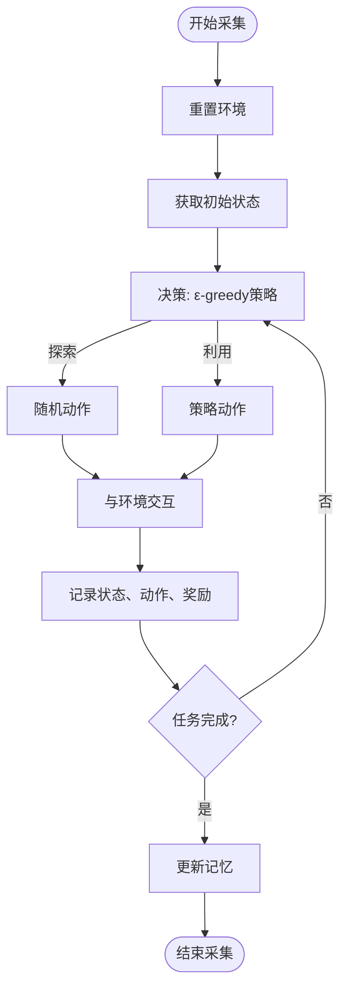
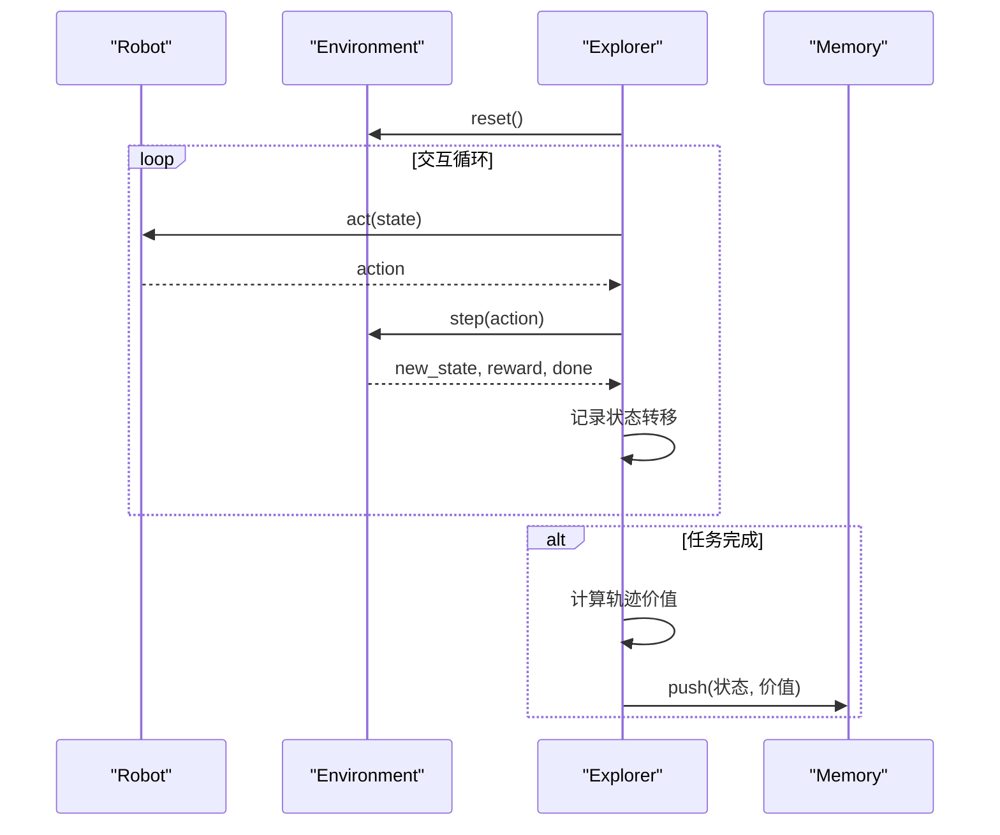
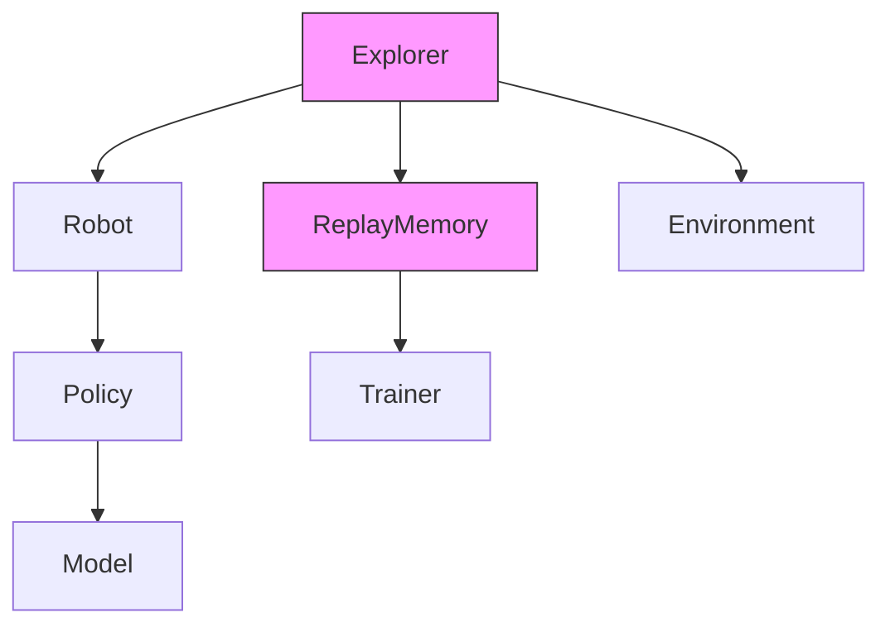

# 数据采集与经验回放

<cite>
**本文档引用文件**   
- [memory.py](file://AEMCARL/crowd_nav/utils/memory.py)
- [explorer.py](file://AEMCARL/crowd_nav/utils/explorer.py)
</cite>

## 目录
1. [简介](#简介)
2. [项目结构](#项目结构)
3. [核心组件](#核心组件)
4. [架构概述](#架构概述)
5. [详细组件分析](#详细组件分析)
6. [依赖分析](#依赖分析)
7. [性能考量](#性能考量)
8. [故障排除指南](#故障排除指南)
9. [结论](#结论)

## 简介
本文档详细阐述CrowdNav中数据采集机制的实现，重点分析经验回放缓冲区的设计与功能。文档聚焦于`memory.py`中`ReplayMemory`类的实现，解释其作为循环缓冲区的数据结构设计、存储的经验元组格式以及批量采样策略。同时结合`explorer.py`中的探索机制，说明ε-greedy策略如何影响数据多样性。此外，讨论缓冲区大小和采样批次对训练稳定性和效率的影响，并提供最佳实践建议。

## 项目结构
CrowdNav项目采用模块化设计，主要组件包括策略模块、环境模拟模块和工具模块。数据采集与经验回放机制主要位于`utils`目录下，由`memory.py`和`explorer.py`两个核心文件实现。`memory.py`负责经验回放缓冲区的管理，而`explorer.py`则负责智能体与环境的交互及经验数据的采集。

```mermaid
graph TD
subgraph "CrowdNav"
subgraph "utils"
Memory[memory.py<br/>经验回放缓冲区]
Explorer[explorer.py<br/>数据采集与探索]
end
subgraph "policy"
Policy[策略实现]
end
subgraph "envs"
Env[环境模拟]
end
end
Explorer --> Memory : "存储经验"
Policy --> Explorer : "执行策略"
Env --> Explorer : "提供状态"
```

**Diagram sources**
- [memory.py](file://AEMCARL/crowd_nav/utils/memory.py)
- [explorer.py](file://AEMCARL/crowd_nav/utils/explorer.py)

**Section sources**
- [memory.py](file://AEMCARL/crowd_nav/utils/memory.py)
- [explorer.py](file://AEMCARL/crowd_nav/utils/explorer.py)

## 核心组件
本节深入分析经验回放缓冲区和数据采集机制的核心组件。

**Section sources**
- [memory.py](file://AEMCARL/crowd_nav/utils/memory.py#L3-L27)
- [explorer.py](file://AEMCARL/crowd_nav/utils/explorer.py#L7-L150)

## 架构概述
CrowdNav的数据采集与经验回放系统采用生产者-消费者模式。`Explorer`类作为生产者，负责与环境交互并生成经验数据；`ReplayMemory`类作为消费者，负责存储和提供训练所需的经验数据。该架构实现了数据采集与模型训练的解耦，提高了系统的灵活性和可维护性。



**Diagram sources**
- [explorer.py](file://AEMCARL/crowd_nav/utils/explorer.py#L7-L150)
- [memory.py](file://AEMCARL/crowd_nav/utils/memory.py#L3-L27)

## 详细组件分析
本节对经验回放缓冲区和数据采集机制进行详细分析。

### 经验回放缓冲区分析
`ReplayMemory`类实现了经验回放缓冲区，采用循环缓冲区数据结构来存储智能体与环境交互的经验。



**Diagram sources**
- [memory.py](file://AEMCARL/crowd_nav/utils/memory.py#L3-L27)

#### 数据结构设计
`ReplayMemory`类采用循环缓冲区（Circular Buffer）作为其底层数据结构。该设计具有以下特点：
- **固定容量**：通过`capacity`参数定义缓冲区的最大容量，防止内存无限增长
- **循环覆盖**：使用`position`变量跟踪当前写入位置，当缓冲区满时，新经验将覆盖最旧的经验
- **高效存储**：使用Python列表作为底层存储，保证O(1)的平均时间复杂度

循环缓冲区的实现确保了经验数据的持续更新，同时保持了固定内存占用，这对于长期训练至关重要。

**Section sources**
- [memory.py](file://AEMCARL/crowd_nav/utils/memory.py#L3-L27)

#### 经验元组存储
经验回放缓冲区存储的经验元组包含状态和对应的价值（value），而非传统的（状态、动作、奖励、下一状态）四元组。这种设计的目的是：
- **简化存储**：只存储状态和预计算的价值，减少存储开销
- **提高效率**：在数据采集阶段就计算好状态价值，避免训练时重复计算
- **适应算法**：符合特定强化学习算法的需求，如Actor-Critic架构

每个经验项以元组`(state, value)`的形式存储，其中`state`表示智能体观察到的环境状态，`value`表示该状态的预期回报。

**Section sources**
- [memory.py](file://AEMCARL/crowd_nav/utils/memory.py#L9-L15)
- [explorer.py](file://AEMCARL/crowd_nav/utils/explorer.py#L113-L150)

#### 批量采样策略
`ReplayMemory`类继承自PyTorch的`Dataset`类，这使得它可以与PyTorch的数据加载器无缝集成。批量采样策略具有以下特点：
- **随机采样**：通过PyTorch的数据加载器实现随机批量采样，打破经验数据的时间相关性
- **可迭代性**：实现`__getitem__`和`__len__`方法，支持标准的索引访问和长度查询
- **批量训练**：与`DataLoader`配合使用，支持高效的批量训练

这种设计充分利用了PyTorch生态系统的优势，简化了训练流程的实现。

**Section sources**
- [memory.py](file://AEMCARL/crowd_nav/utils/memory.py#L17-L23)

### 探索策略分析
`Explorer`类实现了智能体的数据采集机制，其中包含探索与利用的平衡策略。



**Diagram sources**
- [explorer.py](file://AEMCARL/crowd_nav/utils/explorer.py#L7-L150)

#### ε-greedy探索策略
虽然代码中未直接实现ε-greedy策略，但`Explorer`类为实现该策略提供了基础框架。探索与利用的平衡通过以下方式实现：
- **策略切换**：`robot.policy.set_phase(phase)`方法允许在不同策略模式间切换
- **多样化行为**：通过`run_k_episodes`方法执行多轮交互，收集多样化的经验数据
- **条件存储**：仅在成功到达目标或发生碰撞时才将经验存入缓冲区，确保数据质量

这种设计确保了采集到的经验数据既包含成功的导航轨迹，也包含失败的案例，提高了训练数据的多样性。

**Section sources**
- [explorer.py](file://AEMCARL/crowd_nav/utils/explorer.py#L45-L60)

#### 智能体交互示例
以下代码示例展示了智能体如何与环境交互并将经验存入缓冲区：



**Diagram sources**
- [explorer.py](file://AEMCARL/crowd_nav/utils/explorer.py#L61-L112)

## 依赖分析
经验回放缓冲区和数据采集机制与其他组件存在紧密依赖关系。



**Diagram sources**
- [explorer.py](file://AEMCARL/crowd_nav/utils/explorer.py)
- [memory.py](file://AEMCARL/crowd_nav/utils/memory.py)

**Section sources**
- [explorer.py](file://AEMCARL/crowd_nav/utils/explorer.py#L7-L150)
- [memory.py](file://AEMCARL/crowd_nav/utils/memory.py#L3-L27)

## 性能考量
缓冲区大小和采样批次对训练稳定性和效率有重要影响。

### 缓冲区大小影响
- **过小**：导致经验数据快速被覆盖，降低数据多样性，可能引起训练不稳定
- **过大**：增加内存占用，可能导致训练初期采样到大量过时的经验，影响学习效率
- **建议**：根据环境复杂度和训练需求选择合适的缓冲区大小，通常在10,000到100,000之间

### 采样批次影响
- **过小**：增加训练的随机性，可能导致收敛速度慢
- **过大**：降低训练的随机性，可能陷入局部最优
- **建议**：通常选择32到128之间的批次大小，平衡训练稳定性和效率

**Section sources**
- [memory.py](file://AEMCARL/crowd_nav/utils/memory.py)
- [explorer.py](file://AEMCARL/crowd_nav/utils/explorer.py)

## 故障排除指南
### 常见问题
- **缓冲区未填充**：检查`update_memory`参数是否正确设置，确保`memory`和`gamma`已初始化
- **训练不稳定**：调整缓冲区大小和采样批次，检查经验数据的质量
- **内存溢出**：检查缓冲区容量设置，确保不会无限增长

### 调试建议
- 使用`is_full()`方法监控缓冲区状态
- 检查`run_k_episodes`的输出日志，确认数据采集正常
- 验证`update_memory`调用条件，确保关键经验被正确存储

**Section sources**
- [memory.py](file://AEMCARL/crowd_nav/utils/memory.py#L16-L17)
- [explorer.py](file://AEMCARL/crowd_nav/utils/explorer.py#L100-L112)

## 结论
CrowdNav的经验回放缓冲区和数据采集机制设计合理，有效支持了强化学习算法的训练需求。`ReplayMemory`类采用循环缓冲区数据结构，实现了高效的经验存储和批量采样。`Explorer`类提供了完整的数据采集框架，支持探索与利用的平衡。通过合理配置缓冲区大小和采样批次，可以获得稳定的训练性能。建议在实际应用中根据具体需求调整参数，并监控数据采集过程，确保训练质量。