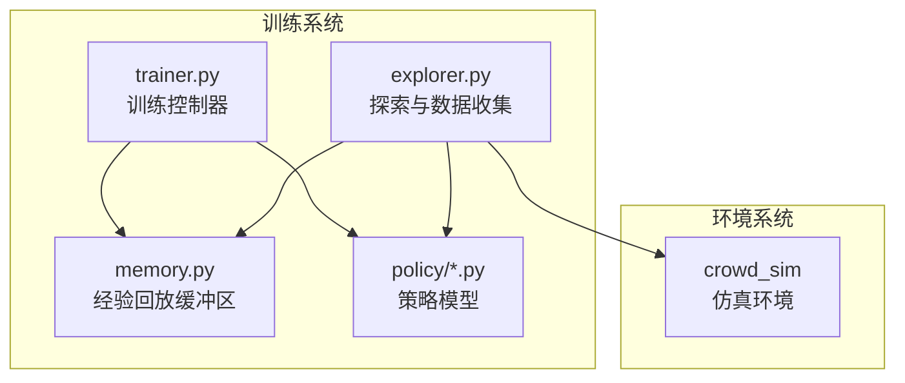
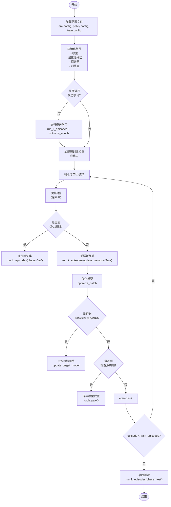
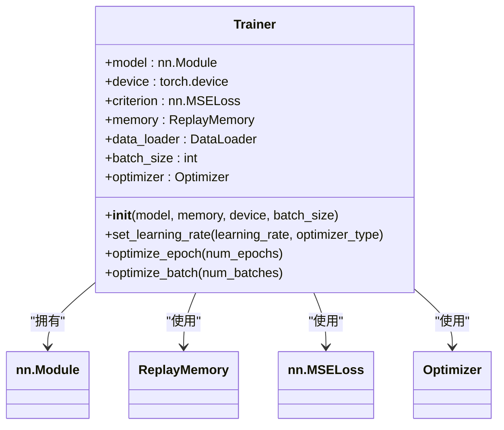
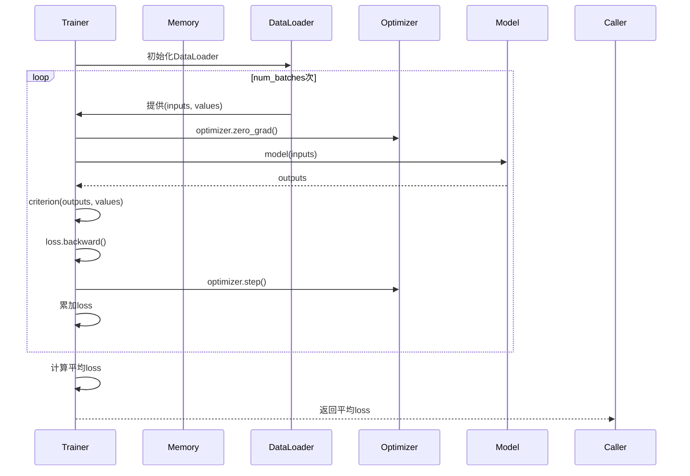
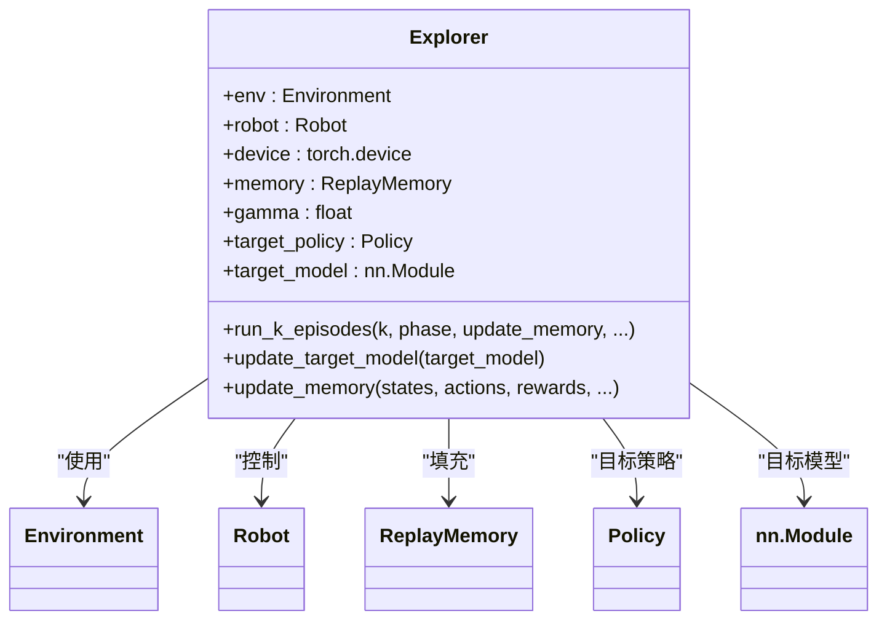
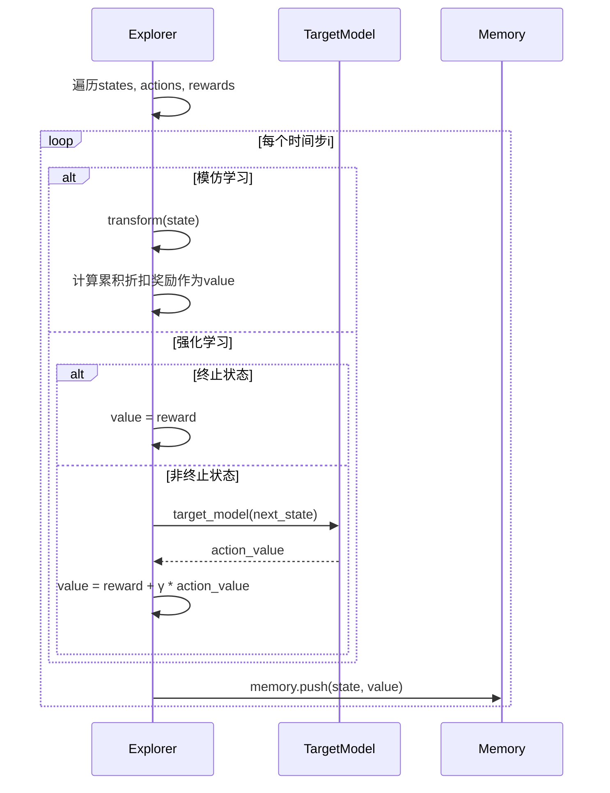
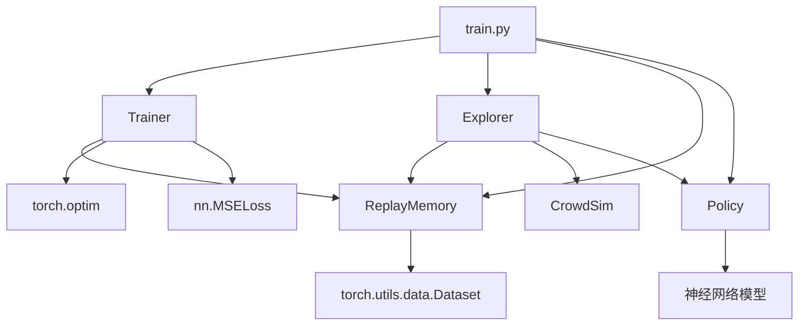

# 模型训练循环

<cite>
**本文档中引用的文件**   
- [trainer.py](file://AEMCARL/crowd_nav/utils/trainer.py)
- [train.py](file://AEMCARL/crowd_nav/train.py)
- [memory.py](file://AEMCARL/crowd_nav/utils/memory.py)
- [explorer.py](file://AEMCARL/crowd_nav/utils/explorer.py)
- [policy_factory.py](file://AEMCARL/crowd_nav/policy/policy_factory.py)
- [actenvcarl.py](file://AEMCARL/crowd_nav/policy/actenvcarl.py)
</cite>

## 目录
1. [简介](#简介)
2. [项目结构](#项目结构)
3. [核心组件](#核心组件)
4. [训练主循环架构](#训练主循环架构)
5. [详细组件分析](#详细组件分析)
6. [依赖分析](#依赖分析)
7. [性能考量](#性能考量)
8. [故障排除指南](#故障排除指南)
9. [结论](#结论)

## 简介
本文档深入分析CrowdNav项目中的模型训练循环，以`trainer.py`为核心，详细阐述从经验回放缓冲区采样、损失计算、反向传播到优化器更新的完整流程。同时结合`train.py`说明训练初始化、检查点保存和日志记录机制，并解释目标网络更新在稳定训练中的作用。

## 项目结构
CrowdNav项目主要包含`crowd_nav`和`crowd_sim`两个核心模块。其中`crowd_nav`负责导航策略的实现与训练，其`utils`目录下的`trainer.py`、`memory.py`和`explorer.py`构成了训练系统的核心组件。

**图示来源**
- [trainer.py](file://AEMCARL/crowd_nav/utils/trainer.py#L1-L86)
- [memory.py](file://AEMCARL/crowd_nav/utils/memory.py#L1-L28)
- [explorer.py](file://AEMCARL/crowd_nav/utils/explorer.py#L1-L158)

**本节来源**
- [AEMCARL\crowd_nav\utils](file://AEMCARL/crowd_nav/utils)
- [AEMCARL\crowd_nav\policy](file://AEMCARL/crowd_nav/policy)

## 核心组件
训练系统由三个核心组件构成：`Trainer`负责执行优化过程，`ReplayMemory`管理经验回放缓冲区，`Explorer`负责与环境交互并收集训练数据。

**本节来源**
- [trainer.py](file://AEMCARL/crowd_nav/utils/trainer.py#L8-L85)
- [memory.py](file://AEMCARL/crowd_nav/utils/memory.py#L4-L28)
- [explorer.py](file://AEMCARL/crowd_nav/utils/explorer.py#L8-L158)

## 训练主循环架构
训练主循环由`train.py`中的`main()`函数驱动，其核心流程包括：初始化配置、执行模仿学习（可选）、进行强化学习训练，并定期保存检查点。

**图示来源**
- [train.py](file://AEMCARL/crowd_nav/train.py#L100-L250)
- [trainer.py](file://AEMCARL/crowd_nav/utils/trainer.py#L40-L85)
- [explorer.py](file://AEMCARL/crowd_nav/utils/explorer.py#L40-L158)

## 详细组件分析

### Trainer组件分析
`Trainer`类是模型优化的核心，负责执行反向传播和参数更新。

#### 训练器类结构

**图示来源**
- [trainer.py](file://AEMCARL/crowd_nav/utils/trainer.py#L8-L85)

#### 优化批次流程

**图示来源**
- [trainer.py](file://AEMCARL/crowd_nav/utils/trainer.py#L65-L85)

**本节来源**
- [trainer.py](file://AEMCARL/crowd_nav/utils/trainer.py#L8-L85)

### Explorer组件分析
`Explorer`负责与环境交互，收集训练数据并计算目标值。

#### 探索器类结构

**图示来源**
- [explorer.py](file://AEMCARL/crowd_nav/utils/explorer.py#L8-L158)

#### 经验更新流程

**图示来源**
- [explorer.py](file://AEMCARL/crowd_nav/utils/explorer.py#L100-L140)

**本节来源**
- [explorer.py](file://AEMCARL/crowd_nav/utils/explorer.py#L8-L158)

## 依赖分析
训练系统各组件之间存在明确的依赖关系，形成一个完整的训练闭环。

**图示来源**
- [train.py](file://AEMCARL/crowd_nav/train.py#L30-L250)
- [trainer.py](file://AEMCARL/crowd_nav/utils/trainer.py#L8-L85)
- [explorer.py](file://AEMCARL/crowd_nav/utils/explorer.py#L8-L158)
- [memory.py](file://AEMCARL/crowd_nav/utils/memory.py#L4-L28)

**本节来源**
- [train.py](file://AEMCARL/crowd_nav/train.py#L1-L250)
- [trainer.py](file://AEMCARL/crowd_nav/utils/trainer.py#L1-L86)
- [explorer.py](file://AEMCARL/crowd_nav/utils/explorer.py#L1-L158)
- [memory.py](file://AEMCARL/crowd_nav/utils/memory.py#L1-L28)

## 性能考量
训练过程中需要注意以下性能相关因素：
- 批量大小(batch_size)影响内存使用和梯度估计的稳定性
- 经验回放缓冲区容量(capacity)需要平衡内存消耗和经验多样性
- 目标网络更新频率(target_update_interval)影响训练稳定性
- 数据加载使用DataLoader的shuffle功能，确保训练样本的随机性

## 故障排除指南
常见问题及解决方案：

**本节来源**
- [trainer.py](file://AEMCARL/crowd_nav/utils/trainer.py#L40-L45)
- [train.py](file://AEMCARL/crowd_nav/train.py#L150-L160)

## 结论
CrowdNav的训练系统采用经典的DQN训练框架，通过`Trainer`、`Explorer`和`ReplayMemory`三个核心组件协同工作，实现了从环境交互到模型优化的完整闭环。系统支持模仿学习预训练，并通过目标网络机制提高训练稳定性，是一个结构清晰、易于扩展的强化学习训练架构。