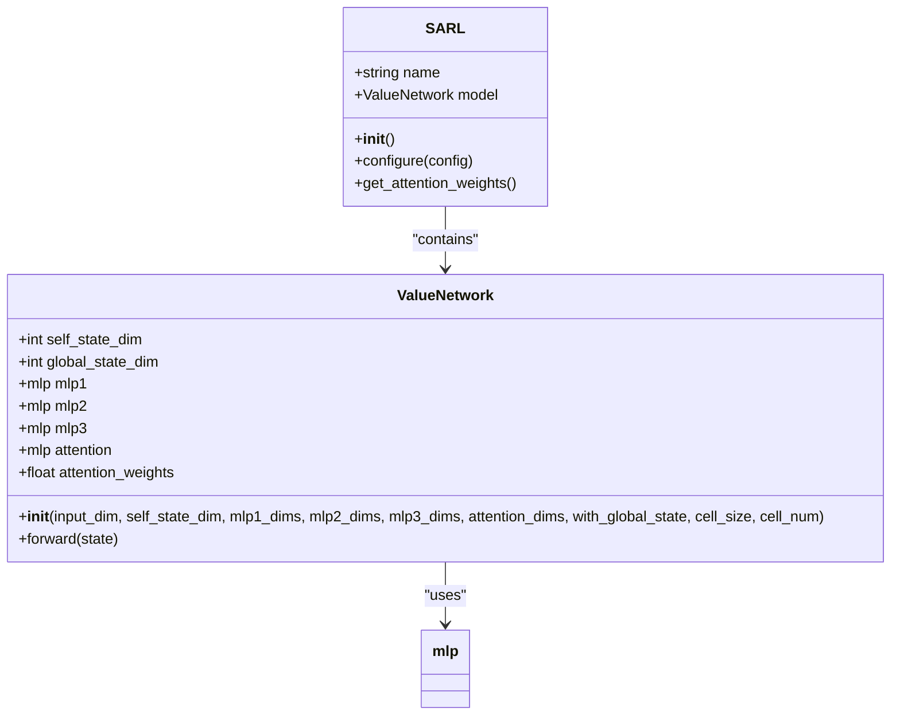
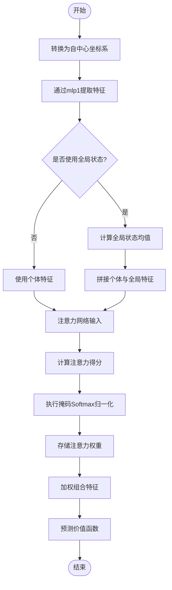

# 注意力机制实现

<cite>
**Referenced Files in This Document**   
- [sarl.py](file://AEMCARL/crowd_nav/policy/sarl.py)
- [components.py](file://AEMCARL/crowd_nav/common/components.py)
- [plot.py](file://AEMCARL/crowd_nav/utils/plot.py)
</cite>

## 目录
1. [注意力机制概述](#注意力机制概述)
2. [核心组件分析](#核心组件分析)
3. [注意力权重计算流程](#注意力权重计算流程)
4. [可学习注意力网络结构](#可学习注意力网络结构)
5. [注意力热力图可视化](#注意力热力图可视化)
6. [模型决策依据分析](#模型决策依据分析)

## 注意力机制概述

SARL（Socially Aware Reinforcement Learning）策略中的注意力机制是一种神经网络架构，旨在使机器人能够在密集人群环境中进行安全导航。该机制通过计算每个行人的社会重要性得分，并将其归一化为权重分布，从而使模型能够动态关注对机器人决策影响最大的行人。

该注意力机制的核心思想是：并非所有行人都对机器人的当前决策具有同等重要性。通过引入可学习的注意力网络，模型能够自动识别并重点关注那些对导航安全构成最大潜在影响的行人，从而提升在复杂社交场景中的决策质量。

**Section sources**
- [sarl.py](file://AEMCARL/crowd_nav/policy/sarl.py#L1-L10)

## 核心组件分析

SARL策略的注意力机制主要由`ValueNetwork`类实现，该类继承自PyTorch的`nn.Module`。其核心组件包括多层感知机（MLP）网络、注意力计算模块和权重归一化机制。

`ValueNetwork`的初始化函数接收多个参数，包括输入维度、自状态维度、各MLP层的维度以及是否使用全局状态等。这些参数共同定义了网络的结构和行为。其中，`mlp1`、`mlp2`和`mlp3`是三个串联的多层感知机，分别负责特征提取、特征转换和最终价值预测。



**Diagram sources**
- [sarl.py](file://AEMCARL/crowd_nav/policy/sarl.py#L8-L89)

**Section sources**
- [sarl.py](file://AEMCARL/crowd_nav/policy/sarl.py#L8-L89)

## 注意力权重计算流程

注意力权重的计算流程在`ValueNetwork`类的`forward`方法中实现。该流程首先将世界坐标系下的状态转换为以机器人为中心的坐标系，然后进行前向计算。

计算过程首先通过`mlp1`网络对输入状态进行特征提取，得到`mlp1_output`。随后，根据配置决定是否使用全局状态。如果使用全局状态，则计算所有行人特征的均值作为全局状态，并将其与个体特征拼接作为注意力网络的输入。

注意力得分通过一个专门的MLP网络计算，该网络的输出经过指数运算和归一化处理，最终得到注意力权重。这一过程实现了对重要行人的动态关注。



**Diagram sources**
- [sarl.py](file://AEMCARL/crowd_nav/policy/sarl.py#L30-L64)

**Section sources**
- [sarl.py](file://AEMCARL/crowd_nav/policy/sarl.py#L30-L64)

## 可学习注意力网络结构

可学习的注意力网络是SARL策略的核心创新之一。该网络通过一个专门的MLP（多层感知机）实现，其输入维度根据是否使用全局状态而有所不同。当使用全局状态时，输入维度为`mlp1_dims[-1] * 2`；否则为`mlp1_dims[-1]`。

注意力网络的输出经过处理后，通过softmax函数归一化为权重分布。这种设计使得模型能够学习到不同行人对机器人决策的重要性差异。权重较大的行人被认为对当前决策更为关键，模型会更多地考虑这些行人的状态和行为。

```python
[SPEC SYMBOL](file://AEMCARL/crowd_nav/policy/sarl.py#L15-L20)
```

该注意力机制通过反向传播算法进行端到端训练，使得注意力权重的分配能够随着策略的优化而不断改进。这种自适应的注意力分配机制是SARL能够在复杂社交场景中表现出色的关键因素。

**Section sources**
- [sarl.py](file://AEMCARL/crowd_nav/policy/sarl.py#L15-L20)

## 注意力热力图可视化

注意力热力图是理解模型决策过程的重要工具。在SARL实现中，注意力权重被存储在`attention_weights`字段中，可以通过`get_attention_weights`方法获取。这些权重可以直接用于生成热力图，直观展示模型在决策时对不同行人的关注程度。

```python
[SPEC SYMBOL](file://AEMCARL/crowd_nav/policy/sarl.py#L85-L88)
```

通过可视化注意力热力图，研究人员和开发者可以验证模型是否合理地分配了注意力。例如，在密集人群中，模型应该更多地关注距离机器人较近或运动方向可能与机器人路径相交的行人。这种可视化分析有助于调试和改进模型。

**Section sources**
- [sarl.py](file://AEMCARL/crowd_nav/policy/sarl.py#L85-L88)

## 模型决策依据分析

SARL的注意力机制通过动态关注对机器人决策影响最大的行人，显著提升了在密集人群中的导航安全性。该机制使模型能够识别出潜在的冲突风险，并优先考虑这些风险因素。

通过分析注意力权重的分布，可以深入理解模型的决策依据。例如，当多个行人同时出现在机器人前方时，模型可能会给予即将穿越机器人路径的行人更高的注意力权重。这种智能的注意力分配机制模拟了人类在社交场合中的自然行为，即优先关注对自己行动有直接影响的个体。

该注意力机制不仅提高了导航的安全性，还增强了模型的可解释性。通过观察注意力权重的变化，可以洞察模型在不同场景下的决策逻辑，为算法的进一步优化提供了有价值的反馈。

**Section sources**
- [sarl.py](file://AEMCARL/crowd_nav/policy/sarl.py#L60-L64)