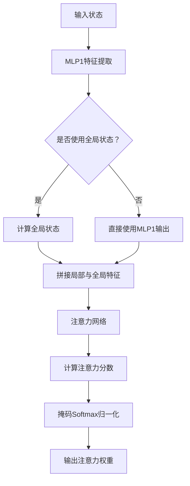
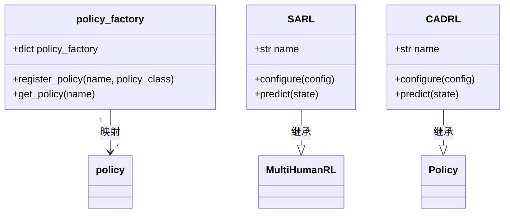
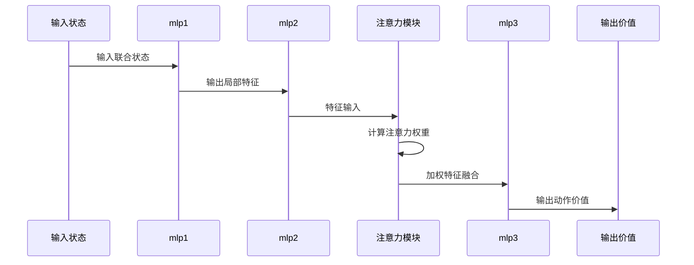

# 社交感知策略实现

<cite>
**本文档引用的文件**  
- [sarl.py](file://AEMCARL/crowd_nav/policy/sarl.py)
- [policy_factory.py](file://AEMCARL/crowd_nav/policy/policy_factory.py)
- [components.py](file://AEMCARL/crowd_nav/common/components.py)
- [cadrl.py](file://AEMCARL/crowd_nav/policy/cadrl.py)
</cite>

## 目录
1. [引言](#引言)
2. [SARL网络结构设计](#sarl网络结构设计)
3. [行人状态编码与注意力机制](#行人状态编码与注意力机制)
4. [策略注册与加载机制](#策略注册与加载机制)
5. [共享组件设计模式](#共享组件设计模式)
6. [前向传播流程与注意力可视化](#前向传播流程与注意力可视化)
7. [SARL与CADRL决策对比](#sarl与cadrl决策对比)
8. [结论](#结论)

## 引言
社交感知强化学习（Socially Aware Reinforcement Learning, SARL）是一种用于多智能体导航的深度学习策略，能够有效处理机器人与行人之间的复杂交互。本文深入分析SARL策略的实现细节，重点解析其网络结构设计、注意力机制、策略注册机制以及共享组件复用模式，旨在提升模型的可解释性与灵活性。

## SARL网络结构设计

SARL策略基于`ValueNetwork`类构建，该类继承自PyTorch的`nn.Module`，其核心结构包含多个MLP（多层感知机）模块和注意力机制。网络输入为机器人与行人的联合状态，输出为动作价值估计。

网络结构主要由以下组件构成：
- `mlp1`：用于处理每个行人状态的初始特征提取
- `mlp2`：进一步抽象行人特征
- `attention`：计算机器人对每个行人的社会重要性权重
- `mlp3`：融合机器人自身状态与加权后的行人特征，输出最终价值

该设计允许模型在决策时动态关注对当前情境最具影响力的行人。

**Section sources**
- [sarl.py](file://AEMCARL/crowd_nav/policy/sarl.py#L0-L89)

## 行人状态编码与注意力机制

### 网格化状态编码
SARL采用基于网格的状态编码方式，将周围行人的位置信息转换为固定维度的特征图。通过`cell_size`和`cell_num`参数定义网格的分辨率和范围，实现对环境的结构化表示。这种编码方式使模型能够处理可变数量的行人输入，并保持空间关系的局部性。

### 注意力权重计算
注意力机制是SARL的核心创新，用于计算机器人与每个行人的社会重要性权重。其计算流程如下：



**Diagram sources**
- [sarl.py](file://AEMCARL/crowd_nav/policy/sarl.py#L0-L89)

具体实现中，注意力输入根据`with_global_state`配置决定是否包含全局状态。若启用，则计算所有行人特征的均值作为全局状态，并与每个行人的局部特征拼接。随后通过`attention` MLP网络生成注意力分数，经掩码Softmax归一化后得到最终的注意力权重。

注意力权重反映了模型在决策时对不同行人的关注程度，可用于可视化和解释模型行为。

**Section sources**
- [sarl.py](file://AEMCARL/crowd_nav/policy/sarl.py#L0-L89)

## 策略注册与加载机制

### 策略工厂模式
`policy_factory.py`文件实现了策略的注册与加载机制，采用工厂设计模式支持多种策略的灵活切换。该机制通过一个全局字典`policy_factory`维护策略名称与对应类的映射关系。



**Diagram sources**
- [policy_factory.py](file://AEMCARL/crowd_nav/policy/policy_factory.py#L0-L19)
- [sarl.py](file://AEMCARL/crowd_nav/policy/sarl.py#L67-L88)
- [cadrl.py](file://AEMCARL/crowd_nav/policy/cadrl.py#L50-L55)

### 工作流程
1. **注册阶段**：在`policy_factory.py`中导入所有策略类，并将其注册到`policy_factory`字典中
2. **配置加载**：根据配置文件中的策略名称，从工厂中获取对应的策略类
3. **实例化**：创建策略实例并进行配置
4. **调用**：通过统一接口调用策略的`predict`方法

此机制实现了策略的解耦，便于添加新策略而无需修改核心代码。

**Section sources**
- [policy_factory.py](file://AEMCARL/crowd_nav/policy/policy_factory.py#L0-L19)

## 共享组件设计模式

### MLP模块复用
`components.py`文件中定义了通用的MLP构建函数`mlp()`，用于创建标准化的全连接网络。该函数接受输入维度、层维度列表和激活函数配置，自动构建包含线性层和ReLU激活的序列。

```python
def mlp(input_dim, mlp_dims, last_relu=False):
    layers = []
    mlp_dims = [input_dim] + mlp_dims
    for i in range(len(mlp_dims) - 1):
        layers.append(nn.Linear(mlp_dims[i], mlp_dims[i + 1]))
        if i != len(mlp_dims) - 2 or last_relu:
            layers.append(nn.ReLU())
    net = nn.Sequential(*layers)
    return net
```

该设计模式在`ValueNetwork`中被多次复用，用于构建`mlp1`、`mlp2`、`mlp3`和`attention`等子网络，确保了代码的一致性和可维护性。

### 其他共享组件
文件中还定义了多种共享组件：
- `GRU`：自定义GRU单元
- `GRUEXND`：扩展的GRU网络
- `NaiveGRUModel`：基于PyTorch GRU的简化模型
- `ATCBasic`：自适应计算时间模块

这些组件可在不同策略中复用，促进代码重用和模块化设计。

**Section sources**
- [components.py](file://AEMCARL/crowd_nav/common/components.py#L0-L264)

## 前向传播流程与注意力可视化

### 前向传播流程
SARL的前向传播过程如下：



**Diagram sources**
- [sarl.py](file://AEMCARL/crowd_nav/policy/sarl.py#L0-L89)

### 注意力可视化
通过`get_attention_weights()`方法可获取模型在前向传播过程中计算的注意力权重，用于可视化分析：

```python
def get_attention_weights(self):
    return self.model.attention_weights
```

这些权重可用于生成热力图，直观展示机器人在不同场景下对周围行人的关注程度，增强模型的可解释性。

**Section sources**
- [sarl.py](file://AEMCARL/crowd_nav/policy/sarl.py#L85-L88)

## SARL与CADRL决策对比

| 特性 | SARL | CADRL |
|------|------|-------|
| **状态编码** | 网格化编码，支持注意力机制 | 联合状态直接输入 |
| **行人处理** | 动态注意力加权 | 固定顺序处理 |
| **社会意识** | 显式建模社会重要性 | 隐式学习交互模式 |
| **可解释性** | 高（可通过注意力权重解释） | 低 |
| **计算复杂度** | 较高（需计算注意力） | 较低 |
| **适用场景** | 复杂多行人交互 | 简单避障场景 |

在复杂交互场景中，SARL能够更好地识别关键行人并做出更合理的决策，而CADRL可能因缺乏显式注意力机制而在密集人群中表现不佳。

**Section sources**
- [sarl.py](file://AEMCARL/crowd_nav/policy/sarl.py#L67-L88)
- [cadrl.py](file://AEMCARL/crowd_nav/policy/cadrl.py#L50-L55)

## 结论
SARL策略通过创新的注意力机制实现了对行人社会重要性的动态评估，显著提升了机器人在复杂社交场景中的导航能力。其模块化设计、策略工厂模式和共享组件架构为系统的可扩展性和可维护性提供了有力支持。未来工作可进一步优化注意力机制，探索更高效的特征编码方式，并增强模型在极端密集场景下的鲁棒性。