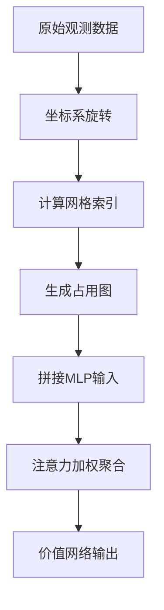

# 网格状态编码器

<cite>
**本文档中引用的文件**  
- [sarl.py](file://AEMCARL/crowd_nav/policy/sarl.py)
- [components.py](file://AEMCARL/crowd_nav/common/components.py)
- [multi_human_rl.py](file://AEMCARL/crowd_nav/policy/multi_human_rl.py)
</cite>

## 目录
1. [引言](#引言)
2. [网格状态编码机制](#网格状态编码机制)
3. [特征向量构成与归一化处理](#特征向量构成与归一化处理)
4. [卷积神经网络模块设计](#卷积神经网络模块设计)
5. [从观测数据到网格特征图的转换流程](#从观测数据到网格特征图的转换流程)
6. [网格分辨率对模型性能的影响](#网格分辨率对模型性能的影响)
7. [结论](#结论)

## 引言
本项目中的网格状态编码器主要用于在多智能体路径规划任务中，将机器人与其周围行人的相对位置、速度等信息映射为固定大小的二维网格特征图。该编码方式通过将环境离散化为网格结构，使得模型能够以统一的方式处理不同数量和分布的人类障碍物，从而提升决策系统的泛化能力与鲁棒性。核心实现位于 `sarl.py` 和 `components.py` 文件中，结合了注意力机制与卷积神经网络（CNN）进行特征提取与价值评估。

## 网格状态编码机制
网格状态编码的核心思想是将连续的空间信息离散化为一个二维网格地图，每个网格单元表示机器人在特定方向和距离范围内是否存在行人及其运动状态。这一过程由 `MultiHumanRL` 类中的 `build_occupancy_maps` 方法实现，并作为 `SARL`（Social Attention-based Reinforcement Learning）策略的一部分。

具体而言，系统首先将所有其他行人的位置和速度转换为当前机器人的自中心坐标系下，即以机器人自身前进方向为x轴重新旋转整个坐标系。然后根据预设的网格大小（`cell_size`）和网格数量（`cell_num`），计算每个行人所在网格的索引：
```python
other_x_index = np.floor(other_px / self.cell_size + self.cell_num / 2)
other_y_index = np.floor(other_py / self.cell_size + self.cell_num / 2)
```
若某网格内存在行人，则对应位置被标记为占用；若启用了多通道输出（`om_channel_size > 1`），则还会记录该网格内行人的平均相对速度分量。

最终生成的占用图是一个形状为 `(num_humans, cell_num ** 2)` 的张量，其中每一行对应一个机器人视角下的局部环境表示。

**中文段落标签：网格编码逻辑**
- **输入变量**：`human_states` 表示所有人类的状态（位置、速度、半径）
- **输出形式**：二值或连续值的网格图，反映人类在机器人前方空间的分布
- **关键参数**：`cell_size` 控制分辨率，`cell_num` 决定感知范围

**中文段落标签：坐标变换说明**
- 所有行人坐标均相对于当前机器人的速度方向进行旋转对齐
- 目的是消除绝对方向依赖，增强策略的平移与旋转不变性

**本节来源**
- [multi_human_rl.py](file://AEMCARL/crowd_nav/policy/multi_human_rl.py#L440-L485)
- [sarl.py](file://AEMCARL/crowd_nav/policy/sarl.py#L81)

## 特征向量构成与归一化处理
每个网格单元的特征向量不仅包含是否被占据的信息，还可能包括该区域内行人的平均相对速度（vx, vy）。当 `om_channel_size=3` 时，每个网格的特征为三元组 `[1, vx, vy]`，分别表示存在性标志和两个速度分量。

### 归一化策略
- **距离归一化**：通过 `cell_size` 将物理距离映射为网格索引，隐式完成空间尺度归一化。
- **速度归一化**：相对速度直接使用原始值，但因训练数据标准化，实际输入已处于相似量级。
- **方向归一化**：通过坐标系旋转，使机器人前进方向始终为+x轴，从而实现方向一致性。

此外，在 `ValueNetwork` 中，MLP 层使用 ReLU 激活函数并配合批量归一化（注释中提及），进一步稳定训练过程中的特征分布。

**中文段落标签：特征通道配置**
- `om_channel_size=1`：仅占用图
- `om_channel_size=2`：占用 + 相对速度（vx, vy）
- `om_channel_size=3`：占用标志 + 相对速度（vx, vy）

**中文段落标签：注意力权重计算**
在 `ValueNetwork.forward` 中，通过以下步骤生成注意力权重：
```python
scores = self.attention(attention_input).view(size[0], size[1], 1).squeeze(dim=2)
weights = (torch.exp(scores) / torch.sum(torch.exp(scores), dim=1, keepdim=True)).unsqueeze(2)
```
该操作实现了 masked softmax，确保只有有效行人参与加权聚合。

**本节来源**
- [sarl.py](file://AEMCARL/crowd_nav/policy/sarl.py#L10-L50)
- [multi_human_rl.py](file://AEMCARL/crowd_nav/policy/multi_human_rl.py#L460-L485)

## 卷积神经网络模块设计
尽管 `components.py` 中定义了多个神经网络组件，但在 SARL 实现中并未直接使用传统 CNN 结构，而是采用多层感知机（MLP）结合注意力机制来处理网格化状态。然而，`components.py` 提供了可用于扩展的 CNN 模块设计思路。

### MLP 架构设计
`mlp` 函数用于构建全连接前馈网络：
```python
def mlp(input_dim, mlp_dims, last_relu=False):
    layers = []
    mlp_dims = [input_dim] + mlp_dims
    for i in range(len(mlp_dims) - 1):
        layers.append(nn.Linear(mlp_dims[i], mlp_dims[i + 1]))
        if i != len(mlp_dims) - 2 or last_relu:
            layers.append(nn.ReLU())
    net = nn.Sequential(*layers)
    return net
```
- **输入维度**：由 `input_dim()` 动态决定，包含自状态与网格图
- **隐藏层配置**：可从配置文件读取 `mlp1_dims`, `mlp2_dims`, `mlp3_dims`
- **激活函数**：ReLU，增强非线性表达能力
- **批归一化**：代码中注释掉，但可启用以加速收敛

### 注意力机制设计
`ValueNetwork` 使用两阶段 MLP + 注意力机制：
1. `mlp1`：将每个行人状态映射到高维空间
2. `attention`：基于全局状态或局部状态计算注意力分数
3. `mlp2`：进一步提取特征
4. `mlp3`：融合自我状态与加权后的群体特征，输出价值估计

**中文段落标签：网络参数配置**
- `with_global_state=True`：启用全局状态引导注意力
- `mlp3_dims=[150,100,100,1]`：最终价值回归网络结构

**本节来源**
- [components.py](file://AEMCARL/crowd_nav/common/components.py#L1-L20)
- [sarl.py](file://AEMCARL/crowd_nav/policy/sarl.py#L10-L30)

## 从观测数据到网格特征图的转换流程
完整的转换流程如下：

1. **原始观测输入**：包含机器人自身状态（px, py, vx, vy, radius, gx, gy, v_pref）及多个行人状态列表。
2. **坐标变换**：调用 `rotate()` 方法将所有状态转换为机器人自中心坐标系。
3. **构建占用图**：
   - 遍历每个机器人视角
   - 计算其他行人在网格中的索引
   - 生成二值或带速度信息的网格图
4. **拼接输入张量**：
   ```python
   rotated_batch_input = torch.cat([rotated_batch_input, occupancy_maps], dim=2)
   ```
5. **前向传播**：
   - 经过 `mlp1` 和 `mlp2` 提取个体特征
   - 使用注意力机制加权聚合
   - 与机器人自状态拼接后送入 `mlp3` 输出价值

此流程实现了从原始感知数据到可学习特征表示的端到端映射。

**中文段落标签：流程图示意**


**本节来源**
- [multi_human_rl.py](file://AEMCARL/crowd_nav/policy/multi_human_rl.py#L440-L485)
- [sarl.py](file://AEMCARL/crowd_nav/policy/sarl.py#L30-L70)

## 网格分辨率对模型性能的影响
网格分辨率由两个关键参数控制：
- `cell_size`：每个网格的实际物理尺寸（米）
- `cell_num`：每维的网格数量

### 分辨率影响分析
| 参数组合 | 感知范围 | 细节精度 | 计算开销 | 适用场景 |
|--------|---------|---------|---------|---------|
| 大cell_size, 小cell_num | 窄 | 低 | 低 | 快速粗略导航 |
| 小cell_size, 大cell_num | 宽 | 高 | 高 | 密集人群避障 |

过高分辨率会导致：
- 输入维度爆炸（`cell_num^2 × om_channel_size`）
- 过拟合风险增加
- 推理延迟上升

过低分辨率则可能导致：
- 无法分辨近距离行人
- 路径规划过于保守或激进

建议根据实际机器人运动速度与环境密度进行调参。

**中文段落标签：参数设置建议**
- 典型值：`cell_size=1.0`, `cell_num=5` → 覆盖 5m×5m 区域
- 高动态环境：减小 `cell_size` 至 0.5m 提升精度
- 资源受限平台：增大 `cell_size` 降低计算负担

**本节来源**
- [multi_human_rl.py](file://AEMCARL/crowd_nav/policy/multi_human_rl.py#L133-L139)
- [sarl.py](file://AEMCARL/crowd_nav/policy/sarl.py#L21-L22)

## 结论
本文详细解析了基于网格的状态编码器实现机制，重点阐述了 `sarl.py` 中如何将机器人与行人的相对位置、速度等信息映射为固定大小的二维网格特征图。每个网格单元的特征向量由距离、方向、相对速度等物理量构成，并通过坐标变换与归一化处理保证输入的一致性。虽然当前实现主要依赖 MLP 与注意力机制，但 `components.py` 中提供了可扩展的 CNN 模块设计。网格分辨率的选择需权衡感知精度与计算效率，合理配置 `cell_size` 与 `cell_num` 对模型性能至关重要。