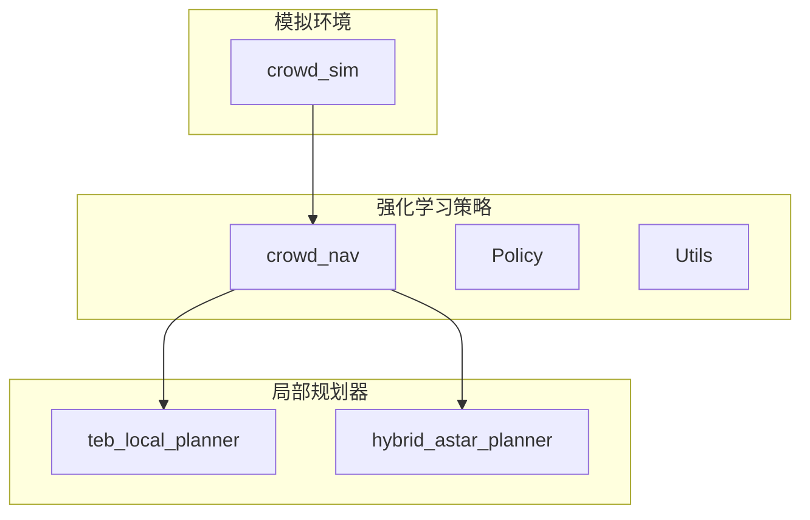
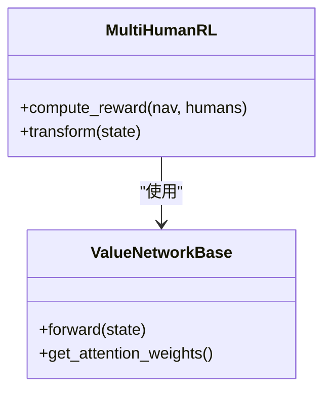
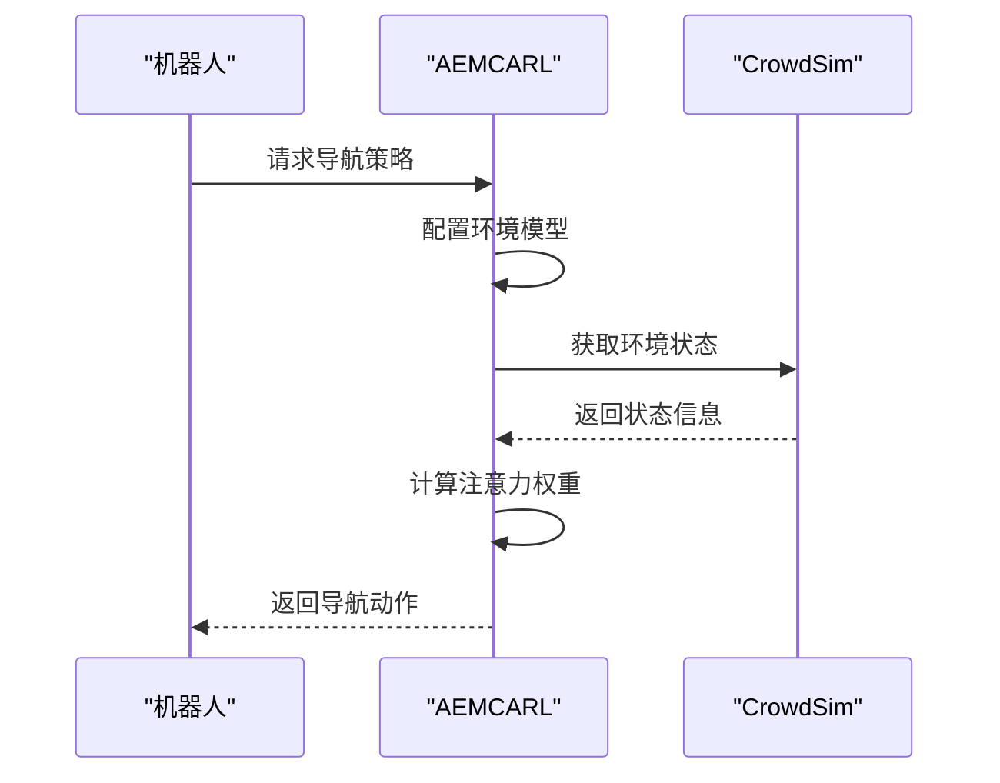
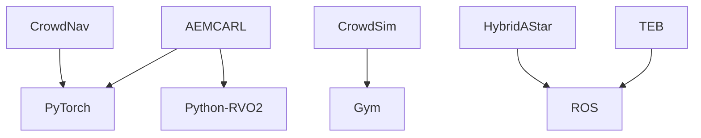

# 群体机器人导航

<cite>
**本文档中引用的文件**
- [actenvcarl.py](file://AEMCARL/crowd_nav/policy/actenvcarl.py)
- [multi_human_rl.py](file://AEMCARL/attachments/ros_ws/local_planner_py/scripts/crowd_nav/policy/multi_human_rl.py)
- [crowd_sim.py](file://AEMCARL/crowd_sim/envs/crowd_sim.py)
- [teb_local_planner_ros.cpp](file://teb_local_planner/src/teb_local_planner_ros.cpp)
- [HybridAStar.h](file://hybrid_astar_planner/include/HybridAStar.h)
- [README.md](file://AEMCARL/README.md)
- [README.md](file://CrowdNav/README.md)
</cite>

## 目录
1. [引言](#引言)
2. [项目结构](#项目结构)
3. [核心组件](#核心组件)
4. [架构概述](#架构概述)
5. [详细组件分析](#详细组件分析)
6. [依赖分析](#依赖分析)
7. [性能考虑](#性能考虑)
8. [故障排除指南](#故障排除指南)
9. [结论](#结论)

## 引言
群体机器人导航是多智能体系统中的关键挑战，特别是在密集人群环境中实现安全、高效的自主导航。本项目重点介绍两个核心子模块：CrowdNav和AEMCARL，它们基于强化学习技术为机器人提供在复杂社交场景中的导航能力。CrowdNav作为基础框架，实现了人群中的自主导航，而AEMCARL则在此基础上扩展，引入了自适应环境建模机制，以应对更复杂的交互场景。这两个模块通过与teb_local_planner和hybrid_astar_planner等局部规划器集成，形成了完整的多智能体协同导航解决方案。本文档旨在为初学者提供概念性概述，同时为经验丰富的开发者提供关于奖励函数设计、状态空间表示和多智能体协调策略的技术细节。

## 项目结构
项目结构分为两个主要部分：`crowd_sim` 文件夹包含模拟环境，`crowd_nav` 文件夹包含训练和测试策略的代码。`AEMCARL` 和 `CrowdNav` 两个目录分别代表了扩展版本和基础版本的实现。`crowd_sim` 模块负责创建n+1代理的运动模拟环境，其中人类代理由未知的固定策略控制，机器人代理由可学习的策略控制。`crowd_nav` 模块则包含了多种基于强化学习的导航策略，如CADRL、LSTM-RL和SARL，并通过`policy_factory`进行管理。此外，项目还集成了`teb_local_planner`和`hybrid_astar_planner`等局部规划器，以支持更复杂的导航任务。

```mermaid
graph TB
subgraph "AEMCARL"
AEMCrowdSim[crowd_sim] --> AEMCrowdNav[crowd_nav]
AEMCrowdNav --> Policy[Policy]
AEMCrowdNav --> Utils[Utils]
end
subgraph "CrowdNav"
CrowdSim[crowd_sim] --> CrowdNav[crowd_nav]
CrowdNav --> Policy[Policy]
CrowdNav --> Utils[Utils]
end
subgraph "集成规划器"
TEB[teb_local_planner]
HybridAStar[hybrid_astar_planner]
end
AEMCrowdNav --> TEB
AEMCrowdNav --> HybridAStar
CrowdNav --> TEB
CrowdNav --> HybridAStar
```

**Diagram sources**
- [crowd_sim.py](file://AEMCARL/crowd_sim/envs/crowd_sim.py#L221-L262)
- [actenvcarl.py](file://AEMCARL/crowd_nav/policy/actenvcarl.py#L0-L69)

**Section sources**
- [crowd_sim.py](file://AEMCARL/crowd_sim/envs/crowd_sim.py#L221-L262)
- [actenvcarl.py](file://AEMCARL/crowd_nav/policy/actenvcarl.py#L0-L69)

## 核心组件
核心组件包括CrowdNav和AEMCARL两个子模块。CrowdNav基于强化学习实现人群中的自主导航，其核心是`multi_human_rl.py`文件中定义的`MultiHumanRL`类，该类负责处理多个人类代理的交互。AEMCARL则在此基础上进行了扩展，引入了自适应环境建模机制，通过`actenvcarl.py`文件中的`ACTENVCARL`类实现。该类利用门控循环单元（GRU）网络进行环境建模，并结合注意力模块实现自适应感知。此外，AEMCARL还开发了自适应奖励函数，用于联合训练环境模型、感知函数和运动规划策略。

**Section sources**
- [actenvcarl.py](file://AEMCARL/crowd_nav/policy/actenvcarl.py#L0-L69)
- [multi_human_rl.py](file://AEMCARL/attachments/ros_ws/local_planner_py/scripts/crowd_nav/policy/multi_human_rl.py#L69-L94)

## 架构概述
系统架构由模拟环境、强化学习策略和局部规划器三部分组成。`crowd_sim`模块提供了一个基于Gym的模拟环境，用于训练和测试导航策略。`crowd_nav`模块实现了多种基于强化学习的导航策略，并通过`policy_factory`进行管理。`teb_local_planner`和`hybrid_astar_planner`作为局部规划器，与强化学习策略协同工作，实现从全局路径到局部轨迹的平滑过渡。AEMCARL框架通过自适应环境建模和注意力机制，提高了机器人在复杂场景中的导航性能。



**Diagram sources**
- [crowd_sim.py](file://AEMCARL/crowd_sim/envs/crowd_sim.py#L221-L262)
- [teb_local_planner_ros.cpp](file://teb_local_planner/src/teb_local_planner_ros.cpp#L92-L134)
- [HybridAStar.h](file://hybrid_astar_planner/include/HybridAStar.h#L0-L36)

## 详细组件分析
### CrowdNav分析
CrowdNav通过`multi_human_rl.py`文件中的`MultiHumanRL`类实现多智能体协同导航。该类定义了奖励函数，用于评估机器人与人类代理的交互。奖励函数考虑了碰撞检测、目标到达和静止状态等因素。通过`compute_reward`方法，系统能够实时评估导航策略的性能，并据此调整机器人的行为。

#### 对于对象导向组件：


**Diagram sources**
- [multi_human_rl.py](file://AEMCARL/attachments/ros_ws/local_planner_py/scripts/crowd_nav/policy/multi_human_rl.py#L69-L94)

### AEMCARL分析
AEMCARL通过`actenvcarl.py`文件中的`ACTENVCARL`类实现自适应环境建模。该类继承自`MultiHumanRL`，并引入了GRU网络和注意力机制。通过`configure`方法，系统能够配置输入MLP维度、排序MLP维度和动作维度等参数。`get_attention_weights`方法用于获取注意力权重，从而实现对环境的自适应感知。

#### 对于API/服务组件：


**Diagram sources**
- [actenvcarl.py](file://AEMCARL/crowd_nav/policy/actenvcarl.py#L0-L69)

**Section sources**
- [actenvcarl.py](file://AEMCARL/crowd_nav/policy/actenvcarl.py#L0-L69)
- [multi_human_rl.py](file://AEMCARL/attachments/ros_ws/local_planner_py/scripts/crowd_nav/policy/multi_human_rl.py#L69-L94)

## 依赖分析
系统依赖于多个外部库和模块。`crowd_sim`模块依赖于Gym框架，用于创建模拟环境。`crowd_nav`模块依赖于PyTorch，用于实现深度学习模型。`teb_local_planner`和`hybrid_astar_planner`作为ROS插件，依赖于ROS生态系统。此外，AEMCARL框架还依赖于Python-RVO2库，用于实现人群模拟。



**Diagram sources**
- [README.md](file://AEMCARL/README.md#L0-L11)
- [README.md](file://CrowdNav/README.md#L78-L90)

**Section sources**
- [README.md](file://AEMCARL/README.md#L0-L11)
- [README.md](file://CrowdNav/README.md#L78-L90)

## 性能考虑
根据性能基准，`teb_local_planner`在低到中等复杂度场景下运行频率为20-40 Hz，内存占用约100MB，适合ROS优化。`hybrid_astar_planner`在中等复杂度场景下运行频率为1-10 Hz，内存占用约50MB，适合启发式搜索。AEMCARL框架由于引入了复杂的环境建模和注意力机制，其计算开销相对较高，但能够在复杂场景中提供更优的导航性能。

## 故障排除指南
常见问题包括环境配置错误、模型训练失败和导航性能不佳。对于环境配置错误，应检查`env.yaml`文件中的参数设置。对于模型训练失败，应检查`train.py`脚本中的超参数配置。对于导航性能不佳，应检查奖励函数的设计和状态空间的表示。

**Section sources**
- [train.py](file://AEMCARL/crowd_nav/train.py#L122-L142)
- [multi_human_rl.py](file://AEMCARL/attachments/ros_ws/local_planner_py/scripts/crowd_nav/policy/multi_human_rl.py#L69-L94)

## 结论
CrowdNav和AEMCARL为群体机器人导航提供了强大的解决方案。CrowdNav作为基础框架，实现了人群中的自主导航。AEMCARL通过引入自适应环境建模和注意力机制，显著提升了机器人在复杂场景中的导航性能。通过与teb_local_planner和hybrid_astar_planner等局部规划器集成，形成了完整的多智能体协同导航系统。未来的工作可以进一步优化计算效率，以支持更大规模的群体机器人应用。