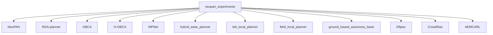
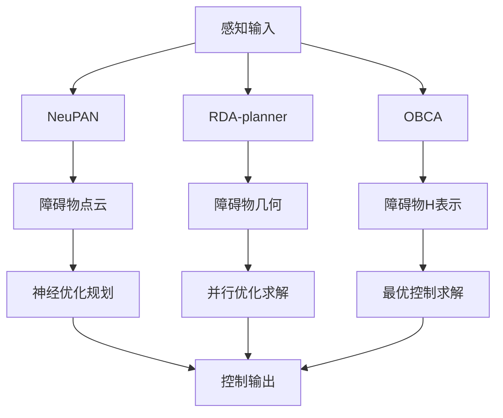
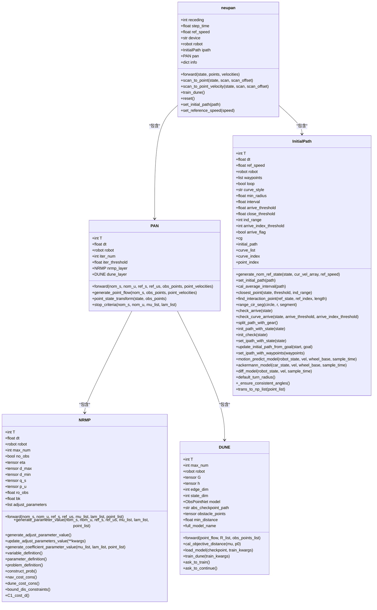
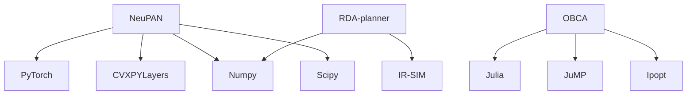

# 项目概述

<cite>
**本文档引用的文件**  
- [README.md](file://README.md)
- [NeuPAN/README.md](file://NeuPAN/README.md)
- [NeuPAN/neupan/neupan.py](file://NeuPAN/neupan/neupan.py)
- [NeuPAN/neupan/blocks/pan.py](file://NeuPAN/neupan/blocks/pan.py)
- [NeuPAN/neupan/blocks/nrmp.py](file://NeuPAN/neupan/blocks/nrmp.py)
- [NeuPAN/neupan/blocks/dune.py](file://NeuPAN/neupan/blocks/dune.py)
- [NeuPAN/neupan/blocks/initial_path.py](file://NeuPAN/neupan/blocks/initial_path.py)
- [RDA-planner/README.md](file://RDA-planner/README.md)
- [H-OBCA/README.md](file://H-OBCA/README.md)
- [OBCA/README.md](file://OBCA/README.md)
</cite>

## 目录
1. [引言](#引言)
2. [项目结构](#项目结构)
3. [核心组件](#核心组件)
4. [架构概述](#架构概述)
5. [详细组件分析](#详细组件分析)
6. [依赖分析](#依赖分析)
7. [性能考量](#性能考量)
8. [故障排除指南](#故障排除指南)
9. [结论](#结论)

## 引言

neupan_experiments 项目是一个综合性路径规划与自主导航算法研究平台，整合了多种前沿运动规划技术。该项目作为学术研究和实际应用的双重载体，提供了从端到端神经规划到经典优化方法的完整技术栈。平台的核心定位是为机器人自主导航提供一个模块化、可扩展的研究框架，支持不同算法的独立开发与集成。通过整合 NeuPAN、RDA-planner、OBCA 等多种规划器，该项目实现了从学习型规划到优化型规划的无缝衔接，为复杂环境下的实时导航提供了全面的解决方案。

## 项目结构

neupan_experiments 项目采用模块化设计，将不同的路径规划算法作为独立的子项目进行组织。这种结构设计支持算法的独立开发、测试和集成，便于研究人员专注于特定技术的研究。项目主要包含以下核心规划器模块：NeuPAN（端到端神经规划器）、RDA-planner（加速碰撞避免规划器）、OBCA（基于优化的碰撞避免）、H-OBCA（分层优化碰撞避免）、MPNet（运动规划网络）等。每个模块都包含完整的文档、示例代码和依赖配置，确保了项目的可复现性和易用性。

**图源**  
- [README.md](file://README.md)

**本节来源**  
- [README.md](file://README.md)

## 核心组件

neupan_experiments 项目的核心组件包括 NeuPAN、RDA-planner 和 OBCA 等多个规划器。NeuPAN 是一个端到端的神经规划器，直接将障碍物点映射到控制指令，实现了实时、无地图的机器人导航。RDA-planner 是一个基于优化的运动规划器，利用交替方向乘子法（ADMM）实现高效的碰撞避免。OBCA 则是一个基于最优控制的碰撞避免算法，能够生成动力学可行的避障轨迹。这些组件通过模块化设计相互独立，同时又可以通过统一的接口进行集成，形成了一个完整的路径规划生态系统。

**本节来源**  
- [NeuPAN/README.md](file://NeuPAN/README.md)
- [RDA-planner/README.md](file://RDA-planner/README.md)
- [OBCA/README.md](file://OBCA/README.md)

## 架构概述

neupan_experiments 项目的架构设计体现了模块化和分层化的思想。在顶层，项目通过一个统一的仓库管理多个独立的规划器模块。每个规划器模块内部采用分层架构，通常包括感知层、规划层和控制层。以 NeuPAN 为例，其架构包括障碍物点云处理、初始路径生成、神经优化规划等层次。RDA-planner 则采用了基于 MPC 的分层优化架构，将复杂的优化问题分解为多个子问题并行求解。这种架构设计不仅提高了系统的可维护性，还为不同算法的比较和集成提供了便利。

**图源**  
- [NeuPAN/README.md](file://NeuPAN/README.md)
- [RDA-planner/README.md](file://RDA-planner/README.md)
- [OBCA/README.md](file://OBCA/README.md)

## 详细组件分析

### NeuPAN 分析

NeuPAN 是一个端到端的神经规划器，其核心是 proximal alternating-minimization network (PAN) 架构。该架构由 NRMP（神经正则化运动规划器）和 DUNE（深度展开神经编码器）两个主要组件构成。NeuPAN 直接将障碍物点云数据映射到控制指令，通过解决包含大量点级碰撞避免约束的优化问题来实现实时导航。

#### NeuPAN 类图

**图源**  
- [NeuPAN/neupan/neupan.py](file://NeuPAN/neupan/neupan.py)
- [NeuPAN/neupan/blocks/pan.py](file://NeuPAN/neupan/blocks/pan.py)
- [NeuPAN/neupan/blocks/nrmp.py](file://NeuPAN/neupan/blocks/nrmp.py)
- [NeuPAN/neupan/blocks/dune.py](file://NeuPAN/neupan/blocks/dune.py)
- [NeuPAN/neupan/blocks/initial_path.py](file://NeuPAN/neupan/blocks/initial_path.py)

**本节来源**  
- [NeuPAN/neupan/neupan.py](file://NeuPAN/neupan/neupan.py)
- [NeuPAN/neupan/blocks/pan.py](file://NeuPAN/neupan/blocks/pan.py)
- [NeuPAN/neupan/blocks/nrmp.py](file://NeuPAN/neupan/blocks/nrmp.py)
- [NeuPAN/neupan/blocks/dune.py](file://NeuPAN/neupan/blocks/dune.py)
- [NeuPAN/neupan/blocks/initial_path.py](file://NeuPAN/neupan/blocks/initial_path.py)

### RDA-planner 分析

RDA-planner 是一个高性能的基于优化的模型预测控制（MPC）运动规划器，专为复杂和杂乱环境中的自主导航而设计。它利用交替方向乘子法（ADMM）将复杂的优化问题分解为几个简单的子问题，从而实现每个障碍物碰撞避免约束的并行计算，显著提高了计算速度。

#### RDA-planner 特性
- **形状感知规划**：处理具有任意凸形状的机器人和障碍物，确保在各种场景下的通用性。
- **高精度控制**：通过先进的优化求解器实现精确的控制轨迹，增强导航的可靠性。
- **动态障碍物处理**：支持静态和动态障碍物，能够在不断变化的环境中实现稳健性能。
- **实时性能**：提供适合实时应用的快速计算时间，确保及时决策和响应。
- **多功能运动学支持**：兼容各种机器人运动学类型，包括差速驱动、阿克曼转向和全向系统，为不同机器人平台提供灵活性。

**本节来源**  
- [RDA-planner/README.md](file://RDA-planner/README.md)

### OBCA 分析

OBCA（基于优化的碰撞避免）是一种基于最优控制的自主停车轨迹生成方法。它能够生成高质量的、动力学可行的无碰撞轨迹，这些轨迹平滑且可以被简单的低层路径跟踪控制器精确跟踪。H-OBCA（分层优化碰撞避免）在此基础上构建，通过分层优化方法进一步提高了轨迹生成的质量和效率。

#### OBCA 应用场景
- **卡车拖车停车**：能够处理复杂的多体系统停车问题。
- **倒车停车**：生成高质量的倒车轨迹。
- **平行停车**：实现精确的平行停车操作。

**本节来源**  
- [H-OBCA/README.md](file://H-OBCA/README.md)
- [OBCA/README.md](file://OBCA/README.md)

## 依赖分析

neupan_experiments 项目中的各个组件具有明确的依赖关系。NeuPAN 依赖于 PyTorch 和 CVXPYLayers 等深度学习和优化库，RDA-planner 依赖于 NumPy 和 IR-SIM 等数值计算和仿真工具，而 OBCA 则基于 Julia 的 JuMP 和 Ipopt 优化包。这些依赖关系反映了不同规划器的技术栈特点：NeuPAN 侧重于学习型方法，RDA-planner 侧重于优化方法，而 OBCA 侧重于最优控制方法。项目通过独立的子项目结构管理这些不同的依赖关系，避免了依赖冲突。

**图源**  
- [NeuPAN/pyproject.toml](file://NeuPAN/pyproject.toml)
- [RDA-planner/setup.py](file://RDA-planner/setup.py)
- [H-OBCA/README.md](file://H-OBCA/README.md)

**本节来源**  
- [NeuPAN/pyproject.toml](file://NeuPAN/pyproject.toml)
- [RDA-planner/setup.py](file://RDA-planner/setup.py)
- [H-OBCA/README.md](file://H-OBCA/README.md)

## 性能考量

neupan_experiments 项目中的各个规划器在性能上各有特点。NeuPAN 能够在强大的 CPU 硬件平台上实现 15-20 Hz 的控制频率，适合实时应用。RDA-planner 通过并行计算实现了 10-15 Hz 的运行频率，适用于处理复杂环境。hybrid_astar_planner 的运行频率为 1-10 Hz，适合中等复杂度的场景。teb_local_planner 在 ROS 环境中优化良好，能够达到 20-40 Hz 的高频率。这些性能差异反映了不同算法在计算复杂度和实时性之间的权衡，为不同应用场景提供了选择依据。

| 模块 | 场景复杂度 | 运行频率 | 内存占用 | 备注 |
|---|---|---|---|---|
| NeuPAN | 中等 | 15-20 Hz | ~500MB | CPU优化 |
| RDA-planner | 高 | 10-15 Hz | ~200MB | 并行计算 |
| hybrid_astar | 中等 | 1-10 Hz | ~50MB | 启发式搜索 |
| teb_local_planner | 低-中 | 20-40 Hz | ~100MB | ROS优化 |

**本节来源**  
- [README.md](file://README.md)

## 故障排除指南

在使用 neupan_experiments 项目时，可能会遇到一些常见问题。对于 NeuPAN，如果无法找到 DUNE 模型，系统会提示用户是否要立即训练模型。对于 RDA-planner，需要确保安装了正确的 Python 版本（>=3.9）。对于 OBCA，需要在 Julia 环境中安装必要的包（JuMP、Ipopt、PyPlot 等）。此外，所有规划器都需要正确配置其依赖项和环境变量，以确保正常运行。

**本节来源**  
- [NeuPAN/README.md](file://NeuPAN/README.md)
- [RDA-planner/README.md](file://RDA-planner/README.md)
- [H-OBCA/README.md](file://H-OBCA/README.md)

## 结论

neupan_experiments 项目作为一个综合性路径规划与自主导航算法研究平台，成功整合了多种前沿运动规划技术。通过模块化设计，项目实现了从端到端神经规划到经典优化方法的完整技术栈覆盖。NeuPAN、RDA-planner 和 OBCA 等核心组件各具特色，分别代表了学习型、优化型和最优控制型规划方法的最新进展。这种多样化的技术整合不仅为学术研究提供了丰富的实验平台，也为实际应用提供了灵活的解决方案选择。项目的成功实施证明了模块化、分层化架构在复杂系统开发中的优势，为未来路径规划算法的研究和发展提供了有价值的参考。